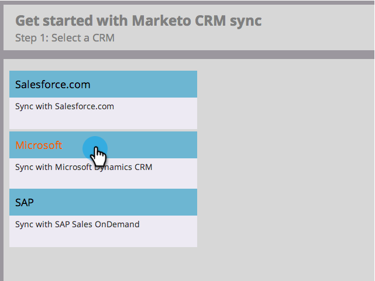
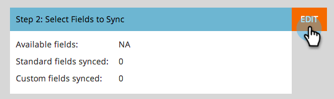

# 步骤3（共3步）：连接Marketo Dynamics（2015年上线） {#step-of-connect-marketo-dynamics-on-premises-2015}

>[!PREREQUISITES]
>
>* [安装Marketo for Microsoft Dynamics 2015本地步骤1（共3步）](/help/marketo/product-docs/crm-sync/microsoft-dynamics-sync/sync-setup/connecting-to-legacy-versions/step-1-of-3-install-2015.md)
>* [安装Marketo for Microsoft Dynamics 2015本地步骤2（共3步）](/help/marketo/product-docs/crm-sync/microsoft-dynamics-sync/sync-setup/connecting-to-legacy-versions/step-2-of-3-set-up-2015.md)

>[!NOTE]
>
>**需要管理员权限**

## 输入Dynamics Sync用户信息 {#enter-dynamics-sync-user-information}

1. 登录Marketo并单击 **管理员**.

   

1. 单击 **CRM**.

   

1. 选择 **Microsoft**.

   

1. 单击 **编辑** in **步骤1:输入凭据**.

   

   >[!CAUTION]
   >
   >请确保您的凭据正确无误，因为我们无法在提交后还原后续架构更改。 如果保存的凭据不正确，则必须获取新的Marketo订阅。

1. 输入 **用户名**, **密码** a Microsoft Dynamics **URL**&#x200B;和 **客户端Id/密钥**. 单击 **保存** 完成时。

   

   >[!NOTE]
   >
   >* 如果您的Marketo是在2020年10月之前配置的，则客户端ID和密钥是可选字段。 否则，它们是强制性的。 获取此信息将取决于您使用的MSD版本。
   >* Marketo中的用户名必须与CRM中同步用户的用户名匹配。 格式可以是 `user@domain.com` 或域\用户。
   >* 如果您不知道URL， [了解如何在此处查找](/help/marketo/product-docs/crm-sync/microsoft-dynamics-sync/sync-setup/view-the-organization-service-url.md).

   >[!TIP]
   >
   >不知道URL? 我们将向您展示如何查找 [Dynamics组织服务URL](/help/marketo/product-docs/crm-sync/microsoft-dynamics-sync/sync-setup/view-the-organization-service-url.md) 这里。

## 选择要同步的字段 {#select-fields-to-sync}

1. 单击 **编辑** in **步骤2:选择要同步的字段**.

   

1. 选择要同步到Marketo的字段，以便预先选择它们。 单击 **保存**.

   

>[!NOTE]
>
>Marketo存储对要同步的字段的引用。 如果删除Dynamics中的字段，我们建议使用 [已禁用](/help/marketo/product-docs/crm-sync/salesforce-sync/enable-disable-the-salesforce-sync.md). 然后，通过编辑和保存 [选择要同步的字段](/help/marketo/product-docs/crm-sync/microsoft-dynamics-sync/microsoft-dynamics-sync-details/microsoft-dynamics-sync-field-sync/editing-fields-to-sync-before-deleting-them-in-dynamics.md).

## 自定义过滤器的同步字段 {#sync-fields-for-a-custom-filter}

如果已创建自定义过滤器，请务必进入并选择要与Marketo同步的新字段。

1. 转到“管理员”并选择 **Microsoft Dynamics**.

   

1. 单击 **编辑** 在字段同步详细信息中。

   

1. 向下滚动到字段并对其进行检查。 实际名称必须是new_synctomkto，但“显示名称”可以是任何内容。 单击 **保存**.

   

## 启用同步 {#enable-sync}

1. 单击 **编辑** in **步骤3:启用同步**.

   

   >[!CAUTION]
   >
   >Marketo不会针对Microsoft Dynamics同步或在您手动输入人员时自动消除重复数据。

1. 阅读弹出窗口中的所有内容，输入电子邮件，然后单击 **开始同步**.

   

1. 第一次同步可能需要几个小时。 完成后，您将收到一封电子邮件通知。

   

干得好！
