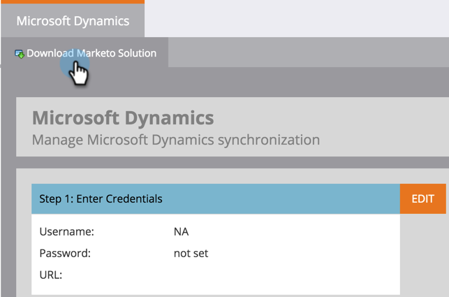

# 下载 Marketo 潜在客户管理解决方案 {#download-the-marketo-lead-management-solution}

>[!NOTE]
>
>**需要管理员权限**

您需要下载Marketo解决方案并将其安装到您的[!DNL Microsoft Dynamics]帐户中才能开始同步。

>[!CAUTION]
>
>在执行任何升级前&#x200B;_必须先下载最新的Marketo解决方案_。

>[!NOTE]
>
>Marketo目前仅支持与Java 7兼容的SSL证书。

1. 进入 **[!UICONTROL Admin]** 区域。

   

1. 单击&#x200B;**[!UICONTROL CRM]**。

   

1. 选择 **[!DNL Microsoft]**。

   

1. 选择 **[!UICONTROL Download Marketo Solution]**。

   

1. 为您的[!DNL Microsoft Dynamics]版本选择适当的解决方案。

   

解决方案的zip文件现在将下载到您的设备。
