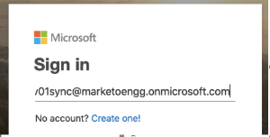

# 授予客户端 ID 和应用程序注册的同意 {#grant-consent-for-client-id-and-app-registration}

请按照以下步骤了解如何授予必要的同意/权限。

## 为同步用户授予委派的用户权限 {#grant-delegated-user-permissions-for-the-sync-user}

1. 使用干净的文本程序(Windows的“记事本”，Mac的“文本编辑”)通过粘贴以下文本并替换`client_id`、`redirect_uri`和`state`值来创建用于授权的统一资源标识符(URI)。

   ```
   https://login.microsoftonline.com/common/oauth2/authorize?
   client_id='xxxxxx-xxxx-xxxx-xxxx-xxxxxxxx'
   &response_type='code'
   &redirect_uri='https://www.<ourdomain>.com'
   &response_mode='query'
   &state='SOME_UNIQUE_UID'
   client_id value should be the client_id generated in App Registration process
   redirect_uri value should be same as value entered at the time of App registration-> Redirect URIs
   state value can be any ID (e.g.,12345)
   ```

   <table>
    <colgroup>
     <col>
     <col>
    </colgroup>
    <tbody>
     <tr>
      <td><strong>client_id值</strong></td>
      <td>应为应用程序注册过程中生成的client_id</td>
     </tr>
     <tr>
      <td><strong>redirect_uri值</strong></td>
      <td>应与应用程序注册&gt;重定向URI时输入的值相同</td>
     </tr>
     <tr>
      <td><strong>状态值</strong></td>
      <td>可以是任何ID(例如，12345)</td>
     </tr>
    </tbody>
   </table>

   最终URL应如下所示： `https://login.microsoftonline.com/common/oauth2/authorize?client_id=xxxxxx-xxxx-xxxx-xxxx-xxxxxxxx&response_type=code&redirect_uri=https://www.marketo.com&response_mode=query&state=12345`

1. 在任何浏览器中打开您创建的URI。

   

1. 以您要为其授予权限的同步用户身份登录。

   

   >[!NOTE]
   >
   >如果您已在其他选项卡中作为管理员登录Azure，则需要使用其他浏览器或无痕模式以同步用户的身份登录。

1. 单击 **[!UICONTROL Accept]**。

   

## 授予所有用户同意 {#grant-consent-for-all-users}

作为管理员，您还可以代表租户中的所有用户同意应用程序的委派权限。 管理同意可防止为租户中的每个用户显示同意对话框，并且可由具有管理员角色的用户在Azure门户中完成。 在此处了解哪些管理员角色可以[同意委派权限](https://docs.microsoft.com/en-us/azure/active-directory/roles/permissions-reference)。

1. 在Azure门户中，导航到应用程序主页。

1. 在[!UICONTROL Manage]下，单击&#x200B;**[!UICONTROL API Permissions]**。

   

1. 单击&#x200B;**[!UICONTROL Grant admin consent]** （适用于租户）按钮。

   

1. 单击&#x200B;**[!UICONTROL Yes]**&#x200B;确认。

   
