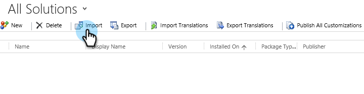

# 第1步，共3步：在Dynamics（2013内部部署）中安装Marketo解决方案{#step-of-install-the-marketo-solution-in-dynamics-on-premises}

在同步Microsoft Dynamics On-Premise和Marketo之前，您需要先在Dynamics中安装Marketo解决方案。

>[!NOTE]
>
>将Marketo同步到CRM后，无法在不替换实例的情况下执行新同步。

>[!PREREQUISITES]
>
>您必须配置[面向Internet的部署](https://www.microsoft.com/en-us/download/confirmation.aspx?id=41701)(IFD)，并配置[ Active Directory联合身份验证服务](https://msdn.microsoft.com/en-us/library/bb897402.aspx) 2.0、2.1或3.0(ADFS)。 注意：当您单击该链接时，IFD文档会自动下载。
>
>[在开始之前](/help/marketo/product-docs/crm-sync/microsoft-dynamics-sync/sync-setup/download-the-marketo-lead-management-solution.md) 下载Marketo解决方案。

>[!NOTE]
>
>**需要Dynamics管理员权限。**
>
>您需要CRM管理员权限才能执行此同步。

1. 登录&#x200B;**Dynamics**。 单击&#x200B;**Microsoft Dynamics CRM**&#x200B;下拉菜单并选择&#x200B;**设置**。

   

1. 在&#x200B;**设置**&#x200B;下，选择&#x200B;**解决方案**。

   

1. 单击&#x200B;**导入**。

   

1. 单击&#x200B;**浏览**&#x200B;并选择[下载的解决方案](/help/marketo/product-docs/crm-sync/microsoft-dynamics-sync/sync-setup/download-the-marketo-lead-management-solution.md)。 单击&#x200B;**下一步**。

   

1. 视图解决方案信息，然后单击&#x200B;**视图解决方案包详细信息**。

   

1. 检查完所有详细信息后，单击&#x200B;**关闭**。

   

1. 返回“解决方案信息”页，单击&#x200B;**下一步**。

   

1. 确保选中了SDK选项。 单击&#x200B;**导入**。

   

1. 等待导入完成。

   >[!TIP]
   >
   >您需要在浏览器上启用弹出窗口才能完成安装过程。

   

1. 下载日志文件（如果需要），然后单击&#x200B;**关闭**。

   >[!NOTE]
   >
   >您可能会看到一条消息，说“Marketo Lead Management已完成，但有警告”。 这完全是预期。

   

1. Marketo潜在客户管理现在将显示在&#x200B;**所有解决方案**&#x200B;页面上。

   

1. 选择Marketo解决方案，然后单击&#x200B;**发布所有自定义项**。

   

不是太糟吧？ 来吧，我会一直陪着你。

>[!CAUTION]
>
>禁用任何Marketo SDK消息传递进程将导致安装中断！

>[!MORELIKETHIS]
>
>[第2步，共3步：为Marketo配置同步用户（2013年内部部署）](/help/marketo/product-docs/crm-sync/microsoft-dynamics-sync/sync-setup/microsoft-dynamics-2013-on-premises/step-2-of-3-configure.md)
