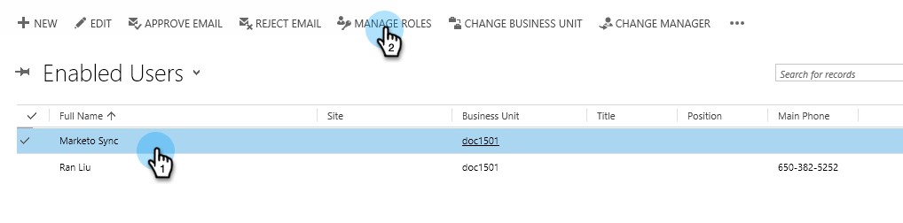

# 设置Marketo for Dynamics（2015 On-Prem和2016 365 On-Prem）的步骤2{#step-of-set-up-for-marketo-on-premises-and-365}

完成上述步骤的工作非常出色。 让我们继续过去。

>[!PREREQUISITES]
[安装Marketo for Dynamics 2015内部版和2016 365内部版步骤1（共3步）](/help/marketo/product-docs/crm-sync/microsoft-dynamics-sync/sync-setup/microsoft-dynamics-2015-on-premises-2016-dynamics-365-on-premises/step-1-of-3-install.md)>
>

## 分配同步用户角色{#assign-sync-user-role}

将Marketo同步用户角色仅分配给Marketo同步用户。 您无需将其分配给任何其他用户。

>[!NOTE]
这适用于Marketo版本4.0.0.14及更高版本。 对于早期版本，所有用户都必须具有同步用户角色。 要升级Marketo，请参阅[升级适用于Microsoft Dynamics的Marketo解决方案](/help/marketo/product-docs/crm-sync/microsoft-dynamics-sync/sync-setup/update-the-marketo-solution-for-microsoft-dynamics.md)。

>[!IMPORTANT]
同步用户[的语言设置应设置为English](https://portal.dynamics365support.com/knowledgebase/article/KA-01201/en-us)。

1. 在&#x200B;**Settings**&#x200B;下，单击&#x200B;**Security**。

   

1. 单击&#x200B;**Users**。

   

1. 您将在此处看到用户列表。 选择专用的Marketo同步用户或联系您的[Active Directory联合身份验证服务](https://msdn.microsoft.com/en-us/library/bb897402.aspx)(ADFS)管理员，为Marketo创建专用用户。

   

1. 选择同步用户。 单击&#x200B;**管理角色**。

   

   选中Marketo同步用户，然后单击确定。

   

   >[!TIP]
   如果看不到该角色，请返回至[第1步（共3步）](/help/marketo/product-docs/crm-sync/microsoft-dynamics-sync/sync-setup/microsoft-dynamics-2015-on-premises-2016-dynamics-365-on-premises/step-1-of-3-install.md)并导入解决方案。

   >[!NOTE]
   同步用户在CRM中进行的任何更新都将&#x200B;**不**&#x200B;同步回Marketo。

## 配置Marketo解决方案{#configure-marketo-solution}

快完了！ 在转到下一篇文章之前，我们只需完成一些最后的配置。

1. 在&#x200B;**Settings**&#x200B;下，单击&#x200B;**Marketo配置**。

   

   >[!NOTE]
   如果Marketo配置缺失，请尝试刷新页面。 如果问题仍然存在，请[发布Marketo解决方案](/help/marketo/product-docs/crm-sync/microsoft-dynamics-sync/sync-setup/microsoft-dynamics-2015-on-premises-2016-dynamics-365-on-premises/step-1-of-3-install.md)或尝试注销并重新登录。

1. 单击&#x200B;**Default**。

   

1. 单击&#x200B;**Marketo User**&#x200B;字段，然后选择同步用户。

   

1. 单击右下角的保存图标。

   

1. 单击&#x200B;**发布所有自定义项**。

   

## 继续执行步骤3 {#before-proceeding-to-step}之前

* 如果要限制同步的记录数，请[立即设置自定义同步筛选器](/help/marketo/product-docs/crm-sync/microsoft-dynamics-sync/create-a-custom-dynamics-sync-filter.md)。
* 运行[验证Microsoft Dynamics Sync](/help/marketo/product-docs/crm-sync/microsoft-dynamics-sync/sync-setup/validate-microsoft-dynamics-sync.md)进程。 它验证初始设置是否正确完成。
* 在Microsoft Dynamics CRM中登录到Marketo同步用户。

>[!MORELIKETHIS]
[安装Marketo for Dynamics 2015内部版和2016 365内部版步骤3（共3步）](/help/marketo/product-docs/crm-sync/microsoft-dynamics-sync/sync-setup/microsoft-dynamics-2015-on-premises-2016-dynamics-365-on-premises/step-3-of-3-connect.md)
