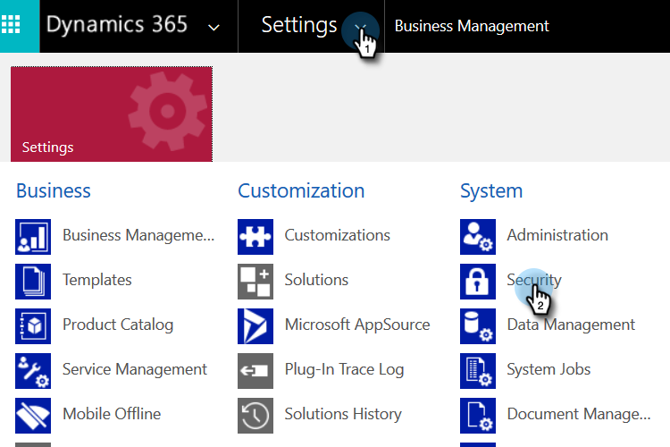

# 步骤3中的2为[!DNL Dynamics]设置Marketo（2016内部部署/[!DNL Dynamics] 365内部部署）{#step-of-set-up-for-marketo-on-premises-2016}

出色完成了前面的步骤。 让我们继续讨论这个问题。

>[!PREREQUISITES]
>
>[安装Marketo for [!DNL Microsoft Dynamics] 2016/[!DNL Dynamics] 365本地步骤1/ 3](/help/marketo/product-docs/crm-sync/microsoft-dynamics-sync/sync-setup/microsoft-dynamics-2016-dynamics-365-on-premises/step-1-of-3-install.md)

## 创建新用户 {#create-a-new-user}

1. 登录到[!DNL Dynamics]。 单击设置图标并选择高级设置。

   

1. 单击&#x200B;**[!UICONTROL Settings]**&#x200B;并选择&#x200B;**[!UICONTROL Security]**。

   

1. 单击 **[!UICONTROL Users]**。

   

1. 单击 **[!UICONTROL New]**。

   

1. 单击&#x200B;**[!UICONTROL Add and License Users]**。 此时应会打开一个新选项卡。

   

1. 单击页面顶部的&#x200B;**[!UICONTROL Admin]**。 此时应会打开另一个新选项卡。

   

1. 单击 **[!UICONTROL Add a user]**。

   

1. 输入您的所有信息。 完成后，单击&#x200B;**[!UICONTROL Add]**。

   

   >[!NOTE]
   >
   >此名称必须是专用同步用户，而不是现有的CRM用户帐户。 它不需要是实际的电子邮件地址。

1. 输入要接收新用户凭据的电子邮件，然后单击发送电子邮件并关闭。

   

## 创建新的客户端应用程序 {#create-a-new-client-application}

按照[此Microsoft文章](https://docs.microsoft.com/en-us/windows-server/identity/ad-fs/development/enabling-oauth-confidential-clients-with-ad-fs#create-an-application-group-in-ad-fs-2016-or-later)中的步骤来创建新的客户端应用程序并授予权限。 请记下[!DNL Dynamics]客户端应用程序的客户端ID/密码。

## 分配同步用户角色 {#assign-sync-user-role}

仅将Marketo同步用户角色分配给Marketo同步用户。 您无需将其分配给任何其他用户。

>[!NOTE]
>
>这适用于Marketo版本4.0.0.14及更高版本。 对于早期版本，所有用户都必须具有同步用户角色。 要升级Marketo，请参阅[升级 [!DNL Microsoft Dynamics]](/help/marketo/product-docs/crm-sync/microsoft-dynamics-sync/sync-setup/update-the-marketo-solution-for-microsoft-dynamics.md)的Marketo解决方案。

>[!IMPORTANT]
>
>同步用户[的语言设置应设置为“英语](https://learn.microsoft.com/en-us/power-platform/admin/enable-languages){target="_blank"}”。

1. 在&#x200B;**[!UICONTROL Settings]**&#x200B;下，单击&#x200B;**[!UICONTROL Security]**。

   

1. 单击 **[!UICONTROL Users]**。

   

1. 您将在此处看到用户列表。 选择专用的Marketo同步用户或联系您的[Active Directory联合身份验证服务](https://msdn.microsoft.com/en-us/library/bb897402.aspx){target="_blank"} (ADFS)管理员以创建Marketo的专用用户。

   

1. 选择同步用户。 单击 **[!UICONTROL Manage Roles]**。

   

1. 检查Marketo同步用户并单击&#x200B;**[!UICONTROL OK]**。

   

   >[!TIP]
   >
   >如果未看到该角色，请返回3[的](/help/marketo/product-docs/crm-sync/microsoft-dynamics-sync/sync-setup/microsoft-dynamics-2016-dynamics-365-on-premises/step-1-of-3-install.md)步骤1并导入解决方案。

   >[!NOTE]
   >
   >同步用户在CRM中所做的任何更新都&#x200B;_不会_&#x200B;同步回Marketo。

## 配置Marketo解决方案 {#configure-marketo-solution}

快完成了！ 在转到下一篇文章之前，我们仅做了最后几段配置。

1. 在&#x200B;**[!UICONTROL Settings]**&#x200B;下，单击&#x200B;**[!UICONTROL Marketo Config]**。

   

   >[!NOTE]
   >
   >如果缺少Marketo配置，请尝试刷新页面。 如果问题仍然存在，请[发布Marketo解决方案](/help/marketo/product-docs/crm-sync/microsoft-dynamics-sync/sync-setup/microsoft-dynamics-2016-dynamics-365-on-premises/step-1-of-3-install.md){target="_blank"}或尝试注销并重新登录。

1. 单击 **[!UICONTROL Default]**。

   

1. 单击&#x200B;**[!UICONTROL Marketo User]**&#x200B;字段并选择同步用户。

   

1. 单击右下角的保存图标。

   

1. 单击 **[!UICONTROL Publish All Customizations]**。

   

## 在继续执行步骤3之前 {#before-proceeding-to-step}

* 如果要限制同步记录数，请立即[设置自定义同步筛选器](/help/marketo/product-docs/crm-sync/microsoft-dynamics-sync/create-a-custom-dynamics-sync-filter.md)。
* 运行[验证 [!DNL Microsoft Dynamics] 同步](/help/marketo/product-docs/crm-sync/microsoft-dynamics-sync/sync-setup/validate-microsoft-dynamics-sync.md)进程。 它验证初始设置是否正确完成。
* 登录到[!DNL Microsoft Dynamics] CRM中的Marketo同步用户。

>[!MORELIKETHIS]
>
>[安装Marketo for [!DNL Microsoft Dynamics] 2016/[!DNL Dynamics] 365本地步骤3/ 3](/help/marketo/product-docs/crm-sync/microsoft-dynamics-sync/sync-setup/microsoft-dynamics-2016-dynamics-365-on-premises/step-3-of-3-connect.md)
