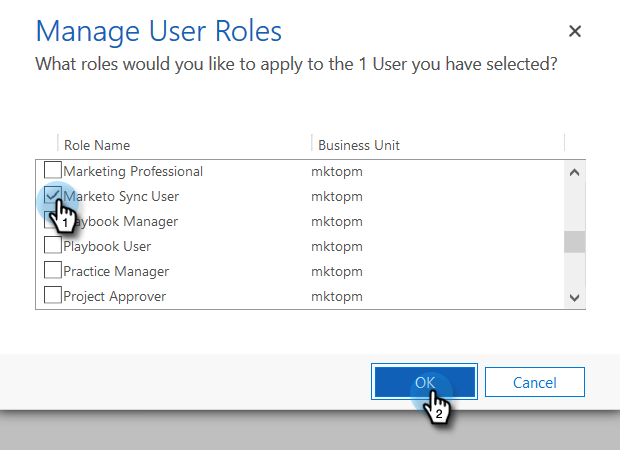

# 步骤2（共3步）：使用资源所有者密码控制连接设置Marketo解决方案 {#step-2-of-3-set-up-the-marketo-solution-ropc}

让我们通过创建用户帐户开始。

>[!PREREQUISITES]
>
>[步骤1（共4步）：安装具有资源所有者密码控制连接的Marketo解决方案](/help/marketo/product-docs/crm-sync/microsoft-dynamics-sync/sync-setup/microsoft-dynamics-365-with-ropc-connection/step-1-of-4-install.md)

## 创建新用户 {#create-a-new-user}

1. 登录到Dynamics。 单击“设置”图标，然后选择 **高级设置**.

   

1. 单击 **设置** 选择 **安全性**.

   

1. 单击 **用户**.

   

1. 单击 **新增。**

   

1. 单击 **添加用户和授权用户** 在新窗口中。

   

1. 将打开一个新选项卡。 单击 **管理员** 的双曲余切值。

   

1. 此时将打开另一个新选项卡。 单击 **添加用户**.

   

1. 输入所有信息。 完成后，单击 **添加**.

   

   >[!NOTE]
   >
   >此名称必须是专用同步用户，而不是现有CRM用户的帐户。 它不必是实际的电子邮件地址。

1. 输入要接收新用户凭据的电子邮件，然后单击 **发送电子邮件并关闭**.

   

## 分配同步用户角色 {#assign-sync-user-role}

将Marketo同步用户角色仅分配给Marketo同步用户。 您无需将其分配给任何其他用户。

>[!NOTE]
>
>这适用于Marketo版本4.0.0.14及更高版本。 对于早期版本，所有用户都必须具有同步用户角色。 要升级Marketo，请参阅 [升级适用于Microsoft Dynamics的Marketo解决方案](/help/marketo/product-docs/crm-sync/microsoft-dynamics-sync/sync-setup/update-the-marketo-solution-for-microsoft-dynamics.md).

>[!IMPORTANT]
>
>同步用户的语言设置 [应设置为英语](https://portal.dynamics365support.com/knowledgebase/article/KA-01201/en-us).

1. 返回到已启用的用户选项卡，然后刷新用户列表。

   

1. 将鼠标悬停在新创建的Marketo同步用户旁边，此时将显示一个复选框。 单击以选择它。

   

1. 单击 **管理角色**.

   

1. 检查 **Marketo同步用户** 单击 **确定**.

   

   >[!NOTE]
   >
   >同步用户在CRM中进行的任何更新都将 **not** 同步回Marketo。

## 配置Marketo解决方案 {#configure-marketo-solution}

快到了！ 我们只剩下一步，就是向Marketo解决方案告知所创建的新用户。

1. 返回至高级设置部分，然后单击  图标，然后选择 **Marketo配置**.

   

   >[!NOTE]
   >
   >如果你看不到 **Marketo配置** 在“设置”菜单中，刷新页面。 如果那不行，请尝试 [发布Marketo解决方案](/help/marketo/product-docs/crm-sync/microsoft-dynamics-sync/sync-setup/microsoft-dynamics-365-with-ropc-connection/step-1-of-4-install.md) 再次注销，然后重新登录。

1. 单击 **默认**.

   

1. 单击 **Marketo用户** 字段，然后选择您创建的同步用户。

   

1. 单击  图标来保存更改。

   

1. 单击 **X** 中，单击以关闭屏幕。

   

1. 单击  图标，然后选择 **解决方案**.

   

1. 单击 **发布所有自定义设置** 按钮。

   

## 继续执行步骤3之前 {#before-proceeding-to-step}

* 如果要限制同步的记录数， [设置自定义同步筛选器](/help/marketo/product-docs/crm-sync/microsoft-dynamics-sync/create-a-custom-dynamics-sync-filter.md) 现在。
* 运行 [验证Microsoft Dynamics同步](/help/marketo/product-docs/crm-sync/microsoft-dynamics-sync/sync-setup/validate-microsoft-dynamics-sync.md) 进程。 它验证初始设置是否正确完成。
* 在Microsoft Dynamics CRM中登录Marketo同步用户。

   >[!MORELIKETHIS]
   >
   >[步骤3（共4步）：将Marketo解决方案与资源所有者密码控制连接连接](/help/marketo/product-docs/crm-sync/microsoft-dynamics-sync/sync-setup/microsoft-dynamics-365-with-ropc-connection/step-3-of-4-set-up.md)
