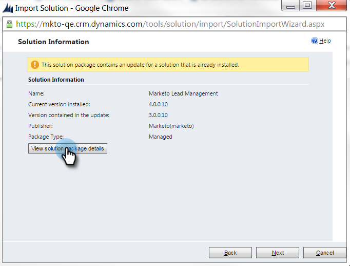

# 第1步，共3步：安装Marketo解决方案（在线）{#step-of-install-the-marketo-solution-online}

在同步Microsoft Dynamics 365和Marketo之前，您需要先在Dynamics中安装Marketo解决方案。 **需要Dynamics管理员权限。**

>[!CAUTION]
>
>* 在完成初始同步之前，请勿启用自定义实体同步。 完成初始同步后，您将通过电子邮件收到通知。
>* 如果您为Dynamics同步启用了多因素身份验证(MFA)，则必须禁用它，Dynamics才能与Marketo正确同步。 如需其他信息，请联系[Marketo支持](https://nation.marketo.com/t5/Support/ct-p/Support)。

>[!NOTE]
>
>将Marketo同步到CRM后，无法在不替换实例的情况下执行新同步。

>[!PREREQUISITES]
>
>[下载Marketo Lead Management解决方案](/help/marketo/product-docs/crm-sync/microsoft-dynamics-sync/sync-setup/download-the-marketo-lead-management-solution.md)

1. 登录到&#x200B;**[Microsoft Office 365](https://login.microsoftonline.com/)**。

   

1. 单击菜单并选择&#x200B;**CRM**。

   

1. 单击菜单。 在下拉菜单中，选择&#x200B;**设置**，然后选择&#x200B;**解决方案**。

   

1. 单击&#x200B;**导入。**

   

1. 单击&#x200B;**选择文件。** 选择您下载的Marketo潜在客户管理解 [决方案](/help/marketo/product-docs/crm-sync/microsoft-dynamics-sync/sync-setup/download-the-marketo-lead-management-solution.md)。单击&#x200B;**下一步**。

   

1. 视图解决方案信息，然后单击&#x200B;**视图解决方案包详细信息**。

   

1. 检查完所有详细信息后，单击&#x200B;**关闭**。

   

1. 现在，返回“解决方案信息”页，单击&#x200B;**下一步**。

   

1. 确保选中“SDK”选项复选框。 单击&#x200B;**导入**。

   

   >[!TIP]
   >
   >您需要在浏览器上启用弹出窗口才能完成安装过程。

1. 现在，等待导入完成。 起来，拉一拉。

   

1. 单击&#x200B;**关闭。**

   >[!NOTE]
   >
   >您可能会看到一条消息，说“Marketo Lead Management已完成，但有警告”。 这完全是预期。

   

1. Marketo潜在客户管理现在将出现在解决方案列表中。

   

1. 选择&#x200B;**Marketo潜在客户管理**&#x200B;并单击&#x200B;**发布所有自定义。**

   

   五！ 安装完成。

   >[!MORELIKETHIS]
   >
   >[第2步，共3步：在Dynamics中设置Marketo Sync用户](/help/marketo/product-docs/crm-sync/microsoft-dynamics-sync/sync-setup/microsoft-dynamics-365/step-2-of-3-set-up.md)
