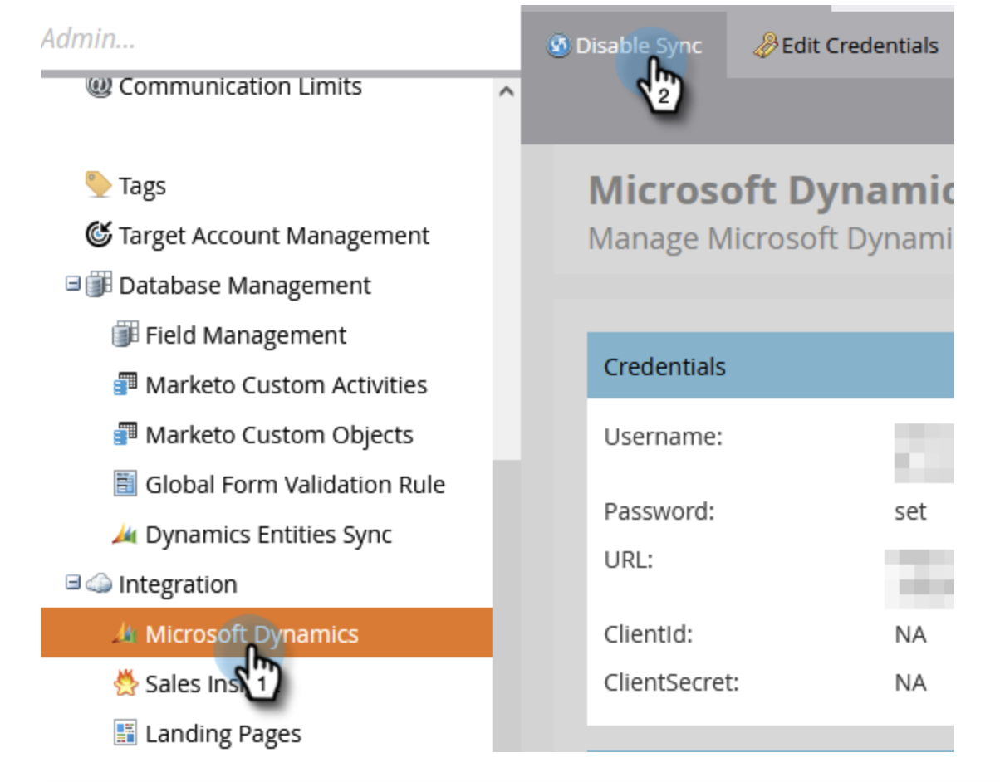
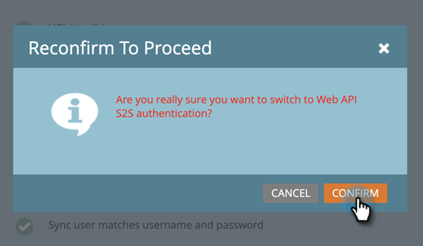

# 重新配置Dynamics身份验证方法 {#reconfigure-dynamics-authentication-method}

请按照以下步骤更新Dynamics身份验证方法。

>[!PREREQUISITES]
>
>在Microsoft Dynamics和Active Directory(Azure AD/ADFS)中使用以下任一文章中所需的身份验证方法设置应用程序：
>
>* [步骤2（共3步）：通过服务器到服务器连接设置Marketo解决方案](/help/marketo/product-docs/crm-sync/microsoft-dynamics-sync/sync-setup/microsoft-dynamics-365-with-s2s-connection/step-2-of-3-set-up.md)
>* [步骤2（共4步）：使用资源所有者密码控制连接设置Marketo解决方案](/help/marketo/product-docs/crm-sync/microsoft-dynamics-sync/sync-setup/microsoft-dynamics-365-with-ropc-connection/step-2-of-4-set-up.md)

1. 在Marketo中，单击 **管理员**.

   

1. 单击 **Microsoft Dynamics**，则 **禁用同步**.

   

   >[!NOTE]
   >
   >必须临时禁用全局同步才能更新身份验证方法。

1. 单击 **重新配置新的身份验证方法** 选项卡。

   

1. 选择所需的新身份验证方法（在本例中，我们选择的是Web API）。

   

1. 输入新的身份验证方法所需的凭据，然后单击 **验证**.

   

   >[!NOTE]
   >
   >* 具体字段将因所选的身份验证方法而异，并且表单将根据以前的身份验证方法自动更新。
   >* 如果您之前已同步，则可能会预填充上述表单中的数据。 请重新输入所有凭据，以确保正确的值。

1. 如果一切正常，验证同步将生成所有绿色复选标记 . 查看消息并单击 **交换机** 以更新身份验证方法。

   

   >[!NOTE]
   >
   >如果您看到 ，则该步骤会出现问题。 请参阅 [修复了Dynamics验证同步问题](/help/marketo/product-docs/crm-sync/microsoft-dynamics-sync/sync-setup/validate-microsoft-dynamics-sync/fix-dynamics-validation-sync-issues.md) 以识别并修复问题。 然后重新运行同步验证步骤，直到结果与上面的图像类似。

1. 单击 **确认** 以继续。

   

1. 单击 **确认** 再次。

   

1. 单击 **确定**.

   >[!IMPORTANT]
   >
   >系统需要15分钟才能接受新的身份验证模式。 请等待15分钟（从交换机开始），然后重新启用同步。
