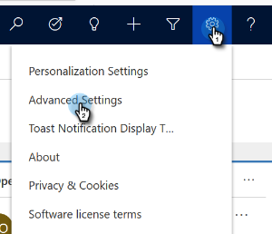
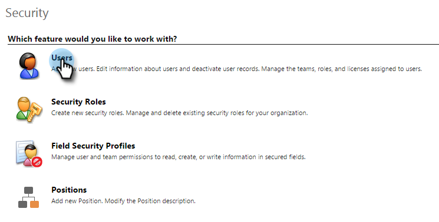

# 修复Dynamics验证同步问题{#fix-dynamics-validation-sync-issues}

## 验证同步工具结果{#validate-sync-tool-results}

运行Dynamics验证同步时，它会生成此报告。 如果步骤旁边有，请参见下面以识别并修复问题。 然后重新运行同步验证步骤，直到结果仅显示复选标记。

## URL有效{#url-is-valid}

如果此处有，请验证URL是否有效。 请在开发人员资源中找到它，并查看组织服务。 URL可能无效，原因有多种。

1. 登录Dynamics。 单击“设置”图标，然后选择“高级设置”**。**

   

1. 单击“设置”并选择“**自定义**”。

   

1. 单击&#x200B;**开发人员资源**。

   

1. 可以在服务端点下找到组织服务URL。

   

## 用户名和密码有效{#username-and-password-are-valid}

如果此处有，请验证您的Microsoft Dynamics用户名和密码是否有效。

## 将同步用户分配给Marketto Sync用户角色{#sync-user-is-assigned-to-the-marketo-sync-user-role}

如果您在此处有，则需要验证Microsoft Dynamics中是否已选中Marketo Sync用户角色。 请参阅Microsoft Dynamics安装文档的步骤2。

1. 在Dynamics中，单击设置图标，然后选择&#x200B;**高级设置**。

   

1. 单击&#x200B;**设置**&#x200B;并选择&#x200B;**安全**。

   

1. 单击&#x200B;**用户。**

   

1. 单击同步用户的链接。

   

1. 单击&#x200B;**管理角色**。

   

1. 验证是否已选中Marketo Sync用户角色。 如果没有，请检查它并单击&#x200B;**确定。**

   

## Marketo解决方案已正确安装{#marketo-solution-is-properly-installed}

如果此处有，请转到Microsoft Dynamics，验证Marketo安装是否存在。 请参阅Microsoft Dynamics设置文档的步骤1。

1. 在Dynamics中，单击设置图标，然后选择&#x200B;**高级设置**。

   

1. 单击**设置**并选择&#x200B;**解决方案。**

   

1. 验证是否列出解决方案。

   

## 解决方案中的所有步骤均已启用{#all-steps-in-the-solution-are-enabled}

如果此处有，请验证所有默认步骤均未停用。 安装时会自动启用所有步骤，但可以在自定义过程中取消激活这些步骤。

## 将同步用户分配给Marketo解决方案{#sync-user-is-assigned-to-the-marketo-solution}

如果此处有，请确保在Microsoft Dynamics的“Marketo Default”（市场默认）页面上分配了Sync用户。

1. 在Dynamics中，单击设置图标，然后选择&#x200B;**高级设置**。

   

1. 单击**设置**并选择&#x200B;**营销配置**。

   

1. 验证是否将同步用户指定为默认用户。

   

## 同步用户与用户名和密码{#sync-user-matches-username-and-password}匹配

如果此处有，请确保在Microsoft Dynamics的Marketo Config默认设置步骤的Marketo User字段中分配正确的同步用户。

>[!MORELIKETHIS]
>
>[验证Microsoft Dynamics同步](../../../../../product-docs/crm-sync/microsoft-dynamics-sync/sync-setup/validate-microsoft-dynamics-sync.md)

