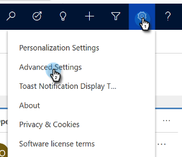
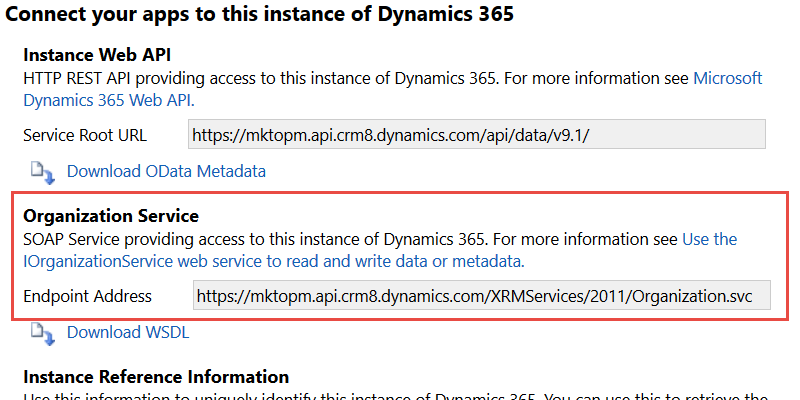

# 查看组织服务 URL {#view-the-organization-service-url}

Marketo Engage需要组织服务URL才能与MD实例同步。 下面是如何在Dynamics中找到它。

1. 登录到[!DNL Dynamics]。 单击设置图标并选择&#x200B;**[!UICONTROL Advanced Settings]**。

   

1. 单击&#x200B;**[!UICONTROL Settings]**&#x200B;并选择&#x200B;**[!UICONTROL Customizations]**。

   

1. 单击 **[!UICONTROL Developer Resources]**。

   

1. 可在&#x200B;**[!UICONTROL Service Endpoints]**&#x200B;下找到组织服务URL。

   

1. 将该URL复制并粘贴到Marketo中，然后尽情体验其余的同步过程。
