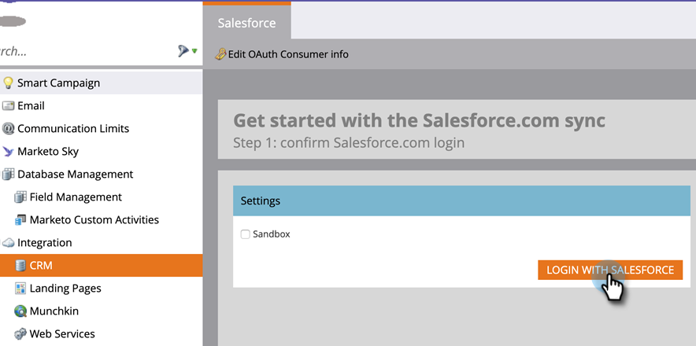

# 使用 OAuth 2.0 登录 {#log-in-using-oauth-2-0}

Salesforce使用OAuth协议，允许应用程序用户安全地访问（使用OAuth 2.0对应用程序进行身份验证）数据，而无需透露登录凭据。 以下是将Marketo Engage安全地连接并与Salesforce同步要执行的步骤。

>[!IMPORTANT]
>
>要使用OAuth连接Marketo和[!DNL Salesforce]，请通过私人（无痕化）浏览器登录Marketo以避免使用错误的用户名连接到[!DNL Salesforce]。

## 设置外部客户端应用程序 {#set-up-external-client-app}

>[!NOTE]
>
>自2025年9月起，Salesforce开始限制[连接的应用程序](https://help.salesforce.com/s/articleView?id=005132365&type=1){target="_blank"}的使用。 对于根据我们的文档设置了“连接的应用程序”的现有用户，您可以向Marketo同步用户的配置文件中添加“批准未安装的连接的应用程序”权限，或者按照以下说明创建新的外部客户端应用程序。

1. 在Salesforce中，单击齿轮图标并选择&#x200B;**设置**。

   

1. 在“快速查找”框中，键入`App Manager`，然后选择&#x200B;**应用程序管理器**。

   

1. 单击&#x200B;**新建外部客户端应用程序**。

   

1. 在&#x200B;_基本信息_&#x200B;下填写详细信息。 将&#x200B;_分发状态_&#x200B;设置为&#x200B;**本地**。

   

1. 展开&#x200B;**API（启用OAuth设置）**&#x200B;部分并选择&#x200B;**[!UICONTROL Enable OAuth]**&#x200B;复选框。 对于&#x200B;_回调URL_，请输入`https://app.marketo.com/salesforce/getSfdcOAuthTokensRedirect`。 选择所有可用的OAuth范围，然后单击向右箭头添加它们。

   

1. 在&#x200B;_流量启用_&#x200B;下，确保未选中任何框。

   

1. 在&#x200B;_安全性_&#x200B;下，确保只选择&#x200B;**Web服务器流需要密码**&#x200B;和&#x200B;**刷新令牌流需要密码**。

   

1. 跳过最后四个部分，然后单击&#x200B;**创建**。

   

1. 创建新的外部客户端应用程序后，选择&#x200B;**设置**&#x200B;选项卡并展开&#x200B;**OAuth设置**&#x200B;部分。

   

1. 单击&#x200B;**使用者密钥和密码**&#x200B;按钮，提示打开一个新选项卡。 复制并保存这两个数字(稍后您将需要它们以在Marketo Engage中使用)。

   

## 设置Marketo {#set-up-marketo}

>[!PREREQUISITES]
>
>* 必须为Salesforce同步用户启用API访问权限(如果您是Salesforce Professional Edition用户，则默认情况下无法访问该权限 — 请联系您的Salesforce帐户管理员)。
>* 必须在Salesforce中创建Marketo同步用户。
>* 对于现有客户，在客户的订阅上启用了“为SFDC同步启用OAuth”功能。
>* 禁用了弹出窗口阻止程序。
>* 已创建连接的应用程序，并且我们有[!UICONTROL Consumer Key]和[!UICONTROL Consumer Secret]可供使用。

>[!CAUTION]
>
>在单击&#x200B;**[!UICONTROL Sync Fields]**&#x200B;之前，请确保向同步用户隐藏Marketo中不需要的所有字段。 单击“同步字段”后，用户在SFDC中可以看到的所有字段都将在Marketo中永久创建，并且无法删除。

1. 在“Marketo管理员”部分中，单击&#x200B;**[!UICONTROL CRM]**，然后单击&#x200B;**[!UICONTROL Sync with Salesforce]**。

   

1. 添加您之前记录的使用者密钥和使用者密钥信息，然后单击&#x200B;**[!UICONTROL Save]**。

   

1. 在Marketo Salesforce同步页面上，单击&#x200B;**[!UICONTROL Login with Salesforce]**&#x200B;按钮。

   

   >[!CAUTION]
   >
   >如果您看到“用户名/密码/令牌”字段而不是“使用Salesforce登录”按钮，则会启用Marketo订阅以进行基本身份验证。 请参阅[使用基本身份验证设置Marketo](/help/marketo/product-docs/crm-sync/salesforce-sync/setup/enterprise-unlimited-edition/step-3-of-3-connect-marketo-and-salesforce-enterprise-unlimited.md){target="_blank"}。 使用一组凭据开始同步后，不会切换Salesforce凭据或订阅。 要为Salesforce身份验证设置Oauth 2.0，请联系[Marketo支持](https://nation.marketo.com/t5/support/ct-p/Support){target="_blank"}。

1. 此时将显示一个包含salesforce登录页面的弹出窗口。 键入“Marketo同步用户”凭据并登录。

   

1. 输入您通过电子邮件收到的验证码(由Salesforce发送)，然后单击&#x200B;**[!UICONTROL Verify]**。

   

1. 成功验证后，访问页面将显示请求访问。 单击 **[!UICONTROL Allow]**。

   

1. 几分钟后，Marketo中将出现弹出窗口。 单击 **[!UICONTROL Confirm Credentials]**。

   

1. 字段同步完成后，单击&#x200B;**[!UICONTROL Start Salesforce Sync]**。

   

1. 单击 **[!UICONTROL Start Sync]**。

   

您在Marketo和[!DNL Salesforce]之间的同步正在进行中。

>[!MORELIKETHIS]
>
>* [第1步（共3步）：将Marketo字段添加到Salesforce (Enterprise/Unlimited)](/help/marketo/product-docs/crm-sync/salesforce-sync/setup/enterprise-unlimited-edition/step-1-of-3-add-marketo-fields-to-salesforce-enterprise-unlimited.md){target="_blank"}
>* [第2步（共3步）：为Marketo (Enterprise/Unlimited)创建Salesforce用户](/help/marketo/product-docs/crm-sync/salesforce-sync/setup/enterprise-unlimited-edition/step-2-of-3-create-a-salesforce-user-for-marketo-enterprise-unlimited.md){target="_blank"}
>* [在Salesforce AppExchange中安装Marketo Sales Insight包](/help/marketo/product-docs/marketo-sales-insight/msi-for-salesforce/installation/install-marketo-sales-insight-package-in-salesforce-appexchange.md){target="_blank"}
>* [在Marketo Enterprise/Unlimited中配置Salesforce Sales Insight](/help/marketo/product-docs/marketo-sales-insight/msi-for-salesforce/configuration/configure-marketo-sales-insight-in-salesforce-enterprise-unlimited.md){target="_blank"}
