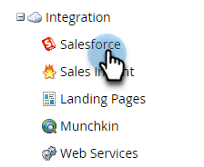

# Salesforce同步积压量度  {#salesforce-sync-backlog-metrics}

同步积压是用于挂起同步的记录的名称。 它负责处理从Salesforce到Marketo Engage的待同步记录，反之亦然。 确保积压事项得到控制将实现平稳的时间同步。 积压事项包括两侧的待处理同步发布更新的数量，而不是同步流程步骤(如Sync Lead to SFDC流程步骤)处理的数量。

## 如何访问 {#how-to-access}

1. 在Marketo Engage中，转到&#x200B;**管理员**&#x200B;区域。

   

1. 选择&#x200B;**Salesforce**。

   

## 同步积压事项趋势 {#sync-backlog-trend}

积压趋势反映过去5天记录的积压更改。 积压以4小时间隔显示，间隔为5天。 因此，该图表将每天显示6个间隔，乘以5天，这等于30个间隔。

在x轴上以特定的4小时间隔观察积压。 此值适用于正在同步的所有对象。 这是Salesforce和Marketo Engage中等待同步的积压工作总数。

## 同步吞吐量和积压 {#sync-throughput-and-backlog}

统计信息反映过去24小时内同步下每种对象类型的吞吐量和积压状态。 对象类型包括同步下的所有对象，包括：潜在客户、联系人、帐户、机会、促销活动、用户和自定义对象。 吞吐量统计信息每15分钟自动刷新一次，但您可以使用刷新图标手动刷新。 每小时获取积压一次。

>[!NOTE]
>
>统计信息是按滚动日期更新的，而不是按日历日更新。

<table><thead>
  <tr>
    <th>字段</th>
    <th>描述</th>
  </tr></thead>
<tbody>
  <tr>
    <td>同步的最大记录数/小时</td>
    <td>对象类型在过去24小时内观察到的每小时同步的最大记录数（最大吞吐量）。 24小时期间会随时间滚动，而不是随着日历日滚动。</td>
  </tr>
  <tr>
    <td>同步的最小记录数/小时</td>
    <td>对象类型在过去24小时内每小时同步的最小记录数（最小吞吐量）。 24小时期间会随时间滚动，而不是随着日历日滚动。</td>
  </tr>
  <tr>
    <td>平均同步记录数/小时</td>
    <td>对象类型在过去24小时内每小时同步的平均记录数（最小吞吐量）。 24小时期间会随时间滚动，而不是随着日历日滚动。 此值计算为过去24小时内同步的总记录数。</td>
  </tr>
  <tr>
    <td>同步积压</td>
    <td>对象类型的待同步记录的积压。 它是两个方向(从Salesforce到Marketo Engage，反之亦然)的待处理同步总数。 来自Salesforce的积压事项是通过Salesforce的API调用获得的，来自Marketo Engage的积压事项是使用从更改数据日志获得的统计信息计算的。 每小时计算一次。 此表中的下两个字段分别通知上次计算积压的时间，以及下一个计算计划。</td>
  </tr>
  <tr>
    <td>估计积压（时间）</td>
    <td>按对象类型同步积压所需的估计时间。 计算为“同步积压/每小时同步的平均记录数”。</td>
  </tr>
  <tr>
    <td>上次获取的积压工作</td>
    <td>上次积压计算的时间。</td>
  </tr>
  <tr>
    <td>积压下一个获取</td>
    <td>下次积压计算的时间。</td>
  </tr>
  <tr>
    <td>积压状态</td>
    <td>这会显示积压在过去6小时内是否有所增加。 如果当前积压大于6小时前记录的积压，则推断为“正在增长”。 否则，将显示为“正常”。 这是为了显示同步吞吐量是否正在赶上积压工作。</td>
  </tr>
</tbody></table>

## 导致同步积压的原因 {#what-causes-sync-backlogs}

无论是在Marketo Engage端还是CRM端进行更新，都会触发要重新同步的记录，以通过常规的Marketo Engage到CRM同步周期更新另一端的信息。 每当对Salesforce上的记录进行更新时，都会生成一个系统修改时间戳，称为“SysModStamp”。 此队列将更改排入同步队列。

当进行大量更新（例如更改字段值）时，许多记录会更改，从而导致出现新的SysModStamps。 随后，大量人员记录更新需要在Marketo Engage与您的CRM之间重新同步，有时会创建临时积压。

## 管理同步积压的最佳实践 {#best-practices}

对同步用户可见的&#x200B;**字段**：确保对同步可见的字段仅为需要同步且对营销工作有价值的字段。 如果对Salesforce中的记录所做的任何更新更新更新了上次修改的时间戳，则会将记录排队到同步积压中，并且不必要的字段同步可能会减慢同步下更重要的字段的速度。 如果对同步用户隐藏不必要的字段，则对这些字段的更新将导致跳过，其速度比更新快得多。 与您的Salesforce管理员合作，在[此处](https://nation.marketo.com/t5/marketo-whisperer-blogs/best-practices-for-determining-which-fields-to-sync-with-marketo/ba-p/247449){target="_blank"}查看最佳实践，并更新Marketo同步用户可见的字段。

**隐藏或筛选不必要的记录**：如果记录不可销售，则可能会浪费同步资源。 如果同步用户看不到它，则不会浪费尝试同步它的资源。 [Marketo Engage支持](https://nation.marketo.com/t5/support/ct-p/Support#_blank){target="_blank"}可以协助设置同步筛选器，以根据其他条件禁止同步记录。 有关设置自定义同步筛选器[的详细信息，请参阅此处](https://nation.marketo.com/t5/product-blogs/instructions-for-creating-a-custom-sync-rule/ba-p/242758){target="_blank"}。 强烈建议在Salesforce中使用索引字段（请联系Salesforce以了解更多信息）。

**在非关键时间安排批量更新**：查看您的数据同步模式以识别非关键时间段。 如果可能，检查是否可以在这些非关键时段中计划批量更新。

**频繁更新的字段**：某些字段容易频繁更新。 例如，货币字段可能会发生货币更改。 检查这些字段是否需要同步，或者字段的设计是否应不同。 如果您有其他频繁更新且不需要的字段，请向同步用户隐藏它们。 请务必与您的SFDC管理员集成讨论可能会更新字段的问题。

**自定义对象**：定期查看[自定义对象](https://experienceleague.adobe.com/en/docs/marketo/using/product-docs/crm-sync/salesforce-sync/sfdc-sync-details/sfdc-sync-custom-object-sync){target="_blank"}，这些自定义对象已启用同步并禁用不再需要同步的自定义对象。

**活动**： [检查是否有任何活动](https://experienceleague.adobe.com/en/docs/marketo/using/product-docs/crm-sync/salesforce-sync/setup/optional-steps/customize-activities-sync){target="_blank"}启用了可从同步中删除的同步。  每个潜在客户每天只能同步一次这些活动。

**查看同步错误**：异常处理可能会减慢同步速度。 查看用户通知并解决错误可以改善同步运行状况。

**联系支持人员**：如果您正在遵循上述所有最佳实践并且仍然遇到大量积压问题，请联系[Marketo Engage支持人员](https://nation.marketo.com/t5/support/ct-p/Support#_blank){target="_blank"}。
