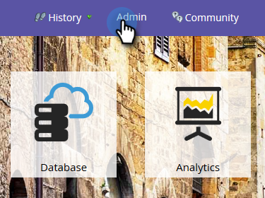

# Salesforce同步状态 {#salesforce-sync-status}

使用同步状态仪表板可以查看同步步骤中的同步状态及其成功状态。

同步步骤反映对象架构和数据本身的每种对象类型执行的推送或拉取操作。 统计信息涵盖同步期间的新记录、更新、删除和失败计数。 用户可以按日期、操作类型或对象类型进行过滤。 同步状态仪表板显示过去五天的同步周期状态。

>[!NOTE]
>
>需要管理员权限

## 查看同步状态 {#view-sync-status}

1. 单击 **管理员**.

   

1. 在集成下，单击Salesforce，然后单击同步状态选项卡。

   

默认情况下，统计信息将按最近启动进行排序。 您可以通过单击排序图标，按“开始于”或“结束于”（从最近到最旧）进行排序。

## 筛选器同步状态 {#filter-sync-status}

1. 要筛选数据，请单击页面最右侧的筛选图标。

   

1. 选择您的日期和时间范围，然后单击下拉菜单以按对象类型、操作类型和/或状态类型进行筛选。

   

1. 单击 **应用**.

   

**可选步骤**：要导出同步错误，请单击 **导出**. 数据将导出为CSV。

## 同步状态字段 {#sync-status-fields}

<table> 
 <colgroup> 
  <col> 
  <col> 
  <col> 
 </colgroup> 
 <tbody> 
  <tr> 
   <th>字段</th> 
   <th>描述</th> 
   <th>枚举值</th> 
  </tr> 
  <tr> 
   <td colspan="1">开始时间</td> 
   <td colspan="1">同步周期的开始日期/时间（用户的时区）</td> 
   <td colspan="1"></td> 
  </tr>  
  <tr> 
   <td colspan="1">结束时间</td> 
   <td colspan="1">同步周期结束日期/时间（用户的时区）</td> 
   <td colspan="1"></td> 
  </tr> 
  <tr> 
   <td colspan="1">对象</td> 
   <td colspan="1">对象类型</td> 
   <td colspan="1">Contact 、 Person 、 Task 、 Opportunity 、 Lead 、 Others ，如下所示</td> 
  </tr>  
  <tr> 
   <td colspan="1">操作</td> 
   <td colspan="1">操作类型</td> 
   <td colspan="1">操作类型，如下所示</td> 
  </tr>  
  <tr> 
   <td colspan="1">状态</td> 
   <td colspan="1">批次的状态</td> 
   <td colspan="1">成功、失败、不完整、正在处理、已清理*</td> 
  </tr>
  <tr> 
   <td colspan="1">新</td> 
   <td colspan="1">新记录计数</td> 
   <td colspan="1"></td> 
  </tr>  
  <tr> 
   <td colspan="1">已更新</td> 
   <td colspan="1">已更新记录计数</td> 
   <td colspan="1"></td> 
  </tr>  
  <tr> 
   <td colspan="1">已删除</td> 
   <td colspan="1">删除的记录数</td> 
   <td colspan="1"></td> 
  </tr> 
  <tr> 
   <td colspan="1">失败的项目</td> 
   <td colspan="1">同步失败的记录数</td> 
   <td colspan="1"> </td> 
  </tr>  
  <tr> 
   <td colspan="1">已跳过</td> 
   <td colspan="1">由于同步感兴趣的字段未发生更改而跳过的记录数</td> 
   <td colspan="1"></td> 
  </tr>  
 </tbody> 
</table>

&#42;同步步骤失败后，数据恢复到以前的完整性状态。

## 对象类型 {#object-type}

<table> 
 <colgroup> 
  <col> 
 </colgroup> 
 <tbody> 
  <tr> 
   <td colspan="1">帐户</td> 
  </tr>  
  <tr> 
   <td colspan="1">帐户类型</td> 
  </tr> 
  <tr> 
   <td colspan="1">自定义对象</td> 
  </tr>  
  <tr> 
   <td colspan="1">Campaign</td> 
  </tr>  
  <tr> 
   <td colspan="1">营销活动成员状态</td> 
  </tr>
  <tr> 
   <td colspan="1">联系人</td> 
  </tr>  
  <tr> 
   <td colspan="1">电子邮件模板</td> 
  </tr>  
  <tr> 
   <td colspan="1">Event</td> 
  </tr> 
  <tr> 
   <td colspan="1">人员（潜在客户）</td> 
  </tr>  
  <tr> 
   <td colspan="1">机会</td> 
  </tr>  
  <tr> 
   <td colspan="1">机会联系人角色</td> 
  </tr>  
  <tr> 
   <td colspan="1">任务</td> 
  </tr>  
  <tr> 
   <td colspan="1">用户</td> 
  </tr>  
 </tbody> 
</table>

## 操作类型 {#operation-type}

<table> 
 <colgroup> 
  <col> 
  <col> 
  <col>
  <col> 
 </colgroup> 
 <tbody> 
  <tr> 
   <th>操作类型</th> 
   <th>对这些对象找到</th> 
   <th>备注</th> 
   <th>操作类型</th>
  </tr> 
  <tr> 
   <td colspan="1">与项目群之间的初始链接</td> 
   <td colspan="1">Campaign</td> 
   <td colspan="1">将营销活动链接到项目群</td> 
   <td colspan="1">更新</td>
  </tr>  
  <tr> 
   <td colspan="1">拉取转化</td> 
   <td colspan="1">人员（潜在客户）*</td> 
   <td colspan="1">提取从SFDC到Marketo的转换操作。 单位（编号）是指转换为联系人的潜在客户</td> 
   <td colspan="1">更新，失败项目或跳过</td>
  </tr> 
  <tr> 
   <td colspan="1">提取删除</td> 
   <td colspan="1">联系人、人员（潜在客户）、机会、营销活动、营销活动成员、机会联系人、自定义对象、营销活动、营销活动成员状态、机会联系人角色</td> 
   <td colspan="1">正在同步到Marketo的SFDC的已删除记录</td> 
   <td colspan="1">已删除、失败项目或已跳过</td>
  </tr>  
  <tr> 
   <td colspan="1">提取更新</td> 
   <td colspan="1">任务，人员（销售线索），人员（销售线索）队列，联系人，事件，机会，客户，帐户类型，促销活动成员，自定义对象，促销活动，促销活动成员状态，事件，人员状态，机会，机会联系人角色</td> 
   <td colspan="1">SFDC中的更新或新记录已同步到Marketo，将事件提取为活动</td> 
   <td colspan="1">新项、更新项、失败项或已跳过</td>
  </tr>  
  <tr> 
   <td colspan="1">推送新内容</td> 
   <td colspan="1">任务，电子邮件模板</td> 
   <td colspan="1">推送任务（活动）</td> 
   <td colspan="1"></td>
  </tr>
  <tr> 
   <td colspan="1">推送更新</td> 
   <td colspan="1">任务、电子邮件模板、人员、联系人、营销活动</td> 
   <td colspan="1">正在将更新推送到SFDC并删除</td> 
   <td colspan="1">更新，失败项目或跳过</td>
  </tr>  
  <tr> 
   <td colspan="1">同步架构</td> 
   <td colspan="1">营销活动成员、自定义对象、营销活动、营销活动成员状态、任务、人员、机会、机会联系人角色、用户</td> 
   <td colspan="1">同步不同对象的元数据，以确定在下一个周期中同步哪些新字段</td> 
   <td colspan="1"></td>
  </tr>  
  <tr> 
   <td colspan="1">与程序同步</td> 
   <td colspan="1">营销活动</td> 
   <td colspan="1">将Marketo计划与SFDC营销活动同步</td> 
   <td colspan="1">新增、更新、失败或跳过</td>
  </tr> 
  <tr> 
   <td colspan="1">更新活动</td> 
   <td colspan="1">任务</td> 
   <td colspan="1">从Salesforce中提取活动</td> 
   <td colspan="1"></td>
  </tr>  
  <tr> 
   <td colspan="1">更新FKS</td> 
   <td colspan="1">全部</td> 
   <td colspan="1">更新所有对象的外键</td> 
   <td colspan="1">不适用</td>
  </tr>  
 </tbody> 
</table>

&#42;订阅级别的品牌策略配置决定报告中的标签 — “潜在客户”或“人员”。
