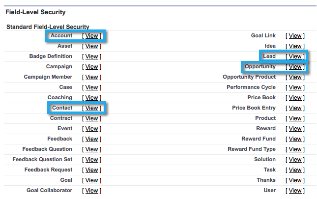

# 第2步，共3步：为Marketo创建Salesforce用户(Enterprise/Unlimited){#step-of-create-a-salesforce-user-for-marketo-enterprise-unlimited}

>[!NOTE]
>
>这些步骤必须由Salesforce管理员完成

>[!PREREQUISITES]
>
>* [第1步，共3步：将Marketo字段添加到Salesforce(Enterprise/Unlimited)](step-1-of-3-add-marketo-fields-to-salesforce-enterprise-unlimited.md)

>

在本文中，您将在Salesforce用户档案中设置用户权限，并创建Marketo-Salesforce集成帐户。

## 创建用户档案{#create-a-profile}

1. 单击&#x200B;**安装程序**。

   

1. 在Nav搜索栏中键入“用户档案”并单击&#x200B;**用户档案**&#x200B;链接。

   

1. 单击&#x200B;**新建**。

   

1. 选择&#x200B;**标准用户**，将用户档案命名为“Marketo-Salesforce同步”，然后单击&#x200B;**保存**。

   

## 设置用户档案权限{#set-profile-permissions}

1. 单击&#x200B;**编辑**&#x200B;以设置安全权限。

   

1. 在&#x200B;**管理权限**&#x200B;部分下，确保选中以下框：

   * 已启用API
   * 编辑HTML模板
   * 管理公共文档
   * 管理公共模板

   

   >[!TIP]
   >
   >确保选中&#x200B;**密码永不过期**&#x200B;框。

1. 在“一般用户权限”部分下，确保选中以下框：

   * 转换潜在客户
   * 编辑事件
   * 编辑任务

   

1. 在“标准对象权限”部分下，确保选中“读取”、“创建”、“编辑”和“删除”权限：

   * 帐户
   * 活动
   * 联系人
   * 潜在客户
   * 机会

   >[!NOTE]
   >
   >如果您计划使用活动同步，请授予活动权限。

   

1. 完成后，单击页面底部的&#x200B;**保存**。

   

## 设置字段权限{#set-field-permissions}

1. 与营销人员讨论，了解同步所需的自定义字段。

   >[!NOTE]
   >
   >此步骤将阻止您不需要的字段显示在Marketo中，这将减少杂乱情况并加快同步速度。

1. 在用户档案详细信息页中，转至&#x200B;**Field-Level Security**&#x200B;部分。 单击&#x200B;**视图**&#x200B;可编辑对象的辅助功能：

   * `Lead`
   * `Contact`
   * `Account`
   * `Opportunity`

   >[!TIP]
   >
   >您可以根据组织的需要配置其他对象。

   

1. 对于每个对象，单击&#x200B;**编辑**。

   

1. 找到不需要的字段，确保未选中**读取访问&#x200B;**和**&#x200B;编辑访问**。 完成后，单击&#x200B;**保存**。

   >[!NOTE]
   >
   >**提醒**
   >
   >
   >仅编辑自定义字段的辅助功能。

   

1. 在禁用所有不需要的字段后，必须选中**读取访问和编辑访问**以下对象字段。 完成后，单击&#x200B;**保存**。

<table> 
 <tbody> 
  <tr> 
   <th colspan="1" rowspan="1">
对象
</th> 
   <th colspan="1" rowspan="1">
字段
</th> 
  </tr> 
  <tr> 
   <td colspan="1" rowspan="1">
帐户
</td> 
   <td colspan="1" rowspan="1">
类型字段
</td> 
  </tr> 
  <tr> 
   <td colspan="1" rowspan="1">
事件
</td> 
   <td colspan="1" rowspan="1">
所有字段
</td> 
  </tr> 
  <tr> 
   <td colspan="1" rowspan="1">
任务
</td> 
   <td colspan="1" rowspan="1">
所有字段
</td> 
  </tr> 
 </tbody> 
</table>

## 创建Marketo-Salesforce同步帐户{#create-marketo-salesforce-sync-account}

>[!TIP]
>
>创建专用的Salesforce帐户(例如，[`[email protected]`](http://docs.marketo.com/cdn-cgi/l/email-protection#89e4e8fbe2ecfde6c9f0e6fcfbeae6e4f9e8e7f0a7eae6e4))来区分Marketo与其他Salesforce用户所做的更改。

1. 在Nav搜索栏中键入“Manage users”，然后单击&#x200B;**Users**。 单击&#x200B;**新建用户**。

   

1. 填写必填字段。 然后，选择&#x200B;**用户许可证：Salesforce**&#x200B;和您之前创建的用户档案。 完成后，单击&#x200B;**保存**。

   

第2步（共2步）已完成。

>[!NOTE]
>
>**相关文章**
>
>* [第3步，共3步：Connect Marketo和Salesforce(Enterprise/Unlimited)](step-3-of-3-connect-marketo-and-salesforce-enterprise-unlimited.md)

>

