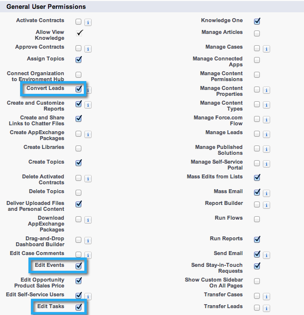

# 第2步（共3步）：创建Salesforce User for Marketo (Enterprise/Unlimited) {#step-of-create-a-salesforce-user-for-marketo-enterprise-unlimited}

>[!NOTE]
>
>这些步骤必须由Salesforce管理员完成

>[!PREREQUISITES]
>
>[第1步（共3步）：将Marketo字段添加到Salesforce (Enterprise/Unlimited)](/help/marketo/product-docs/crm-sync/salesforce-sync/setup/enterprise-unlimited-edition/step-1-of-3-add-marketo-fields-to-salesforce-enterprise-unlimited.md)

在本文中，您将在Salesforce配置文件中设置用户权限，并创建一个Marketo-Salesforce集成帐户。

## 创建配置文件 {#create-a-profile}

1. 单击 **设置**.

   

1. 在导航搜索栏中键入“profiles”，然后单击 **配置文件** 链接。

   

1. 单击 **新**.

   

1. 选择 **标准用户**，将配置文件命名为“Marketo-Salesforce Sync”，然后单击 **保存**.

   

## 设置配置文件权限 {#set-profile-permissions}

1. 单击 **编辑** 以设置安全权限。

   

1. 在 **管理权限** 部分，确保选中了以下复选框：

   * API已启用
   * 编辑模板HTML
   * 管理公共文档
   * 管理公共模板

   

   >[!TIP]
   >
   >请务必检查 **密码永不过期** 盒子。

1. 在“常规用户权限”部分下，确保选中以下复选框：

   * 转换潜在客户
   * 编辑事件
   * 编辑任务

   

1. 在“标准对象权限”部分下，确保选中“读取”、“创建”、“编辑”和“删除”权限：

   * 帐户
   * 营销活动
   * 联系人
   * 潜在客户
   * 机会

   >[!NOTE]
   >
   >如果您计划使用Campaign同步，请向促销活动授予权限。

   

1. 完成后，单击 **保存** 页面底部的。

   

## 设置字段权限 {#set-field-permissions}

1. 与您的营销人员讨论，了解哪些自定义字段是同步所必需的。

   >[!NOTE]
   >
   >此步骤将阻止您不需要的字段显示在Marketo中，这将减少杂乱并加快同步速度。

1. 在配置文件详细信息页面中，转到 **字段级安全性** 部分。 单击 **视图** 要编辑对象的辅助功能，请执行以下操作：

   * 商机
   * 联系人
   * 帐户
   * 机会

   >[!TIP]
   >
   >您可以根据组织的需求配置其他对象。

   

1. 对于每个对象，单击 **编辑**.

   

1. 找到不需要的字段，确保 **读取权限** 和 **编辑访问权限** 将取消选中。 单击 **保存** 等你完事了。

   >[!NOTE]
   >
   >仅编辑自定义字段的辅助功能。

   

1. 禁用完所有不需要的字段后，必须选中 **读取权限和编辑权限** 对象字段。 单击 **保存** 等你完事了。

<table> 
 <tbody> 
  <tr> 
   <th colspan="1" rowspan="1">
对象
</th> 
   <th colspan="1" rowspan="1">
字段
</th> 
  </tr> 
  <tr> 
   <td colspan="1" rowspan="1">
帐户
</td> 
   <td colspan="1" rowspan="1">
类型字段
</td> 
  </tr> 
  <tr> 
   <td colspan="1" rowspan="1">
Event
</td> 
   <td colspan="1" rowspan="1">
所有字段
</td> 
  </tr> 
  <tr> 
   <td colspan="1" rowspan="1">
任务
</td> 
   <td colspan="1" rowspan="1">
所有字段
</td> 
  </tr> 
 </tbody> 
</table>

## 创建Marketo-Salesforce同步帐户 {#create-marketo-salesforce-sync-account}

>[!TIP]
>
>创建一个专用的Salesforce帐户(例如marketo@yourcompany.com)，以区分Marketo与其他Salesforce用户所做的更改。

1. 在导航搜索栏中键入“Manage users”，然后单击 **用户**. 单击 **新用户**.

   

1. 填写必填字段。 然后，选择 **用户许可证： Salesforce** 以及您之前创建的配置文件。 单击 **保存** 等你完事了。

   

第2步（共2步）已完成。

>[!NOTE]
>
>[第3步（共3步）：连接Marketo和Salesforce (Enterprise/Unlimited)](/help/marketo/product-docs/crm-sync/salesforce-sync/setup/enterprise-unlimited-edition/step-3-of-3-connect-marketo-and-salesforce-enterprise-unlimited.md)
