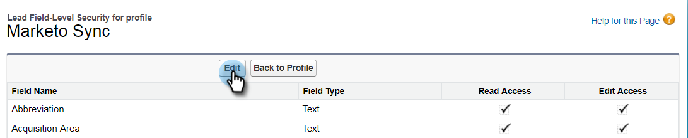

# 第2步（共3步）：为Marketo (Enterprise/Unlimited)创建[!DNL Salesforce]用户 {#step-of-create-a-salesforce-user-for-marketo-enterprise-unlimited}

>[!NOTE]
>
>这些步骤必须由[!DNL Salesforce]管理员完成

>[!PREREQUISITES]
>
>[第1步（共3步）：将Marketo字段添加到 [!DNL Salesforce] (Enterprise/Unlimited)](/help/marketo/product-docs/crm-sync/salesforce-sync/setup/enterprise-unlimited-edition/step-1-of-3-add-marketo-fields-to-salesforce-enterprise-unlimited.md)

在本篇文章中，您将在[!DNL Salesforce]配置文件中设置用户权限，并创建一个Marketo-[!DNL Salesforce]集成帐户。

## 创建配置文件 {#create-a-profile}

1. 单击 **[!UICONTROL Setup]**。

   

1. 在导航搜索栏中键入“profiles”，然后单击&#x200B;**[!UICONTROL Profiles]**&#x200B;链接。

   

1. 单击&#x200B;**[!UICONTROL New]**。

   

1. 选择&#x200B;**[!UICONTROL Standard User]**，将配置文件命名为“Marketo-Salesforce Sync”，然后单击&#x200B;**[!UICONTROL Save]**。

   

## 设置配置文件权限 {#set-profile-permissions}

1. 单击&#x200B;**[!UICONTROL Edit]**&#x200B;设置安全权限。

   

1. 在&#x200B;**[!UICONTROL Administrative Permissions]**&#x200B;部分下，确保选中以下复选框：

   * [!UICONTROL API Enabled]
   * [!UICONTROL Edit HTML Templates]
   * [!UICONTROL Manage Public Documents]
   * [!UICONTROL Manage Public Templates]

   

   >[!TIP]
   >
   >请务必选中&#x200B;**[!UICONTROL Password Never Expires]**&#x200B;框。

1. 在[!UICONTROL General User Permissions]部分下，确保选中以下复选框：

   * [!UICONTROL Convert Leads]
   * [!UICONTROL Edit Events]
   * [!UICONTROL Edit Tasks]

   

1. 在[!UICONTROL Standard Object Permissions]部分下，确保检查[!UICONTROL Read, Create, Edit, and Delete]权限：

   * [!UICONTROL Accounts]
   * [!UICONTROL Campaigns]
   * [!UICONTROL Contacts]
   * [!UICONTROL Leads]
   * [!UICONTROL Opportunities]

   >[!NOTE]
   >
   >如果您计划使用Campaign同步，请向[!UICONTROL Campaigns]授予权限。

   

1. 完成后，单击页面底部的&#x200B;**[!UICONTROL Save]**。

   

## 设置字段权限 {#set-field-permissions}

1. 与您的营销人员讨论，了解哪些自定义字段是同步所必需的。

   >[!NOTE]
   >
   >此步骤将阻止您不需要的字段显示在Marketo中，这将减少杂乱并加快同步速度。

1. 在配置文件详细信息页面中，转到&#x200B;**[!UICONTROL Field-Level Security]**&#x200B;部分。 单击&#x200B;**[!UICONTROL View]**&#x200B;可编辑对象的辅助功能：

   * [!UICONTROL Lead]
   * [!UICONTROL Contact]
   * [!UICONTROL Account]
   * [!UICONTROL Opportunity]

   >[!TIP]
   >
   >您可以根据组织的需求配置其他对象。

   

1. 对于每个对象，单击&#x200B;**[!UICONTROL Edit]**。

   

1. 找到不需要的字段，确保取消选中&#x200B;**[!UICONTROL Read Access]**&#x200B;和&#x200B;**[!UICONTROL Edit Access]**。 完成后，单击&#x200B;**[!UICONTROL Save]**。

   >[!NOTE]
   >
   >仅编辑自定义字段的辅助功能。

   

1. 在禁用完所有不需要的字段后，必须检查&#x200B;**[!UICONTROL Read Access and Edit Access]**&#x200B;中的以下对象字段。 完成后，单击&#x200B;**[!UICONTROL Save]**。

<table>
 <tbody>
  <tr>
   <th>对象</th>
   <th>字段</th>
  </tr>
  <tr>
   <td>帐户</td>
   <td>类型字段</td>
  </tr>
  <tr>
   <td>活动</td>
   <td>所有字段</td>
  </tr>
  <tr>
   <td>任务</td>
   <td>所有字段</td>
  </tr>
 </tbody>
</table>

## 创建Marketo-Salesforce同步帐户 {#create-marketo-salesforce-sync-account}

>[!TIP]
>
>创建专用的[!DNL Salesforce]帐户（例如<marketo@yourcompany.com>），以区分Marketo所做的更改与其他[!DNL Salesforce]用户所做的更改。

1. 在导航搜索栏中键入“管理用户”，然后单击&#x200B;**[!UICONTROL Users]**。 单击&#x200B;**[!UICONTROL New User]**。

   

1. 填写必填字段。 然后，选择&#x200B;**[!UICONTROL User License: Salesforce]**&#x200B;和您之前创建的配置文件。 完成后，单击&#x200B;**[!UICONTROL Save]**。

   

第2步（共3步）已完成。

>[!NOTE]
>
>[第3步（共3步）：连接Marketo和 [!DNL Salesforce] (Enterprise/Unlimited)](/help/marketo/product-docs/crm-sync/salesforce-sync/setup/enterprise-unlimited-edition/step-3-of-3-connect-marketo-and-salesforce-enterprise-unlimited.md)
