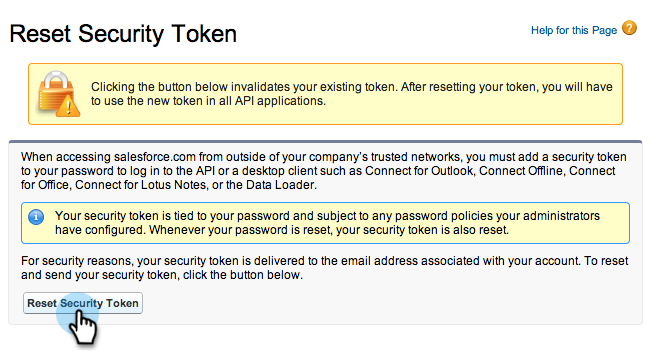

# 步骤3（共3步）：连接Marketo和Salesforce（企业/无限制） {#step-of-connect-marketo-and-salesforce-enterprise-unlimited}

在本文中，您将配置Marketo以与配置的Salesforce实例同步。

>[!PREREQUISITES]
>
>* [步骤1（共3步）：将Marketo字段添加到Salesforce（企业/无限制）](/help/marketo/product-docs/crm-sync/salesforce-sync/setup/enterprise-unlimited-edition/step-1-of-3-add-marketo-fields-to-salesforce-enterprise-unlimited.md)
>* [步骤2（共3步）：为Marketo创建Salesforce用户（企业/无限制）](/help/marketo/product-docs/crm-sync/salesforce-sync/setup/enterprise-unlimited-edition/step-2-of-3-create-a-salesforce-user-for-marketo-enterprise-unlimited.md)

## 检索同步用户安全令牌 {#retrieve-sync-user-security-token}

>[!TIP]
>
>如果您已经具有安全令牌，请直接转到设置同步用户凭据和备份！

1. 使用Marketo同步用户登录Salesforce，单击同步用户的名称，然后 **我的设置**.

   

1. 在快速查找中，键入“reset”并单击 **重置我的安全令牌**.

   

1. 单击 **重置安全令牌**.

   

   安全令牌将通过电子邮件发送给您。

## 设置同步用户凭据 {#set-sync-user-credentials}

1. 在Marketo，转到 **管理员**，选择 **CRM**，然后单击 **与同步 [Salesforce.com](https://Salesforce.com)**

   

   >[!NOTE]
   >
   >一定要 [隐藏您不需要的所有字段](/help/marketo/product-docs/crm-sync/salesforce-sync/sfdc-sync-details/hide-a-salesforce-field-from-the-marketo-sync.md) 在Marketo中单击 **同步字段**. 单击“同步字段”后，用户可以看到的所有字段都将在Marketo中永久创建，并且无法删除。

1. 输入在Salesforce配置第2部分中创建的Salesforce同步用户凭据([专业](/help/marketo/product-docs/crm-sync/salesforce-sync/setup/professional-edition/step-2-of-3-create-a-salesforce-user-for-marketo-professional.md) 或 [企业](/help/marketo/product-docs/crm-sync/salesforce-sync/setup/enterprise-unlimited-edition/step-2-of-3-create-a-salesforce-user-for-marketo-enterprise-unlimited.md))并单击 **同步字段** （检查） **沙盒** 仅当您将Marketo沙盒同步到Salesforce沙盒时)。

   

   >[!CAUTION]
   >
   >如果您看到“登录Salesforce”按钮而不是用户名/密码/令牌字段，则会为OAuth启用Marketo订阅。 请 [请参阅本文](/help/marketo/product-docs/crm-sync/salesforce-sync/log-in-using-oauth-2-0.md). 一旦同步开始使用一组凭据， **没有切换Salesforce凭据或订阅**. 如果要使用基本身份验证，请联系Adobe帐户团队（您的客户经理）。

1. 阅读警告，然后单击 **确认凭据**.

   

   >[!CAUTION]
   >
   >如果您想查看 [映射和自定义它们](/help/marketo/product-docs/crm-sync/salesforce-sync/setup/optional-steps/edit-initial-field-mappings.md)，这是你唯一的机会！ 单击“开始Salesforce同步”后，同步即告完成。

## 启动Salesforce同步 {#start-salesforce-sync}

1. 单击 **启动Salesforce同步** 开始永久的Marketo-Salesforce同步。

   

   >[!CAUTION]
   >
   >Marketo不会根据Salesforce同步或手动输入潜在客户时自动消除重复数据。

1. 单击 **开始同步**.

   

   >[!NOTE]
   >
   >完成初始同步的时间因数据库的大小和复杂性而异。

## 验证同步 {#verify-sync}

Marketo在“管理员”区域中为Salesforce同步提供状态消息。 您可以按照以下步骤来验证同步是否正确工作。

1. 在Marketo中，单击 **管理员**，则 **Salesforce**.

   

1. 同步状态显示在右上角。 它将显示三条消息之一： **上次同步**, **正在同步**&#x200B;或 **失败**.

   

   

   

哇，您刚刚完成了Marketo最强大功能之一的配置，您就去！

>[!MORELIKETHIS]
>
>* [步骤1（共3步）：将Marketo字段添加到Salesforce（企业/无限制）](/help/marketo/product-docs/crm-sync/salesforce-sync/setup/enterprise-unlimited-edition/step-1-of-3-add-marketo-fields-to-salesforce-enterprise-unlimited.md)
>* [步骤2（共3步）：为Marketo创建Salesforce用户（企业/无限制）](/help/marketo/product-docs/crm-sync/salesforce-sync/setup/enterprise-unlimited-edition/step-2-of-3-create-a-salesforce-user-for-marketo-enterprise-unlimited.md)
>* [在SalesforceAppExchange中安装Marketo Sales Insight包](/help/marketo/product-docs/marketo-sales-insight/msi-for-salesforce/installation/install-marketo-sales-insight-package-in-salesforce-appexchange.md)
>* [在Salesforce企业/无限制中配置Marketo Sales Insight](/help/marketo/product-docs/marketo-sales-insight/msi-for-salesforce/configuration/configure-marketo-sales-insight-in-salesforce-enterprise-unlimited.md)

