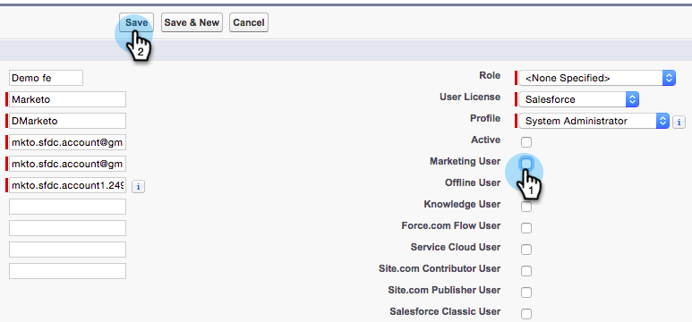

# 将Marketo同步用户设为营销用户 {#make-marketo-sync-user-a-marketing-user}

此 [Marketo同步用户](/help/marketo/product-docs/crm-sync/salesforce-sync/setup/enterprise-unlimited-edition/step-2-of-3-create-a-salesforce-user-for-marketo-enterprise-unlimited.md) 需要成为营销用户，Salesforce促销活动同步才能正常工作。 下面是如何在Salesforce中将用户设为营销用户。

>[!NOTE]
>
>**需要管理员权限**

1. 登录Salesforce。 在左侧搜索栏中搜索用户，然后单击 **用户** 下 **管理用户**.

   

1. 找到您的同步用户并单击其名称。

   

1. 单击 **编辑**.

   

1. 查看 **营销用户** 复选框，然后单击 **保存**.

   

   太棒了！ 此Marketo同步用户现在是营销用户。
