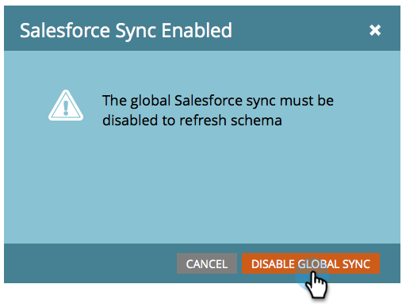
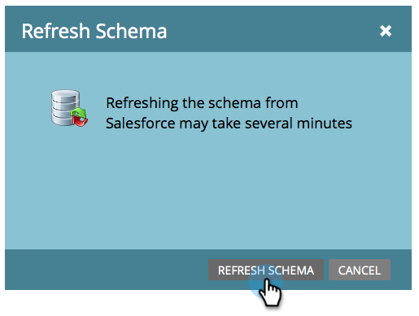
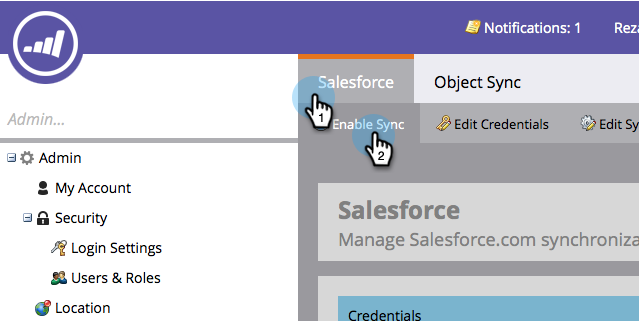

# 启用/禁用自定义对象同步 {#enable-disable-custom-object-sync}

在Salesforce实例中创建的自定义对象也可以是Marketo Engage的一部分。 下面是设置方法。

## 启用/禁用自定义对象同步 {#enable-disable-custom-object-sync-1}

>[!NOTE]
>
>**需要管理员权限**

1. 进入 **[!UICONTROL Admin]** 区域。

   

1. 在“数据库管理”菜单中，单击&#x200B;**[!UICONTROL Salesforce Objects Sync]**。

   

1. 如果这是您的第一个自定义对象，请单击&#x200B;**[!UICONTROL Sync schema]**。 否则，请单击&#x200B;**[!UICONTROL Refresh Schema]**&#x200B;以确保您拥有最新版本。

   

1. 如果全局同步正在运行，则必须通过单击&#x200B;**[!UICONTROL Disable Global Sync]**&#x200B;将其禁用。

   

   >[!NOTE]
   >
   >同步[!DNL Salesforce]自定义对象架构可能需要几分钟时间。

1. 单击 **[!UICONTROL Refresh Schema]**。

   

1. 选择要同步的对象，然后单击&#x200B;**[!UICONTROL Enable Sync]**。

   >[!TIP]
   >
   >如果Marketo与[!DNL Salesforce]中的潜在客户、联系人或帐户对象有直接关系，则只能同步自定义对象。

   

1. 再次单击&#x200B;**[!UICONTROL Enable Sync]**。

   

1. 返回&#x200B;**[!DNL Salesforce]**&#x200B;选项卡并单击&#x200B;**[!UICONTROL Enable Sync]**。

   

## 使用自定义对象 {#using-your-custom-objects}

>[!NOTE]
>
>不能将智能营销活动中的自定义对象与触发器一起使用。

1. 在智能列表中，拖动到&#x200B;**[!UICONTROL Has Opportunity]**&#x200B;筛选器上并设置为&#x200B;**[!UICONTROL true]**。

   

1. 然后，使用筛选约束缩小焦点。

   

   现在，您可以在智能营销活动和智能列表中使用此自定义对象的数据。

>[!MORELIKETHIS]
>
>[添加/删除自定义对象字段作为智能列表/触发器约束](/help/marketo/product-docs/crm-sync/salesforce-sync/setup/optional-steps/add-remove-custom-object-field-as-smart-list-trigger-constraints.md){target="_blank"}
