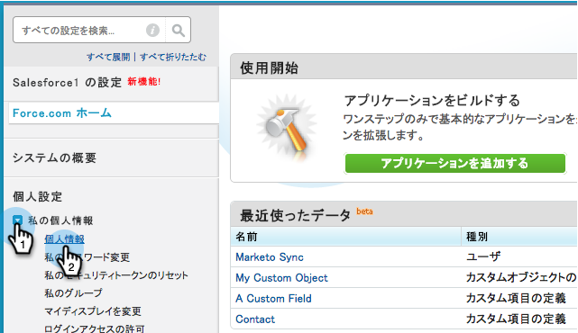
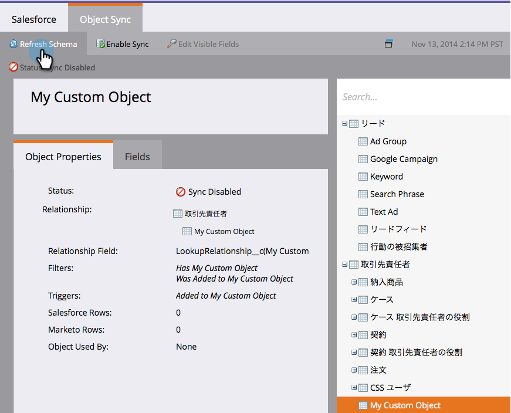

# 启用非英语自定义对象同步 {#enable-non-english-custom-object-sync}

如果您的Marketo同步用户设置为英语以外的语言，则在尝试启用自定义对象同步时可能会遇到错误。

## 错误 {#the-error}

## 绕过它 {#getting-around-it}

1. 使用marketo同步用户登录到Salesforce。

   

1. 在用户名下，转到 **设置**.

   

1. 在 **个人信息**，单击 **我的个人信息**.

   

1. 单击 **编辑**.

   

1. 更改 **语言** to **英语**.

   

1. 单击 **保存**.

   

1. 回到Marketo，在 **管理员> Salesforce >对象** 单击 **刷新架构**.

   

1. 这将以英语提取对象列表。 现在，选择您选择的对象并单击 **启用同步**.

   

1. 请注意，您的自定义对象现已启用并同步。

   

1. 现在，返回到Salesforce并使用上述步骤将同步用户更改回首选语言。

>[!NOTE]
>
>请不要忘记最后一次刷新架构以将对象拉回您的语言。
