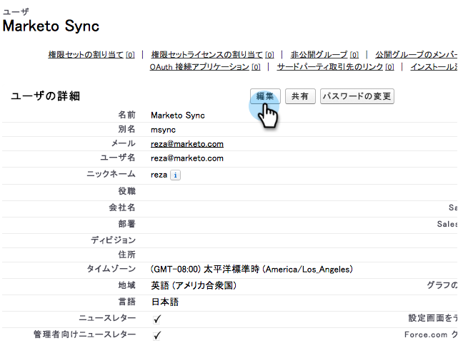
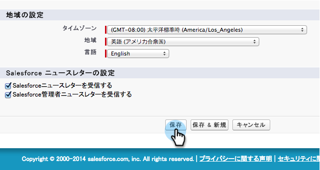
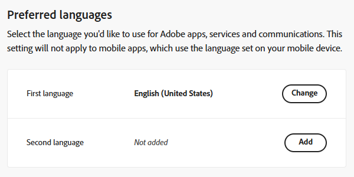

# 启用非英语自定义对象同步 {#enable-non-english-custom-object-sync}

如果将Marketo同步用户设置为英语以外的语言，则在尝试启用自定义对象同步时可能会遇到错误。

## 如何修复 {#how-to-fix}

1. 使用marketo同步用户登录[!DNL Salesforce]。

   

1. 单击用户名下拉列表并选择&#x200B;**[!UICONTROL Setup]**。

   

1. 在&#x200B;**[!UICONTROL Personal Information]**&#x200B;下，单击&#x200B;**[!UICONTROL My Personal Information]**。

   

1. 单击 **[!UICONTROL Edit]**。

   

1. 将&#x200B;**[!UICONTROL Language]**&#x200B;更改为&#x200B;**[!UICONTROL English]**。

   

1. 单击 **[!UICONTROL Save]**。

   

1. 在您的[Adobe帐户资料](https://account.adobe.com/cn/profile){target="_blank"}中，向下滚动到&#x200B;**[!UICONTROL Preferred languages]**&#x200B;并确保您的母语设置为英语。

   

1. 在Marketo Engage中，导航到&#x200B;**[!UICONTROL Admin]** > **[!UICONTROL Salesforce]** > **[!UICONTROL Objects]**。 单击 **[!UICONTROL Refresh Schema]**。

   

1. 这将拉出英文的对象列表。 选择您选择的对象并单击&#x200B;**[!UICONTROL Enable Sync]**。

   

1. 您的自定义对象现已启用并同步。

   

1. 返回[!DNL Salesforce]并使用上述步骤将同步用户更改回首选语言。

>[!NOTE]
>
>最后一次刷新模式以用您的语言拉回对象。
