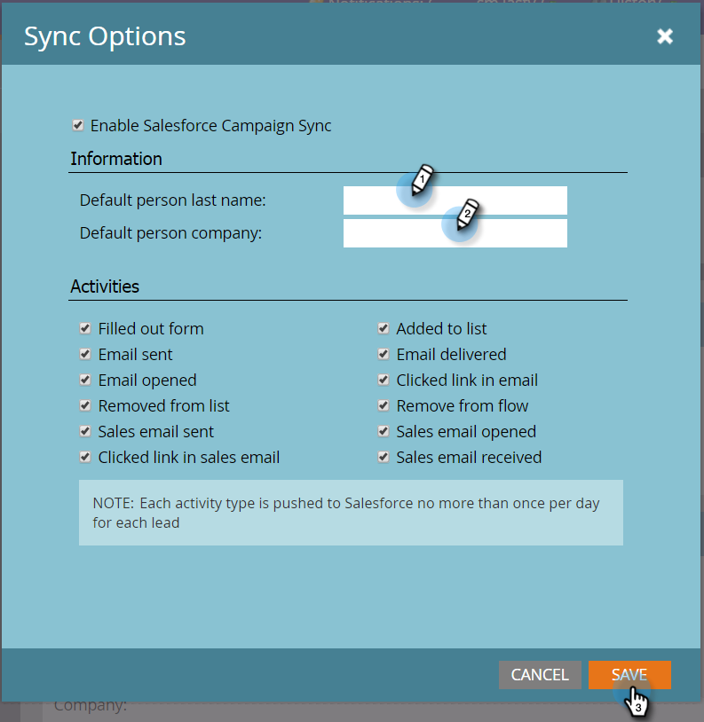

# 设置默认人员姓和公司名{#set-default-person-last-name-and-company-name}

Salesforce需要（最小）Lead和Contacts的姓氏和公司名。 未完成的记录将不会同步到Salesforce。 如果要同步部分记录，则必须设置Marketo与Salesforce一起使用的默认值。

1. 转至&#x200B;**Admin**&#x200B;并单击&#x200B;**Salesforce**。

   

1. 单击&#x200B;**编辑同步选项**。

   

1. 输入&#x200B;**默认人员姓氏**&#x200B;和&#x200B;**默认人员公司**，然后单击&#x200B;**保存**。

   

   >[!NOTE]
   >
   >Marketo仅在最初同步到Salesforce的记录时分配默认值，并且仅当其中一个必填字段为空时才分配默认值。

就这样！ 每次缺少姓名和/或公司名时，Marketo将添加默认值，同时将记录同步。
