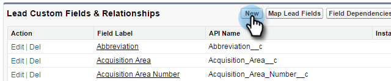
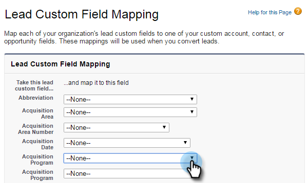

# 第1步，共3步：将Marketo字段添加到Salesforce(Professional){#step-of-add-marketo-fields-to-salesforce-professional}

>[!PREREQUISITES]
>
>您的Salesforce实例必须具有访问Salesforce API的权限，才能在Marketo和Salesforce之间同步数据。

Marketo使用一组字段来捕获某些类型的营销相关信息。 如果您希望在Salesforce中使用此数据，请按照以下说明操作。

1. 在潜在客户和联系人对象的Salesforce中创建三个自定义字段：得分、客户获取项目和客户获取日期。
1. 在潜在客户和联系人之间映射这些自定义字段，以便在Salesforce中进行转换时，这些值会继续显示。
1. 如有必要，可创建其他字段（请参阅下表）。

所有这些自定义字段都是可选字段，并且不是同步Marketo和Salesforce所必需的。 作为最佳实践，我们建议您确实为分数、客户获取项目和客户获取日期创建字段。

## 将Marketo字段添加到Salesforce {#add-marketo-fields-to-salesforce}

在上面列出的Salesforce中的潜在客户和联系人对象上添加三个自定义字段。 如果要添加更多，请参阅本节末尾的可用字段表。

对三个自定义字段中的每个字段执行以下步骤以添加它们。 开始&#x200B;**得分**。

1. 登录到Salesforce，然后单击&#x200B;**安装。**

   

1. 在左侧的“生成”菜单中，单击&#x200B;**自定义**&#x200B;并选择&#x200B;**潜在客户**。 单击&#x200B;**字段**。

   

1. 在页面底部的“自定义字段和关系”部分单击&#x200B;**新建**。

   

1. 选择相应的字段类型(对于“分数” — **number**;获取项目— **文本**;获取日期 — **日期/时间**)。

   

1. 单击&#x200B;**下一步**。

   

1. 输入字段的字段标签、长度和字段名称，如下表所示。

<table> 
 <thead> 
  <tr> 
   <th> 
    

      字段标签 
    
</th> 
   <th> 
    

      字段名称 
    
</th> 
   <th> 
    

      数据类型 
    
</th> 
   <th> 
    

      字段属性 
    
</th> 
  </tr> 
 </thead> 
 <tbody> 
  <tr> 
   <td>得分</td> 
   <td>mkto71_Lead_Score</td> 
   <td>数字</td> 
   <td>长度10 小数位0 </td> 
  </tr> 
  <tr> 
   <td>收购日期</td> 
   <td>mkto71_Acquisition_Date</td> 
   <td>日期/时间</td> 
   <td> </td> 
  </tr> 
  <tr> 
   <td>赢取项目</td> 
   <td>mkto71_Acquisition_项目</td> 
   <td>文本</td> 
   <td>长255</td> 
  </tr> 
 </tbody> 
</table>

>[!NOTE]
>
>Salesforce在使用字段名称创建API名称时，会将__c附加到字段名称。

>[!NOTE]
>
>文本和数字字段需要长度，但日期/时间字段不需要。说明是可选的。

1. 单击&#x200B;**下一步**。

   

1. 指定访问设置，然后单击&#x200B;**下一步**:

   * 将所有角色设置为&#x200B;**Visible**&#x200B;和&#x200B;**只读**

   * 清除同步用户用户档案的&#x200B;**只读**&#x200B;复选框：

      * 如果您有用户档案为&#x200B;_System Administrator_&#x200B;的用户作为同步用户，请清除“System Administrator”用户档案的&#x200B;**只读**&#x200B;复选框（如下所示）

      * 如果为同步用户创建了&#x200B;_自定义用户档案_，请清除该自定义用户档案的&#x200B;**只读**&#x200B;复选框

   

1. 选择应显示字段的页面布局。

   

1. 单击&#x200B;**保存并新建**&#x200B;可返回并创建其他两个自定义字段。 单击&#x200B;**保存**&#x200B;即可完成这三项操作。

   

1. 在左侧的“生成”菜单中，单击&#x200B;**自定义**&#x200B;并选择&#x200B;**联系人**。 单击&#x200B;**字段**。
1. 对联系对象上的“分数”、“客户获取日期”和“客户获取项目”字段执行步骤3至10，就像对潜在客户对象执行步骤一样。
1. （可选）对此表中的任何其他自定义字段使用上述过程。

<table> 
 <tbody> 
  <tr> 
   <th>字段标签</th> 
   <th>字段名称</th> 
   <th>数据类型</th> 
   <th>字段属性</th> 
  </tr> 
  <tr> 
   <td>客户获取项目ID</td> 
   <td>mkto71_Acquisition_项目_Id</td> 
   <td>数字</td> 
   <td>长度18 小数位0 </td> 
  </tr> 
  <tr> 
   <td>原始推荐人</td> 
   <td>mkto71_Original_推荐人</td> 
   <td>文本</td> 
   <td>长255</td> 
  </tr> 
  <tr> 
   <td>原始搜索引擎</td> 
   <td>mkto71_Original_Search_Engine</td> 
   <td>文本</td> 
   <td>长255</td> 
  </tr> 
  <tr> 
   <td>原始搜索短语</td> 
   <td>mkto71_Original_Search_Phrase</td> 
   <td>文本</td> 
   <td>长255</td> 
  </tr> 
  <tr> 
   <td>原始源信息</td> 
   <td>mkto71_Original_Source_Info</td> 
   <td>文本</td> 
   <td>长255</td> 
  </tr> 
  <tr> 
   <td>原始源类型</td> 
   <td>mkto71_Original_Source_Type</td> 
   <td>文本</td> 
   <td>长255</td> 
  </tr> 
  <tr> 
   <td>推断城市</td> 
   <td>mkto71_Intermited_City</td> 
   <td>文本</td> 
   <td>长255</td> 
  </tr> 
  <tr> 
   <td>推断公司</td> 
   <td>mkto71_Interrited_公司</td> 
   <td>文本</td> 
   <td>长255</td> 
  </tr> 
  <tr> 
   <td>推断国家</td> 
   <td>mkto71_Interrited_Country</td> 
   <td>文本</td> 
   <td>长255</td> 
  </tr> 
  <tr> 
   <td>推断的都市区</td> 
   <td>mkto71_Interrited_Metropolitan_Area</td> 
   <td>文本</td> 
   <td>长255</td> 
  </tr> 
  <tr> 
   <td>推断出的电话区号</td> 
   <td>mkto71_Interrited_Phone_Area_Code</td> 
   <td>文本</td> 
   <td>长255</td> 
  </tr> 
  <tr> 
   <td>推断的邮政编码</td> 
   <td>mkto71_Intermited_Postal_Code</td> 
   <td>文本</td> 
   <td>长255</td> 
  </tr> 
  <tr> 
   <td>推断的州</td> 
   <td>mkto71_Interrited_State_Region</td> 
   <td>文本</td> 
   <td>长255</td> 
  </tr> 
 </tbody> 
</table>

## 映射转换的自定义字段{#map-custom-fields-for-conversions}

Salesforce中潜在客户对象上的自定义字段应映射到联系人对象上的联系人字段，以便在发生转换时传递数据。

1. 在右上角，单击“设置”。

   

1. 在Nav Search中键入“fields”而不按Enter。 字段显示在不同对象下；单击潜在客户下的字段。

   

1. 转至“潜在客户自定义字段和关系”部分，然后单击“映射潜在客户字段”。

   

1. 单击要映射的字段旁边的下拉列表。

   

1. 选择相应的联系人自定义字段。

   

1. 对您创建的任何其他字段重复上述步骤。
1. 完成后，单击“保存”。

够轻松，对吧？

>[!NOTE]
>
>以下是整个过程的[视频，应该能够清晰显示！](https://nation.marketo.com/videos/1475)

>[!MORELIKETHIS]
>
>[第2步，共3步：为Marketo(Professional)创建Salesforce用户](/help/marketo/product-docs/crm-sync/salesforce-sync/setup/professional-edition/step-2-of-3-create-a-salesforce-user-for-marketo-professional.md)
