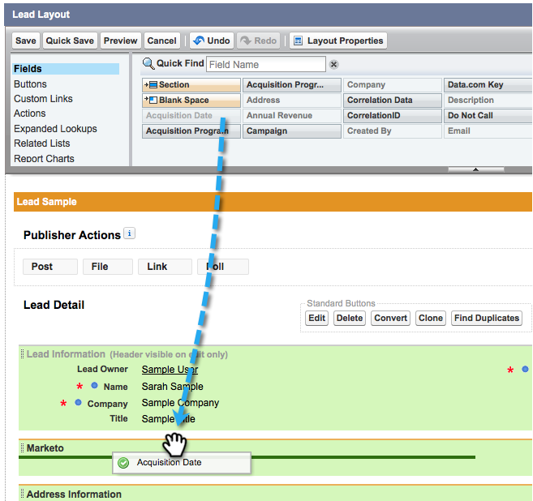
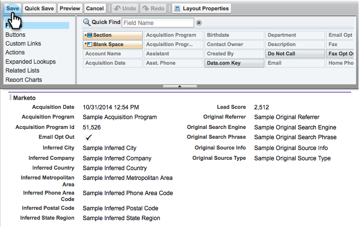

# 第2步（共3步）：创建Marketo的Salesforce用户（专业） {#step-of-create-a-salesforce-user-for-marketo-professional}

>[!NOTE]
>
>这些步骤必须由Salesforce管理员完成。

>[!PREREQUISITES]
>
>[第1步（共3步）：将Marketo字段添加到Salesforce (Professional)](/help/marketo/product-docs/crm-sync/salesforce-sync/setup/professional-edition/step-1-of-3-add-marketo-fields-to-salesforce-professional.md){target="_blank"}

在本文中，您将使用Salesforce页面布局自定义字段权限，并创建Marketo-Salesforce同步用户。

## 设置页面布局 {#set-page-layouts}

Salesforce Professional使用页面布局设置字段级辅助功能，而不是Salesforce Enterprise/Unlimited的用户档案。 执行以下步骤将允许Marketo同步用户更新自定义字段。

1. 在导航搜索栏中键入“[!UICONTROL 页面布局]”，而不按&#x200B;**[!UICONTROL Enter]**，然后单击&#x200B;**[!UICONTROL 潜在客户]**&#x200B;下的&#x200B;**[!UICONTROL 页面布局]**。

   

1. 单击潜在客户布局旁边的&#x200B;**[!UICONTROL 编辑]**。

   

1. 单击新的&#x200B;**[!UICONTROL 节]**&#x200B;并将其拖到页面布局中。

   

1. 为&#x200B;**[!UICONTROL 节名称]**&#x200B;输入“Marketo”，然后单击&#x200B;**[!UICONTROL 确定]**。

   

1. 单击并将字段&#x200B;**[!UICONTROL 客户获取日期]**&#x200B;拖入&#x200B;**Marketo**&#x200B;部分。

   

1. 对以下字段重复上述步骤：

   * 客户获取计划
   * 客户获取计划ID
   * 电子邮件选择退出
   * 推断的城市
   * 推断公司
   * 推断国家
   * 推断的都市区
   * 推断的电话区号
   * 推断的邮政编码
   * 推断的状态区域
   * 潜在客户分数
   * 原始反向链接
   * 原始搜索引擎
   * 原始搜索短语
   * 原始来源信息
   * 原始来源类型

   >[!NOTE]
   >
   >这些字段需要在页面布局中，以便Marketo能够对其执行读/写操作。

   >[!TIP]
   >
   >通过向下拖动到页面的右侧，为字段创建两列。 您可以将字段从一侧移动到另一侧，以平衡列长度。

1. 添加完字段后，单击&#x200B;**[!UICONTROL 保存]**。

   

1. 对Salesforce **[!UICONTROL 联系页面布局]**&#x200B;重复上述所有步骤。

   

1. 完成&#x200B;**[!UICONTROL 联系人页面布局]**&#x200B;后，请记得单击&#x200B;**[!UICONTROL 保存]**。

   

   >[!NOTE]
   >
   >确保已将&#x200B;**[!UICONTROL 全天事件]**&#x200B;字段添加到&#x200B;**[!UICONTROL 事件页面布局]**。

## 创建同步用户 {#create-sync-user}

Marketo需要凭据才能访问Salesforce。 最好是通过执行以下步骤创建的专用用户来完成此操作。

>[!NOTE]
>
>如果贵组织没有其他Salesforce许可证，则可以使用具有系统管理员配置文件的现有营销用户。

1. 在导航搜索栏中输入“用户”，然后单击&#x200B;**[!UICONTROL 管理用户]**&#x200B;下的&#x200B;**[!UICONTROL 用户]**。

   

1. 单击&#x200B;**[!UICONTROL 新用户]**。

   

1. 填写必填字段，选择&#x200B;**[!UICONTROL 用户许可证：Salesforce]**，设置&#x200B;**[!UICONTROL 配置文件：系统管理员]**，选中&#x200B;**[!UICONTROL 营销用户]**，然后单击&#x200B;**[!UICONTROL 保存]**。

   

   >[!TIP]
   >
   >确保您输入的电子邮件地址有效。 您需要以同步用户身份登录才能重置密码。

太棒了！ 现在，您已拥有Marketo可用于连接到Salesforce的帐户。 我们开始吧。

>[!MORELIKETHIS]
>
>[第3步（共3步）：连接Marketo和Salesforce（专业）](/help/marketo/product-docs/crm-sync/salesforce-sync/setup/professional-edition/step-3-of-3-connect-marketo-and-salesforce-professional.md){target="_blank"}
