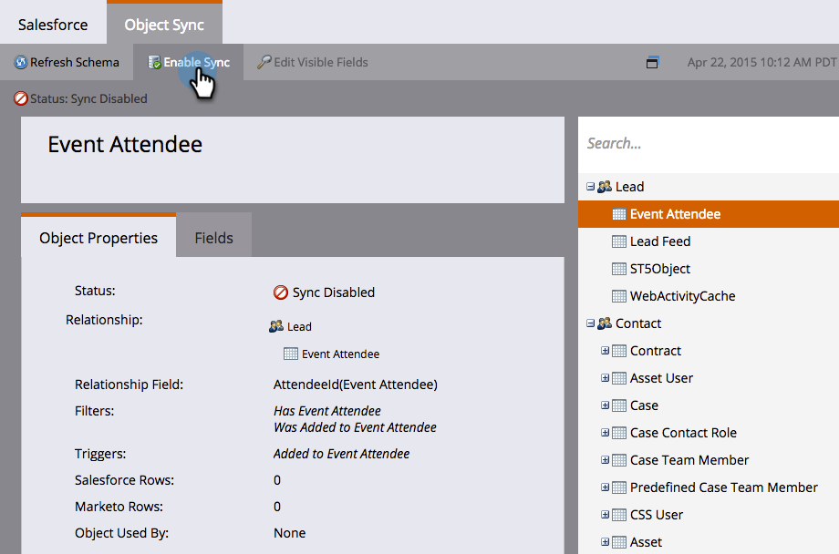

# SFDC同步：自定义对象同步 {#sfdc-sync-custom-object-sync}

在Salesforce实例中创建的自定义对象也可以包含在Marketo中。  下面是如何设置它。

>[!NOTE]
>
>**需要管理员权限**

>[!PREREQUISITES]
>
>要使用自定义对象，它必须与 [商机](/help/marketo/product-docs/crm-sync/salesforce-sync/sfdc-sync-details/sfdc-sync-field-sync.md), [联系人](/help/marketo/product-docs/crm-sync/salesforce-sync/sfdc-sync-details/sfdc-sync-contact-sync.md)或 [帐户](/help/marketo/product-docs/crm-sync/salesforce-sync/sfdc-sync-details/sfdc-sync-account-sync.md) 对象。

## 启用自定义对象  {#enable-custom-object}

1. 单击 **管理员** 和 **Salesforce对象同步** 链接。

   .

1. 如果这是您的第一个自定义对象，请单击 **同步架构**.

   

1. 单击 **禁用全局同步**.

   

   >[!NOTE]
   >
   >Salesforce自定义对象架构的初始同步可能需要几分钟时间。

   

1. 将您要同步的自定义对象拖到画布中。

   

   >[!NOTE]
   >
   >自定义对象必须具有唯一名称。 Marketo不支持具有相同名称的两个不同的自定义对象。

1. 单击 **启用同步**.

   

1. 单击 **启用同步** 再次。

   

   >[!NOTE]
   >
   >不要忘记重新启用全局同步！

1. 返回到 **Salesforce** 选项卡。

   

1. 单击 **启用同步**.

   

1. 要查看所有Salesforce自定义对象，请单击 **管理员** 和 **Salesforce对象同步** 链接（与上面的步骤1相同）。

   

   >[!NOTE]
   >
   >Marketo仅支持链接到深度为一或两级的标准实体的自定义实体。

### 下一步： {#whats-next}

[将自定义对象字段添加/删除为智能列表/触发器约束](/help/marketo/product-docs/crm-sync/salesforce-sync/setup/optional-steps/add-remove-custom-object-field-as-smart-list-trigger-constraints.md)

太棒了！ 现在，您可以在智能营销活动和智能列表中使用来自此自定义对象的数据。
