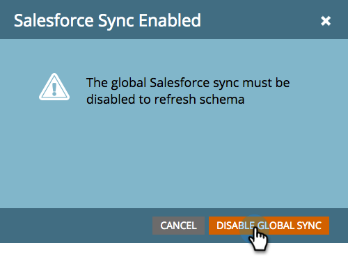

# SFDC同步：自定义对象同步{#sfdc-sync-custom-object-sync}

在Salesforce实例中创建的自定义对象也可以是Marketo的一部分。  下面介绍如何设置。

>[!NOTE]
>
>**需要管理员权限**

>[!PREREQUISITES]
>
>要使用自定义对象，它必须与Salesforce中的[潜在客户](/help/marketo/product-docs/crm-sync/salesforce-sync/sfdc-sync-details/sfdc-sync-field-sync.md)、[联系人](/help/marketo/product-docs/crm-sync/salesforce-sync/sfdc-sync-details/sfdc-sync-contact-sync.md)或[帐户](/help/marketo/product-docs/crm-sync/salesforce-sync/sfdc-sync-details/sfdc-sync-account-sync.md)对象相关联。

## 启用自定义对象{#enable-custom-object}

1. 单击&#x200B;**Admin**&#x200B;和&#x200B;**Salesforce对象同步**&#x200B;链接。

   .

1. 如果这是您的第一个自定义对象，请单击&#x200B;**同步模式**。

   

1. 单击&#x200B;**禁用全局同步**。

   

   >[!NOTE]
   >
   >Salesforce自定义对象模式的初始同步可能需要几分钟时间。

   

1. 将要同步的自定义对象拖入画布。

   

   >[!NOTE]
   >
   >自定义对象必须具有唯一名称。 Marketo不支持两个名称相同的不同自定义对象。

1. 单击&#x200B;**启用同步**。

   

1. 再次单击&#x200B;**启用同步**。

   

   >[!NOTE]
   >
   >不要忘记重新启用全局同步！

1. 返回&#x200B;**Salesforce**&#x200B;选项卡。

   

1. 单击&#x200B;**启用同步**。

   

1. 要视图所有Salesforce自定义对象，请单击&#x200B;**管理员**&#x200B;和&#x200B;**Salesforce对象同步**&#x200B;链接（与上面的步骤1相同）。

   

   >[!NOTE]
   >
   >Marketo仅支持链接到标准实体（深度为一或两级）的自定义实体。

### 下一步：{#whats-next}

[添加／删除自定义对象字段作为智能列表/触发器约束](/help/marketo/product-docs/crm-sync/salesforce-sync/setup/optional-steps/add-remove-custom-object-field-as-smart-list-trigger-constraints.md)

太棒了！ 您现在可以在智能活动和智能列表中使用此自定义对象中的数据。
