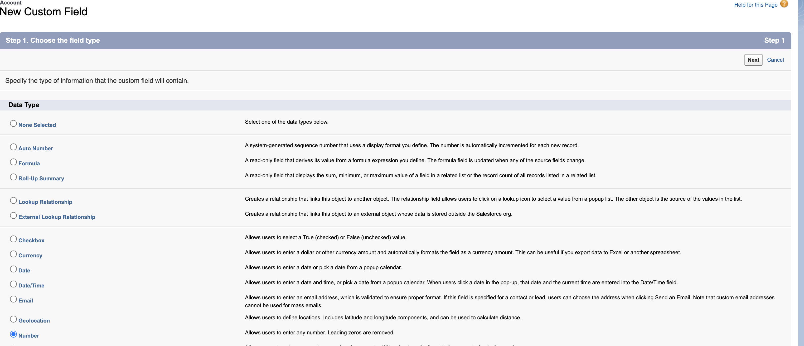

# 步骤1（共3步）：将Marketo字段添加到Veeva CRM {#step-1-of-3-add-marketo-fields-to-veeva-crm}

>[!PREREQUISITES]
>
>您的Veeva CRM实例必须有权访问Salesforce API，才能在Marketo Engage和Veeva CRM之间同步数据。

Marketo Engage使用一组字段来捕获某些类型的营销相关信息。 如果要在Veeva CRM中获取此数据，请按照以下说明操作。

`1.` 在Veva CRM中对联系对象创建自定义字段：得分

`2.` 如有需要，您可以创建其他字段（请参阅下表）。

所有这些自定义字段都是可选的，并且不是同步Marketo Engage和Veeva CRM所必需的。

## 将Marketo字段添加到Veeva CRM {#add-marketo-fields-to-veeva-crm}

在上面列出的Veeva CRM中的潜在客户和联系人对象上添加自定义字段。 如果要添加更多，请参阅此部分末尾的可用字段表。

对“得分”字段执行以下步骤以添加该字段。

1. 登录到Veeva CRM并单击 **设置**.

   

1. 单击“对象和字段”(Objects and Fields)，然后选择“对象管理器”(Object Manager)。

   

1. 在搜索栏中，搜索“联系人”。

   

1. 单击Contact对象。

1. 选择字段和关系。

1. 单击 **新建**.

   

1. 选择相应的字段类型（对于“分数 — 数字”）。

   

1. 单击 **下一个**.

   

1. 输入字段的字段标签、长度和字段名称，如下表所示。

<table>
 <tbody>
  <tr>
   <th>字段标签
   <th>字段名称
   <th>数据类型
   <th>字段属性
  </tr>
  <tr>
   <td>得分</td>
   <td>mkto71_Lead_Score</td>
   <td>数字</td>
   <td>长度10 
小数位0</td>
  </tr>
 </tbody>
</table>

>[!NOTE]
>
>Veva CRM在使用字段名称创建API名称时，会将__c附加到字段名称。

>[!NOTE]
>
>文本和数字字段需要长度，但日期/时间字段没有。描述是可选的。

1. 单击 **下一个**.

   

1. 指定访问设置并单击 **下一个**.

1. 将所有角色设置为“可见”和“只读”。

1. 清除同步用户配置文件的只读复选框：

* 如果您有一个用户，其用户的配置文件为系统管理员的同步用户，请清除系统管理员配置文件的只读复选框（如下所示）。
* 如果您为同步用户创建了自定义配置文件，请清除该自定义配置文件的只读复选框。

   

1. 选择应显示字段的页面布局。

1. 单击 **保存并新建** 返回并创建其他两个自定义字段。

1. 单击 **保存** 你三个都完蛋了。

   

>[!NOTE]
>
>通过将字段添加到联系人对象，这些字段也会添加到人员帐户对象。

可选：请对下表中的任何其他自定义字段使用上述过程。

<table>
 <tbody>
  <tr>
   <th>字段标签
   <th>字段名称
   <th>数据类型
   <th>字段属性
  </tr>
  <tr>
   <td>推断的城市</td>
   <td>mkto71_Intermited_City</td>
   <td>文本</td>
   <td>长255</td>
  </tr>
  <tr>
   <td>推断公司</td>
   <td>mkto71_Intermited_Company</td>
   <td>文本</td>
   <td>长255</td>
  </tr>
  <tr>
   <td>推断的国家</td>
   <td>mkto71_Intercuted_Country</td>
   <td>文本</td>
   <td>长255</td>
  </tr>
  <tr>
   <td>推断的都市区</td>
   <td>mkto71_Intercuted_Metropolitan_Area</td>
   <td>文本</td>
   <td>长255</td>
  </tr>
  <tr>
   <td>推断的电话区号</td>
   <td>mkto71_Intermited_Phone_Area_Code</td>
   <td>文本</td>
   <td>长255</td>
  </tr>
  <tr>
   <td>推断的邮政编码</td>
   <td>mkto71_Intermited_Postal_Code</td>
   <td>文本</td>
   <td>长255</td>
  </tr>
  <tr>
   <td>推断的状态区域</td>
   <td>mkto71_Intercuted_State_Region</td>
   <td>文本</td>
   <td>长255</td>
  </tr>
 </tbody>
</table>

>[!NOTE]
>
>创建新字段后，由Marketo自动分配的字段中的值将不会立即在Veeva CRM中可用。 Marketo将在下次更新任一系统上的记录时(即，对Marketo和Veeva CRM之间同步的任何字段进行更新)，将数据同步到Veeva CRM。
