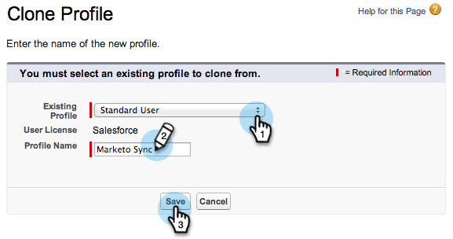

# 第2步（共3步）：为Marketo Engage创建[!DNL Veeva] CRM用户 {#step-2-of-3-create-a-veeva-crm-user-for-marketo-engage}

>[!NOTE]
>
>本文中的步骤必须由[!DNL Veeva] CRM管理员完成。

>[!PREREQUISITES]
>
>[第1步（共3步）：将Marketo字段添加到 [!DNL Salesforce] （专业）](/help/marketo/product-docs/crm-sync/veeva-crm-sync/setup/step-1-of-3-add-marketo-fields-to-veeva-crm.md){target="_blank"}

在本文中，您将使用[!DNL Veeva] CRM页面布局自定义字段权限，并创建[!DNL Marketo-Veeva] CRM同步用户。

## 设置页面布局 {#set-page-layouts}

执行以下步骤将允许Marketo同步用户更新自定义字段。

1. 不按Enter键单击导航搜索栏中的&#x200B;**[!UICONTROL Account]** （人员帐户）页面布局，然后单击&#x200B;**[!UICONTROL Page Layout]**&#x200B;下的[!UICONTROL Contacts]。

   

1. 单击 **[!UICONTROL Page Layouts]**。

   

1. 单击 **[!UICONTROL HCP - Professional]**。

   

1. 单击并将新&#x200B;**[!UICONTROL Section]**&#x200B;拖到页面布局中。

1. 输入&#x200B;**[!UICONTROL Section Name]**&#x200B;的“Marketo”并单击&#x200B;**[!UICONTROL OK]**。

   

1. 单击并将&#x200B;**[!UICONTROL Score]**&#x200B;字段拖入Marketo部分。

   

1. 对以下字段重复上述步骤：

   * 推断的城市
   * 推断公司
   * 推断国家
   * 推断的都市区
   * 推断的电话区号
   * 推断的邮政编码
   * 推断的状态区域

   >[!NOTE]
   >
   >这些字段需要在页面布局中，以便Marketo能够对其执行读/写操作。

   >[!TIP]
   >
   >通过向下拖动到页面的右侧，为字段创建两列。 您可以将字段从一侧移动到另一侧，以平衡列长度。

1. 完成[!UICONTROL HCP-Professional]布局后，单击&#x200B;**[!UICONTROL Save]**。

   

>[!NOTE]
>
>对其他[!UICONTROL Account]页面布局重复此操作。

## 创建配置文件 {#create-a-profile}

1. 单击 **[!UICONTROL Setup]**。

   

1. 在导航搜索栏中键入“profiles”，然后单击&#x200B;**[!UICONTROL Profiles]**&#x200B;链接。

   

1. 单击 **[!UICONTROL New]**。

   

1. 选择&#x200B;**[!UICONTROL Standard User]**，将配置文件命名为“[!UICONTROL Marketo-Salesforce Sync]”，然后单击&#x200B;**[!UICONTROL Save]**。

   

## 设置配置文件权限 {#set-profile-permissions}

1. 单击&#x200B;**[!UICONTROL Edit]**&#x200B;设置安全权限。

   

1. 在[!UICONTROL Administrative Permissions]部分下，确保选择[!UICONTROL API Enabled]。

   

   >[!TIP]
   >
   >请务必选中[!UICONTROL Password Never Expires]框。

1. 在[!UICONTROL General User Permissions]部分下，确保选择[!UICONTROL Edit Events]和[!UICONTROL Edit Tasks]。

   

1. 在[!UICONTROL Standard Object Permissions]部分下，确保检查[!UICONTROL Read]和[!UICONTROL Create]的[!UICONTROL Edit]、[!UICONTROL Delete]、[!UICONTROL Accounts]和[!UICONTROL Contacts]权限。

   

1. 在[!UICONTROL Custom Object Permissions]部分下，确保为[!UICONTROL Read]、[!UICONTROL Call]和任何其他所需的自定义对象检查[!UICONTROL Call Key Message]权限。

   

1. 完成后，单击页面底部的&#x200B;**[!UICONTROL Save]**。

   

## 设置字段权限 {#set-field-permissions}

1. 与您的营销人员讨论，了解哪些自定义字段是同步所必需的。

   >[!NOTE]
   >
   >此步骤将阻止您不需要的字段显示在Marketo中，这将减少杂乱并加快同步速度。

1. 在[!UICONTROL profile detail]页面中，转到&#x200B;**[!UICONTROL Field-Level Security]**&#x200B;部分。 单击&#x200B;**[!UICONTROL View]**&#x200B;编辑[!UICONTROL Contact]和[!UICONTROL Account]对象的辅助功能。

   

   >[!TIP]
   >
   >您可以根据组织的需求配置其他对象。

1. 对于每个对象，单击&#x200B;**[!UICONTROL Edit]**。

   

找到不必要的字段，确保[!UICONTROL Read Access]和[!UICONTROL Edit Access]已&#x200B;**取消**&#x200B;选中。 完成后单击&#x200B;**[!UICONTROL Save]**。

>[!NOTE]
>
>仅编辑自定义字段的辅助功能。

1. 完成禁用所有不必要的字段后，请检查[!UICONTROL Read Access]和[!UICONTROL Edit Access]中的以下对象字段。 完成后单击&#x200B;**[!UICONTROL Save]**。

<table>
 <tbody>
  <tr>
   <th>对象
   <th>字段
  </tr>
  <tr>
   <td>帐户</td>
   <td>类型字段</td>
  </tr>
  <tr>
   <td>活动</td>
   <td>所有字段</td>
  </tr>
  <tr>
   <td>任务</td>
   <td>所有字段</td>
  </tr>
 </tbody>
</table>

## 创建同步用户 {#create-sync-user}

Marketo需要凭据才能访问[!DNL Veeva] CRM。 最好是通过执行以下步骤创建的专用用户来完成此操作。

>[!NOTE]
>
>如果您的组织没有其他[!DNL Veeva] CRM许可证，则可以将现有营销用户与系统管理员配置文件结合使用。

1. 在导航搜索栏中输入“用户”，然后单击&#x200B;**[!UICONTROL Users]**&#x200B;下的[!UICONTROL Manage Users]。

   

1. 单击 **[!UICONTROL New User]**。

   

1. 填写必填字段，选择&#x200B;**[!UICONTROL User License]**： **[!UICONTROL Salesforce]**，设置&#x200B;**[!UICONTROL Profile]**： **[!UICONTROL Marketo Sync]**&#x200B;用户并单击&#x200B;**[!UICONTROL Save]**。

   

>[!TIP]
>
>确保您输入的电子邮件地址有效。 您需要以同步用户身份登录才能重置密码。

太棒了！ 现在，您拥有了一个帐户，Marketo Engage可使用该帐户连接到[!DNL Veeva] CRM。 我们开始吧。

>[!MORELIKETHIS]
>
>[第3步（共3步）：连接Marketo和 [!DNL Veeva] CRM](/help/marketo/product-docs/crm-sync/veeva-crm-sync/setup/step-3-of-3-connect-marketo-engage-and-veeva-crm.md){target="_blank"}
