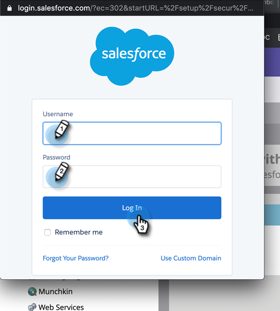

# 步骤3（共3步）：连接Marketo Engage和Veeva CRM {#step-3-of-3-connect-marketo-engage-and-veeva-crm}

在本文中，您将配置Marketo Engage以与配置的Veeva CRM实例同步。 **您会在一些弹出窗口中看到Salesforce** 因为Veva CRM是在Salesforce平台上构建的。

>[!PREREQUISITES]
>
>* [步骤1（共3步）：将Marketo字段添加到Veeva](/help/marketo/product-docs/crm-sync/veeva-crm-sync/setup/step-1-of-3-add-marketo-fields-to-veeva-crm.md){target=&quot;_blank&quot;}
>* [步骤2（共3步）：为Marketo创建Veeva用户](/help/marketo/product-docs/crm-sync/veeva-crm-sync/setup/step-2-of-3-create-a-veeva-crm-user-for-marketo-engage.md){target=&quot;_blank&quot;}

>[!IMPORTANT]
>
>一次只能将一个Marketo实例连接到Veeva CRM实例。

## 使用OAuth连接到Veeva CRM {#connect-to-veeva-crm-using-oauth}

1. 在Marketo中，单击 **管理员**. 选择 **CRM** 单击 **与Veeva同步**.

   

   >[!NOTE]
   >
   >一定要 [隐藏您不需要的所有字段](/help/marketo/product-docs/crm-sync/salesforce-sync/sfdc-sync-details/hide-a-salesforce-field-from-the-marketo-sync.md)单击“同步字段”之前，从同步用户在Marketo中的{target=&quot;_blank&quot;}。 单击“同步字段”后，用户可以看到的所有字段都将在Marketo中永久创建，并且无法删除。

1. 单击 **使用Veeva登录**.

   

   >[!NOTE]
   >
   >如果要将Marketo沙盒与Veeva CRM沙盒同步，请检查沙盒。

1. 单击 **确认凭据**.

   

1. 此时将显示一个包含Salesforce登录页面的弹出窗口。 输入“Marketo同步用户”凭据并单击 **登录**.

   

1. 输入您通过电子邮件（由Salesforce发送）收到的验证代码，然后单击 **验证**.

   

1. 成功验证后，访问页面将显示请求访问。 单击 **允许**.

   

1. 几分钟后，Marketo Engae中将显示一个弹出窗口。 单击 **确认凭据**.

   

## 启动Veeva同步 {#start-veeva-sync}

1. 单击 **启动Veeva同步** 开始永久性Marketo-Veeva CRM同步。

   

   >[!CAUTION]
   >
   >Marketo不会针对Veeva CRM同步或在您手动输入潜在客户时自动消除重复数据。

1. 单击 **开始同步**.

   

>[!NOTE]
>
>完成初始同步的时间因数据库的大小和复杂性而异。

## 验证同步 {#verify-sync}

Marketo在“管理员”区域中为Veva CRM同步提供状态消息。 您可以按照以下步骤来验证同步是否正确工作。

1. 在Marketo中，单击 **管理员**，则 **韦瓦**.

   

1. 同步状态显示在右上角。 它将显示三条消息之一：上次同步、正在同步或失败。

>[!MORELIKETHIS]
>
>[配置自定义对象](/help/marketo/product-docs/crm-sync/veeva-crm-sync/sync-details/custom-object-sync.md){target=&quot;_blank&quot;}
