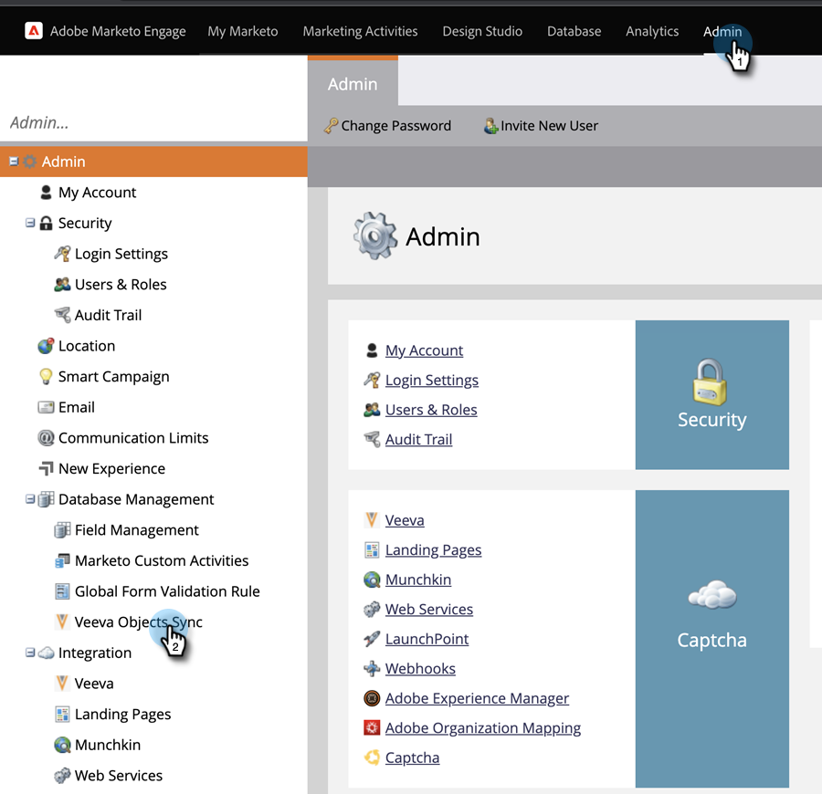

# 自定义对象同步 {#custom-object-sync}

在Veeva CRM实例中创建的自定义对象也可以是Marketo Engage的一部分。 下面是设置方法。

>[!NOTE]
>
>**需要管理员权限**

>[!PREREQUISITES]
>
>要使用自定义对象，必须将其与Veeva CRM中的联系人或帐户对象关联。

## 启用自定义对象 {#enable-custom-object}

1. 在Marketo中，单击 **管理员**，则 **Veeva对象同步**.

   

1. 如果这是您的第一个自定义对象，请单击 **同步架构**.

   

1. 单击 **禁用全局同步**.

   

   >[!NOTE]
   >
   >Veeva自定义对象架构的初始同步可能需要几分钟时间。

1. 将要同步的自定义对象拖到画布中。

   

   >[!NOTE]
   >
   >自定义对象必须具有唯一的名称。 Marketo不支持具有相同名称的两个不同自定义对象。

1. 单击 **启用同步**.

   

1. 单击 **启用同步** 再来一次。

   

1. 返回至 **Veeva** 选项卡。

   

1. 单击 **启用同步**.

   

1. 要查看所有Veeva自定义对象，请单击管理员和Veeva对象同步。

   

   >[!NOTE]
   >
   >Marketo仅支持链接到一到两级深度标准实体的自定义实体。

太棒了！ 现在，您可以在智能营销活动和智能列表中使用此自定义对象中的数据。

>[!MORELIKETHIS]
>
>* [正在同步呼叫和呼叫关键消息](/help/marketo/product-docs/crm-sync/veeva-crm-sync/sync-details/syncing-call-and-call-key-messages.md){target="_blank"}
>* [添加/删除自定义对象字段作为智能列表/触发器约束](/help/marketo/product-docs/crm-sync/veeva-crm-sync/sync-details/add-remove-custom-object-field-as-smart-list-trigger-constraints.md){target="_blank"}
