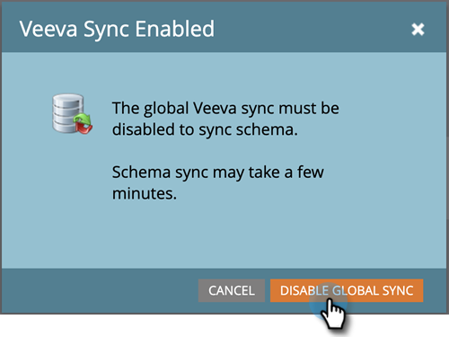
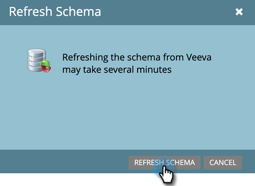
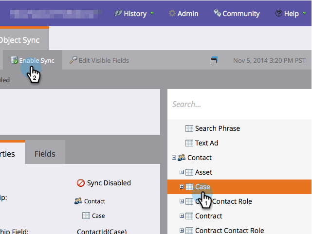

# 启用/禁用自定义对象同步 {#enable-disable-custom-object-sync}

在Veeva CRM实例中创建的自定义对象也可以是Marketo Engage的一部分。 下面是设置方法。

## 启用或禁用自定义对象同步 {#enable-or-disable-the-custom-object-sync}

>[!NOTE]
>
>**需要管理员权限**

1. 在Marketo中，单击 **管理员**，则 **Veeva对象同步**.

   

1. 如果这是您的第一个自定义对象，请单击“同步架构”。 如果没有，请单击 **刷新架构** 以确保您拥有最新版本。

   

1. 如果全局同步正在运行，请单击 **禁用全局同步**.

   

   >[!NOTE]
   >
   >同步Veeva自定义对象架构可能需要几分钟时间。

1. 单击 **刷新架构**.

   

选择要同步的对象，然后单击“启用同步”。

>[!TIP]
>
>Marketo只能同步自定义对象，前提是它与Veeva CRM中的联系人或帐户对象存在直接关系。

1. 单击 **启用同步** 再来一次。

   

1. 返回Veeva选项卡并单击 **启用同步**.

   

## 使用自定义对象 {#using-your-custom-objects}

>[!NOTE]
>
>您不能在带有触发器的智能营销活动中使用自定义对象。

1. 在智能列表中，拖到“Has Opportunity”筛选器上，并将设置为 **True**.

   

1. （可选）使用筛选条件约束来缩小焦点。

   

太棒了！ 现在，您可以在智能营销活动和智能列表中使用此自定义对象的数据。

>[!MORELIKETHIS]
>
>[添加/删除自定义对象字段作为智能列表/触发器约束](/help/marketo/product-docs/crm-sync/veeva-crm-sync/sync-details/add-remove-custom-object-field-as-smart-list-trigger-constraints.md){target="_blank"}
