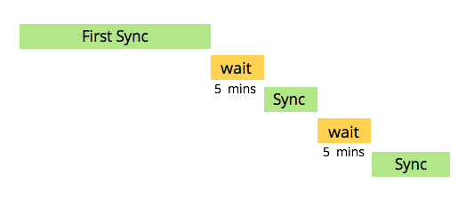

# 了解[!DNL Veeva] CRM同步 {#understanding-the-veeva-crm-sync}

在Adobe Marketo Engage和[!DNL Veeva] CRM之间运行同步只需几个步骤。

## 同步的工作方式 {#how-the-sync-works}

Marketo Engage每天与[!DNL Veeva] CRM同步。 每次同步都需要一些时间，暂停5分钟，然后重新开始。

>[!NOTE]
>
>由于Marketo Engage正在从[!DNL Veeva]复制整个数据库，首次同步可能需要几个小时甚至几天。 之后，每次同步通常需要几分钟（有时几秒），并且只同步已更改的数据。

[!DNL Veeva]与Marketo Engage之间的同步仅针对Person帐户对象中的Contact字段是双向的。 在这些情况下，只要您在[!DNL Veeva]或Marketo Engage中进行更改，您的更新就会反映在这两个系统中。 所有其他同步仅从[!DNL Veeva]到Marketo Engage。 请点击下方链接，查看各项同步的详细信息。

## 在Marketo Engage和[!DNL Veeva]之间同步的内容 {#what-is-synced-between-marketo-engage-and-veeva}

* [人员帐户](/help/marketo/product-docs/crm-sync/veeva-crm-sync/sync-details/person-account-sync-faq.md){target="_blank"}
* 用户
* [调用和调用关键对象](/help/marketo/product-docs/crm-sync/veeva-crm-sync/sync-details/syncing-call-and-call-key-messages.md){target="_blank"}
* [自定义对象](/help/marketo/product-docs/crm-sync/veeva-crm-sync/sync-details/custom-object-sync.md){target="_blank"}

## 须知事项 {#things-to-know}

* 您在Marketo Engage中为 [!DNL Veeva]&#x200B;[&#128279;](/help/marketo/product-docs/crm-sync/salesforce-sync/setup/enterprise-unlimited-edition/step-2-of-3-create-a-salesforce-user-for-marketo-enterprise-unlimited.md){target="_blank"}输入的凭据用于同步数据。 只有这些凭据有权限访问的数据才会包含在内。

* [!DNL Veeva] CRM基于force.com，此同步中继承了Marketo Engage在该平台中拥有的丰富体验。

* Veeva CRM显示：潜在客户、联系人、客户、业务客户、机会、营销活动和活动。 但是，与Marketo Engage同步时不支持这些功能。
