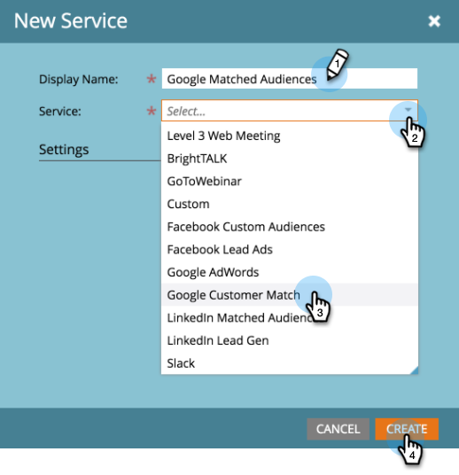
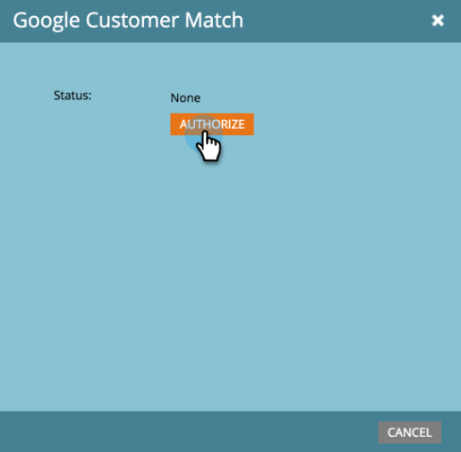

# 将Google客户匹配项添加为LaunchPoint服务 {#add-google-customer-match-as-a-launchpoint-service}

通过此集成，您可以向Google发送Marketo受众以使用Google AdWords进行定位，以及在YouTube、搜索和Gmail中重新定位受众。

>[!NOTE]
>
>**需要管理员权限**

1. 转到 **管理员**.

   

1. 单击 **LaunchPoint**.

   

1. 选择 **新建** then **新服务**.

   

1. 输入 **显示名称** 选择 **Google客户匹配** 从 **服务** 下拉菜单。 单击 **创建**.

   

1. 要连接Google AdWords帐户，请单击 **授权**.

   

1. Google将在新选项卡中打开。 从此处登录到您的Google AdWords帐户。

   >[!CAUTION]
   >
   >为了让Marketo跨多个AdWords帐户发送受众，您在以下步骤中授权的Google用户需要有权访问 _全部_ 这些账户中。

   

1. 查看请求的权限，然后单击 **允许**.

   

1. 您的Google AdWords帐户现已连接到Marketo。 单击 **创建**.

   

   太棒了！ 现在，您将在“已安装的服务”选项卡中看到“Google匹配的受众”，该受众将列为LaunchPoint服务。

>[!NOTE]
>
>Google客户匹配集成只能容纳一个经理帐户以及该经理帐户内的所有子帐户。 不支持多个管理员帐户。
