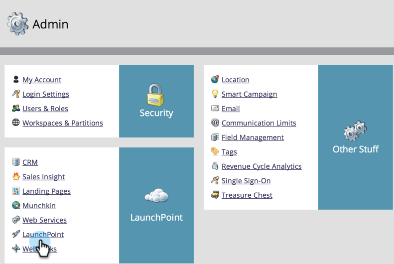
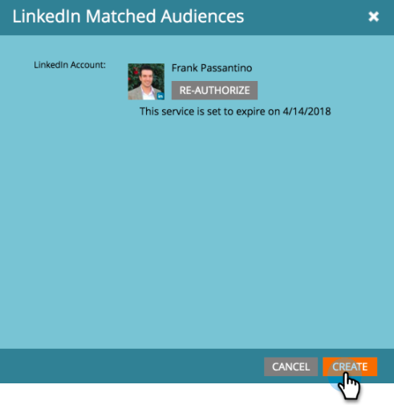
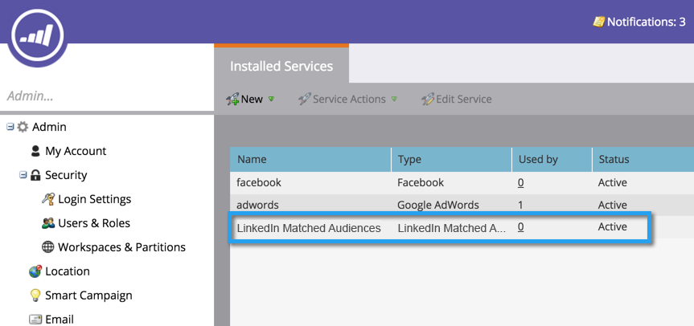

# 将[!DNL LinkedIn]个匹配的受众添加为[!DNL LaunchPoint]服务 {#add-linkedin-matched-audiences-as-a-launchpoint-service}

>[!IMPORTANT]
>
>LinkedIn正在升级由Marketo Engage LinkedIn集成使用的营销API。 在2024年6月7日至12月15日之间，这些更改将要求对您的&#x200B;**管理员** > **LaunchPoint**&#x200B;菜单中的所有LinkedIn LaunchPoint服务进行重新身份验证，以避免服务中断。 有关详细信息，请参阅[迁移常见问题解答](https://nation.marketo.com/t5/employee-blogs/linkedin-re-authentication-required/ba-p/347794){target="_blank"}。

>[!NOTE]
>
>**需要管理员权限**

将您的Marketo帐户与[!DNL LinkedIn]个匹配的受众连接，以使用Marketo静态列表或智能列表作为[!DNL LinkedIn]受众区段。

1. 转到&#x200B;**[!UICONTROL Admin]**&#x200B;部分。

   

1. 选择 **[!UICONTROL LaunchPoint]**。

   

1. 选择&#x200B;**[!UICONTROL New]**&#x200B;和&#x200B;**[!UICONTROL New Service]**。

   

1. 输入&#x200B;**[!UICONTROL Display Name]**&#x200B;并选择&#x200B;**[!UICONTROL LinkedIn Matched Audiences]**。 单击 **[!UICONTROL Create]**。

   

1. 要连接[!DNL LinkedIn]帐户，请单击&#x200B;**[!UICONTROL Authorize]**。

   

   >[!CAUTION]
   >
   >为了使Marketo能够跨多个[!DNL LinkedIn]广告帐户发送受众，您在以下步骤中授权的[!DNL LinkedIn]用户需要有权访问其营销活动管理器中的&#x200B;*所有*&#x200B;这些广告帐户。

1. [!DNL LinkedIn]在新选项卡中打开。 从这里，登录到您的[!DNL LinkedIn]帐户。

   

1. 查看请求的权限，然后单击&#x200B;**[!UICONTROL Allow]**。

   

1. 您的[!DNL LinkedIn]帐户现已连接到Marketo。 单击 **[!UICONTROL Create]**。

   

   太棒了！ 现在，您将在“已安装的服务”选项卡中看到[!DNL LinkedIn]个匹配受众作为[!DNL LaunchPoint]服务列出。

   

>[!MORELIKETHIS]
>
>[使用Marketo列表或智能列表作为 [!DNL LinkedIn] 受众区段](/help/marketo/product-docs/demand-generation/social/social-functions/use-a-marketo-list-or-smart-list-as-a-linkedin-audience-segment.md)
