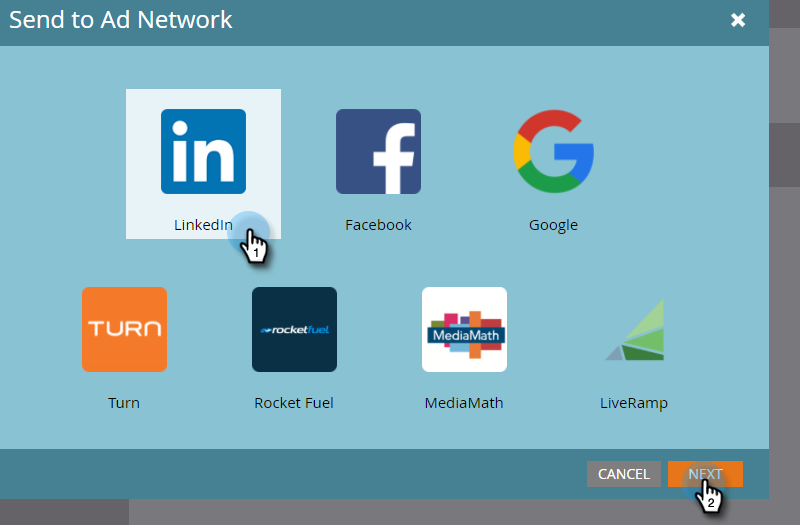
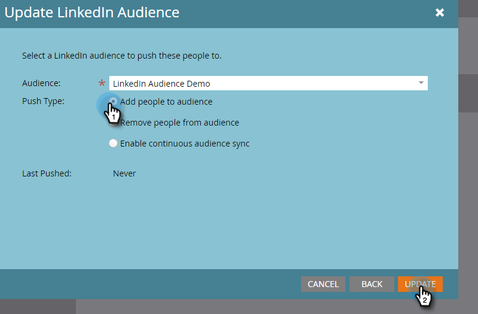

# 将列表发送到广告网络 {#send-a-list-to-an-ad-network}

了解如何将静态列表发送到[!DNL LinkedIn]、[!DNL Facebook]或Google。

## 如何发送列表 {#how-to-send-a-list}

1. 在Marketo中，选择您的列表，单击&#x200B;**[!UICONTROL List Actions]**&#x200B;下拉列表，然后选择&#x200B;**[!UICONTROL Send to Ad Network]**。

   

1. 在[!DNL LinkedIn]、[!DNL Facebook]或Google（其他选项目前不可用）之间选择。 在本例中，我们选择&#x200B;**[!DNL LinkedIn]**。 单击 **[!UICONTROL Next]**。

   

1. 单击&#x200B;**[!UICONTROL Audience]**&#x200B;下拉列表并选择所需的受众。

   

   >[!TIP]
   >
   >如果您需要检查，可以通过状态选项卡查看要将列表同步到的目标受众。

1. 选择所需的[!UICONTROL Push Type]并单击&#x200B;**[!UICONTROL Update]**。

   

   >[!NOTE]
   >
   >如果您选择“[!UICONTROL Enable continuous audience sync]”，Marketo会在您的Marketo实例中的列表更改时，使所选广告网络中的列表保持最新。 如果从静态列表中添加/删除了受众中的人员，则我们将同时添加&#x200B;**和**。

1. 就是这样！ 单击&#x200B;**[!UICONTROL OK]**&#x200B;退出。

   

## 常见问题解答 {#faq}

**单个静态列表能否与多个广告受众同步？**

不能，列表只能同步到单个目标受众。

**如果我启用与现有广告受众的连续同步，是否会替换现有受众？**

不会，现有受众将会添加至，而不是被替换。
