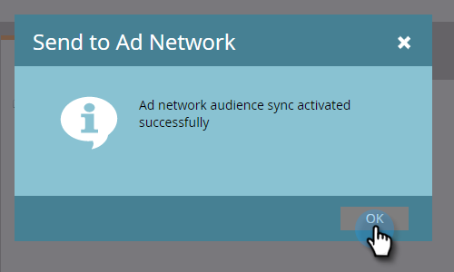

# 将列表发送到广告网络{#send-a-list-to-an-ad-network}

了解如何将静态列表发送到LinkedIn、Facebook或Google。

## 如何发送列表{#how-to-send-a-list}

1. 在Marketo中，选择您的列表，单击&#x200B;**列表操作**&#x200B;下拉框，然后选择&#x200B;**发送到广告网络**。

   

1. 在LinkedIn、Facebook或Google之间进行选择（其他选项目前不可用）。 在此示例中，我们选择&#x200B;**LinkedIn**。 单击&#x200B;**下一步**。

   

1. 单击“受众”下拉框并选择所需的受众。

   

   >[!TIP]
   >
   >如果需要检查，您可以通过状态选项卡查看列表正同步到的目标受众。

1. 选择所需的推送类型，然后单击&#x200B;**更新**。

   

   >[!NOTE]
   >
   >如果您选择“启用连续受众同步”，则Marketo会随着列表成员资格在Marketo实例中发生更改，在选定的广告网络中使列表保持最新。

1. 就这样！ 单击&#x200B;**确定**&#x200B;退出。

   

## 常见问题解答{#faq}

**单个静态列表是否可以与多个广告受众同步？**

否，列表只能同步到单个目标受众。

**如果我启用与现有广告受众的连续同步，是否会替换现有受众?**

否，现有受众将添加到，而不是替换。
