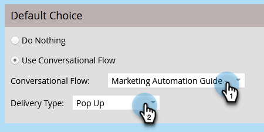

# Marketo EngageForms的对话流设置{#conversational-flow-settings-for-marketo-engage-forms}

通过将Marketo EngageForms与Dynamic Chat对话流集成，使它们具有对话性。 使用表单数据或智能列表成员资格即时确定满足预订、白皮书链接或自定义目标的潜在客户。

>[!PREREQUISITES]
>
>在此处添加先决条件

1. 查找并选择您的表单（或创建一个新表单）。

   

1. 单击 **编辑草稿**.

   

1. 在表单编辑页面上，单击 **表单设置**，则 **设置**.

   

1. 单击 **对话流量设置** 要启用的滑块。

   

1. 此时将显示“默认选择”模式窗口。 选择您的首选项。 在本例中，我们选择 **使用对话流**.

   

1. 选择所需的对话流程和投放类型。

   

   >[!NOTE]
   >
   >[了解有关对话流的更多信息](/help/marketo/product-docs/demand-generation/dynamic-chat-two/automated-chat/conversational-flows-overview.md){target="_blank"}

   **可选步骤**：您可以单击添加选择以定位符合特定标准的聊天访客。

   

   >[!IMPORTANT]
   >
   >在提交表单之前，访客的浏览器必须是以已知人员身份使用Cookie，以便有资格成为静态/智能列表的成员。

1. 单击 **完成** 完成时。

   
