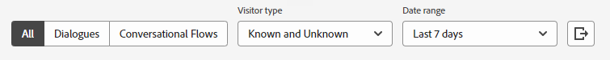

# Analytics {#analytics}

虽然可在对话框级别进行报告，但可使用以下三个功能板检查总体参与情况。

访问左侧导航栏中&#x200B;**Analytics**&#x200B;下的每个仪表板。

## 全局性能仪表板 {#global-performance-dashboard}

查看您的对话框的性能如何，包括参与度和性能量度（总计和一段时间内的性能量度）、性能最佳的页面以及性能最佳的对话框。

查看对话框、对话流或全部。 按已知访客和/或未知访客排序。 选择预设或自定义日期范围。 通过单击按钮导出结果。

## 会议表现信息板 {#meeting-performance-dashboard}

查看已预订的会议数量以及正在与谁预订会议。

查看对话框、对话流或全部。 选择预设或自定义日期范围。 通过单击按钮导出结果。

## 实时聊天性能仪表板 {#live-chat-performance-dashboard}

查看您的现场销售人员进行了多少对话，以及哪些团队表现最佳。

查看对话框、对话流或全部。 选择预设或自定义日期范围。 单击按钮可导出结果。

## 定义 {#definitions}

<table>
<thead>
<tbody>
  <tr>
    <td style="width:25%"><b>已完成</b></td>
    <td>当访客耗尽对话<i>或</i>中的所有内容时，当访客到达对话中的最后一个提示时，就会发生已完成的事件。
     每个访客、每个会话一个已完成的事件。</td>
  </tr>
  <tr>
    <td style="width:25%"><b>已获取用户</b></td>
    <td>在访客提交其电子邮件地址时发生。
     每个访客、每个会话一个客户获取。</td>
  </tr>
</tbody>
</table>
