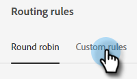

# 路由 {#routing}

可通过两种方式来发送在动态聊天中预订的会议。 轮循或使用自定义规则。

轮盘：会议按顺序分配给座席。 所以，如果你有五个探员和三号探员参加最后一次会议，四号探员会得到下一个，接着是五号探员，然后回到一号探员。

自定义规则：您可以根据您选择的属性选择特定的座席来接收会议。

## 创建自定义规则 {#create-a-custom-rule}

在本例中，我们将所有从CA、OR和WA的推断状态发送给John代理。

1. 在动态聊天中，选择 **路由**.

   

1. 单击 **自定义规则** 选项卡。

   

1. 单击 **创建规则**.

   

1. 为您的规则指定一个名称并单击 **下一个**.

   

1. 选择所需的代理。

   

1. 将鼠标拖动到所需的属性上。

   

1. 查找并选择所需的值。

   

1. 选择所有所需值后，单击 **保存**.

   
