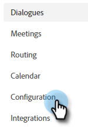

# 对话框概述 {#dialogue-overview}

对话是单独的聊天对话。 在每个对话框中，您可以决定特定聊天对话的显示位置、显示对象以及对话的内容。 每个对话框都有自己的报告页面，您可以在其中监控有效性。

## 受众标准 {#audience-criteria}

在对话的[受众条件](/help/marketo/product-docs/demand-generation/dynamic-chat/automated-chat/audience-criteria.md){target="_blank"}部分，您将定义聊天对话的显示位置和对象

## 流设计器 {#stream-designer}

在对话的[流Designer](/help/marketo/product-docs/demand-generation/dynamic-chat/automated-chat/stream-designer.md){target="_blank"}部分，您将设计要与网站访客进行的对话。

## 报告 {#reports}

在“报表”选项卡中，您可以看到有关对话框执行情况的量度。

<table>
 <tr>
  <td><strong>总触发</strong></td>
  <td>每当访客符合/显示在对话框中时递增。
</td>
 </tr>
 <tr>
  <td><strong>已参与</strong></td>
  <td>当访客与对话框中的至少一个信息卡（例如，问题、信息捕获等）交互时递增</td>
 </tr>
 <tr>
  <td><strong>已完成</strong></td>
  <td>每当访客到达对话框中的任何分支结尾时，就会递增。</td>
 </tr>
 <tr>
  <td><strong>已获取用户</strong></td>
  <td>每次访客在对话框流中提供有效的电子邮件地址时递增。</td>
 </tr>
 <tr>
  <td><strong>已预定会议</strong></td>
  <td>每次访客通过聊天机器人成功安排约会时递增。</td>
 </tr>
 <tr>
  <td><strong>达成的目标</strong></td>
  <td>每当访客在任何对话框流中实现目标时递增。</td>
 </tr>
</table>

## 禁用/启用所有对话框 {#disable-enable-all-dialogues}

您可以同时禁用（和重新启用）所有已发布的对话框。

1. 在Dynamic Chat中，单击&#x200B;**[!UICONTROL 配置]**&#x200B;选项卡。

   

1. 将&#x200B;**[!UICONTROL Chat Enabled]**&#x200B;开关切换为off以禁用（重新启用）所有对话框。

   
