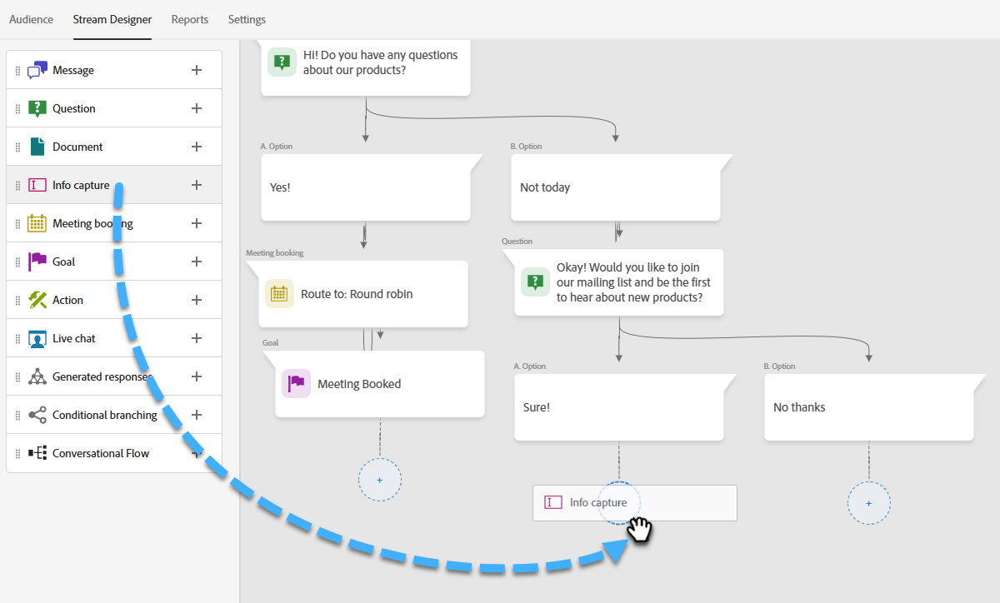

# 流设计器 {#stream-designer}

有 _许多_ 可能的流组合。 本文包含一个示例，其中营销人员询问网站访客是否对产品有任何疑问。 如果是，访客可以安排约会。 如果没有，访客可以选择加入邮件列表以备将来通信。 酒店还提供免费PDF。 最终目标是安排约会或收集访客的电子邮件。

>[!PREREQUISITES]
>
>必须先执行以下操作，然后才能使用文档卡 [设置](/help/marketo/product-docs/demand-generation/dynamic-chat/integrations/adobe-pdf-embed-api.md){target="_blank"} 在您的Adobe帐户中。

## 流设计器卡片 {#stream-designer-cards}

流设计器包含多个卡片，您可以添加这些卡片来塑造聊天对话。

<table>
 <tr>
  <td style="width:25%"><strong>消息</strong></td>
  <td>当您想在不做任何响应的情况下发表声明时(例如：“您好！ 使用优惠码SAVE25”，现享所有项目现享25%优惠)。
</td>
 </tr>
 <tr>
  <td style="width:25%"><strong>问题</strong></td>
  <td>当您想询问多选问题时使用，您可以提供其中可用的回答(例如：您感兴趣的车辆类型是什么？ 响应= SUV、紧凑型、卡车等)。</td>
 </tr>
 <tr>
  <td style="width:25%"><strong>文档</strong></td>
  <td>允许将PDF文档嵌入对话框并跟踪访客的文档参与活动（查看了多少页、是否下载了文档以及/或者使用了任何搜索词）。</td>
 </tr>
 <tr>
  <td style="width:25%"><strong>信息捕获</strong></td>
  <td>在要收集信息（例如，姓名、电子邮件地址、职务等）时使用。 选择要将访客的响应归因到哪个字段后，您可以选择允许访客键入其响应，或从您确定的选择列表中选择选项（提示：后者有助于保持数据库清洁）。 您还可以选择用用户的响应覆盖当前为其列出的任何数据，或者完全跳过问题（如果您已经为其指定了值）。</td>
 </tr>
 <tr>
  <td style="width:25%"><strong>会议预订</strong></td>
  <td>为访客提供可用于安排会议的日期的日历。 通过循环调度法、特定代理或使用自定义规则选择日历可用性。 单击 <b>添加属性</b> 如果您要捕获代理的姓名或电子邮件地址，并将其分配给聊天访客的个人记录以供将来查询(提示：创建 <a href="/help/marketo/product-docs/administration/field-management/create-a-custom-field-in-marketo.md" target="_blank">自定义字段</a> 将代理的信息映射为以便不覆盖标准Marketo Engage字段)。</td>
 </tr>
 <tr>
  <td style="width:25%"><strong>目标</strong></td>
  <td>这是访客不会看到的唯一一张卡。 由您来确定在特定聊天中实现目标的时间（例如：如果收集访客的电子邮件是您的目标，则将“目标”卡片放在流中信息捕获后的紧跟位置）。</td>
 </tr>
 <tr>
  <td style="width:25%"><strong>操作</strong></td>
  <td>与表单中的隐藏字段类似，使用操作卡，您可以填充任何潜在客户或公司属性(具有 <a href="/help/marketo/product-docs/administration/field-management/custom-field-type-glossary.md#string">字符串数据类型</a>)，其中包含您要针对潜在客户记录捕获的隐式值。 您可以在对话的任何位置添加操作卡，并使用自动填充相应值的值或本机令牌更新相应的属性。</td>
 </tr>
 <tr>
  <td style="width:25%"><strong>实时聊天</strong></td>
  <td>当您希望访客与实时座席聊天时，可使用实时聊天卡。
  <li>实时聊天卡必须是分支中的最后一张卡。</li>
  <li>访客一旦在流中到达此信息卡就会被路由到代理，因此建议在此信息卡之前添加一个问题卡，询问访客是否愿意与实时代理聊天。</li></td>
 </tr>
</table>

## 流设计器图标 {#stream-designer-icons}

在流设计器的右上角，您会看到几个图标。 这是他们所做的。

<table>
 <tr>
  <td style="width:10%"></td>
  <td>放大，创建更大的卡片</td>
 </tr>
 <tr>
  <td style="width:10%"></td>
  <td>缩小，创建较小的卡片</td>
 </tr>
 <tr>
  <td style="width:10%"></td>
  <td>打开一个用于测试聊天内容的窗口（按同一按钮关闭）</td>
 </tr>
 <tr>
  <td style="width:10%"></td>
  <td>允许您在流中搜索卡片类型或内容</td>
 </tr>
 <tr>
  <td style="width:10%"></td>
  <td>排列您的流中的所有卡片</td>
 </tr>
</table>

## 创建流 {#create-a-stream}

可以为对话框创建流或 [对话式Forms](/help/marketo/product-docs/demand-generation/dynamic-chat/automated-chat/conversational-flow-overview.md){target="_blank"}. 在本例中，我们将为对话框创建一个。

1. 在您拥有 [已创建您的对话框](/help/marketo/product-docs/demand-generation/dynamic-chat/automated-chat/create-a-dialogue.md){target="_blank"}，单击 **流设计器** 选项卡。

   

1. 拖放问题卡。

   

1. 在“聊天机器人响应”下，说出您想要如何回答的问题。

   

   >[!TIP]
   >
   >您可以使用令牌为已知聊天访客个性化体验(例如：Hello `{{lead.leadFirstName:""}}`)。 只需单击右侧的花括号图标即可进行选择。 如果您希望匿名访客看到通用内容（例如：Hello），请在引用之间添加默认值 `{{lead.leadFirstName:"there"}}`)。

   >[!NOTE]
   >
   >默认情况下，Poke设置为on，它会在聊天图标旁边显示开始的问题，访客无需单击该图标即可查看。 Poke仅在对话的第一张卡片中可用。

1. 输入用户响应并单击 **保存**.

   

   >[!NOTE]
   >
   >**编辑存储的值** 对于希望为问题卡中的映射属性在数据库中存储与聊天机器人中向访客显示的值不同的值的人来说，这是一个可选步骤（例如：访客看到“搜索引擎优化”，即将该值存储为“SEO”）。

1. 对于“是”，我们需要安排约会，因此在该选项的下方将拖到Appointment Scheduler卡。

   

1. 在右侧的列中，单击 **保存**.

   

1. 由于这是目标，因此请将目标卡拖动到约会计划程序下。

   

1. 命名您的目标（或选择现有目标），然后单击 **保存**.

   

1. 对于“否”，我们希望查看他们是否将加入邮件列表，因此在该选项下拖动到另一个问题卡上。

   

1. 输入您的响应，并为访客添加响应选项。 单击 **保存** 完成时。

   

   >[!NOTE]
   >
   >您可以通过单击 **添加响应**.

1. 在“是”响应下方，将拖到“信息捕获”卡上，以便收集访客的电子邮件。

   

1. 单击 **类型** 下拉并选择 **电子邮件**.

   

1. 输入聊天机器人消息和占位符。 确保将该属性映射到Marketo中的相应字段，然后单击 **保存**.

   

   <table>
    <tr>
     <td style="width:30%"><strong>类型</strong></td>
     <td>要捕获的信息类型：电话、文本、电子邮件。</td>
    </tr>
    <tr>
     <td style="width:30%"><strong>聊天机器人消息</strong></td>
     <td>访客看到的提示他们提供信息的消息。</td>
    </tr>
    <tr>
     <td style="width:30%"><strong>占位符</strong></td>
     <td>帮助访客查看要输入内容的示例文本。</td>
    </tr>
    <tr>
     <td style="width:30%"><strong>将响应映射到属性</strong></td>
     <td>允许您将访客的响应同步到Marketo订阅中其人员记录中的相应字段。</td>
    </tr>
   </table>

1. 由于收集其电子邮件是一个目标，因此请将“目标”卡片拖动到“信息捕获”下方。

   

1. 命名您的目标（或选择现有目标），然后单击 **保存**.

   

1. 如果回答“否”，请记得添加响应。 一种选择是将信息卡拖到下面并说“谢谢”。 但在本例中，我们将改为向他们提供免费PDF文档。

   

1. 在本例中，我们将创建一个新文档。 为其命名，输入已托管PDF的URL，然后单击 **保存**.

   

1. 选择 **预览** 切换可预览您的对话框。

   

1. 准备好激活对话框时，请单击 **Publish**.

   

>[!NOTE]
>
>在单击“发布”之前，请记住确保 [已输入您的目标URL](/help/marketo/product-docs/demand-generation/dynamic-chat/automated-chat/audience-criteria.md#target){target="_blank"}.

>[!MORELIKETHIS]
>
>* [创建对话框](/help/marketo/product-docs/demand-generation/dynamic-chat/automated-chat/create-a-dialogue.md){target="_blank"}
>* [受众标准](/help/marketo/product-docs/demand-generation/dynamic-chat/automated-chat/audience-criteria.md){target="_blank"}
>* [Adobe PDF嵌入API](/help/marketo/product-docs/demand-generation/dynamic-chat/integrations/adobe-pdf-embed-api.md){target="_blank"}
