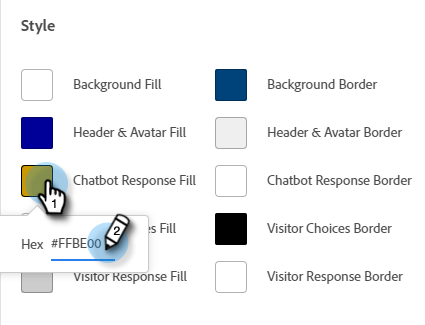

# 配置 {#configuration}

了解如何自定义聊天机器人对话框窗口的外观。

要开始配置，请单击 **配置**.

有几个不同的自定义选项。

## 样式选项卡 {#style-tab}

**样式**

您将在此处定义将显示对话框的聊天机器人的外观，包括：颜色、字体、机器人小组件的位置以及聊天机器人的名称/头像。

每个类别的颜色由 [十六进制颜色值](https://color.adobe.com/create/color-wheel) (例如，白色= #ffffff、红色= #bf1932等)。

锚点允许网站访客打开/关闭聊天框。 您可以选择希望该图标显示在右下方还是左下方。 您还可以增加/减少填充（图标与网页底部之间的间距量）。

**代理设置**

在“代理设置”中，您可以向动态消息框中添加标签(例如：“Adobe机器人”)。 您还可以确定响应延迟（以秒为单位），并更改您的聊天头像。 要上传您自己的头像图像，请单击 **+** 按钮。

>[!NOTE]
>
>自定义头像应为小于256kb且小于200x200像素的方形图像。 支持的文件类型包括：.jpg、.png、.gif、.webp、.svg。

完成更改后，请记住单击 **保存**.

## “隐私”选项卡 {#privacy-tab}

单击 **隐私** 选项卡，以添加/编辑网站隐私政策的URL（可选）。

## “安装”选项卡 {#installation-tab}

为了让聊天机器人显示在您的网站上，您首先需要安装动态聊天JavaScript代码片段。 单击此选项卡以查找/复制必需的代码。 如果您不熟悉此操作，请联系您的Web团队或IT部门以寻求帮助。

>[!TIP]
>
>如果您的网站使用内容安全策略，您可能需要将以下URL列入白名单，以便聊天机器人能够按预期工作：
>
>* `*.adoberesources.net`
>* `*.adobe.io`
>* `*.typekit.net`

>[!NOTE]
>
>Marketo支持未设置为有助于对HTML进行故障诊断。 如需HTML帮助，请咨询Web开发人员。
