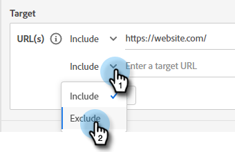

# 受众标准 {#audience-criteria}

与Marketo智能列表类似，受众标准属性允许您定义目标受众。 您可以使用推断的、人员或公司属性（或它们的组合）定位已知或未知人员。

## 优先级 {#priority}

优先级确定在符合多个对话框资格的情况下，潜在客户将收到哪个对话框。 它是当你第一次接触时 [创建您的对话框](/help/marketo/product-docs/demand-generation/dynamic-chat/dialogues/create-a-dialogue.md){target="_blank"}. 您可以通过打开现有对话框并转到 **对话框详细信息** 在受众标准选项卡中。

## 事件 {#events}

事件允许您根据访客滚动多少或他们在您的页面/网站上的时间长短来定位访客。 在以下示例中，我们的定位是在特定页面上停留超过20秒的访客。

1. 抓住 **页面逗留时间** 事件并将其拖动到右侧。

   

1. 将“大于”时间设置为20秒。

   

1. 将所需页面的URL添加到 [Target](#target) 部分。

   

## 属性 {#attributes}

**已知人员**

有 _许多_ 属性组合以供选择。 在下面的示例中，我们以 **已知人员** 在加州一家员工超过50人的公司工作。

1. 抓住 **人员状态** 属性，并将其拖动到右侧。

   

1. _是_ 默认设置。 在选择值字段中，键入CA（您还可以单击下拉菜单并从列表中选择）。

   

1. 抓住 **公司规模** 归因并将其拖动到上面写着 _将属性拖放到此处_.

   

   >[!NOTE]
   >
   >您还可以通过单击属性的 **+** 图标。

1. 单击运算符下拉列表，然后选择 **大于**.

   

1. 键入50并单击屏幕上的其他位置进行保存。

   

就是这样！

**匿名人员**

有一种简便的方法可以专门定向尚未出现在数据库中的用户。 在本例中，我们以 **匿名人员** 位于纽约地区。

1. 抓住 **人员电子邮件** 属性，并将其拖动到右侧。

   

1. 单击运算符下拉列表，然后选择 **为空**.

   

1. 抓住 **推断的状态** 归因并将其拖动到上面写着 _将属性拖放到此处_.

   

   >[!NOTE]
   >
   >当有人访问您的网站时， [蒙奇金](/help/marketo/product-docs/administration/additional-integrations/add-munchkin-tracking-code-to-your-website.md) 将他们饼干并放入系统中。 我们在一个特殊的数据库中查找他们的IP，并推断出各种好的信息。

1. _是_ 默认设置。 在选择值字段中，键入NY （您还可以单击下拉菜单并从列表中选择）。

   

## 添加组 {#add-groups}

如果您希望具有所有特定属性以及其他的“所有或任何”属性，也可以选择对属性进行分组。 您可以添加多个组。

## 目标 {#target}

您可以在此处输入希望特定对话框显示的URL。 您还可以选择添加排除项。

可接受的格式：

* `http://website.com`
* `https://*.website.com`
* `http://website.com/folder/*`
* `https://*.website.com/folder/*`

>[!NOTE]
>
>使用星号就像一个全面的通配符。 因此 `https://*.website.com` 将对话框置于网站的每个页面上，包括子域(例如： `support.website.com`)。 和 `https://website.com/folder/*` 会在后续文件夹中的每个HTML页面上放置对话框(例如：在此示例中，假设文件夹为“sports”，例如：website.com/sports/baseball.html、website.com/sports/football.html等)。

**排除项**

使用排除项确保您的对话框 **非** 会显示在您网站的特定页面/区域。 排除项遵循与包含项相同的格式。

>[!MORELIKETHIS]
>
>* [创建对话框](/help/marketo/product-docs/demand-generation/dynamic-chat/dialogues/create-a-dialogue.md){target="_blank"}
>* [流设计器](/help/marketo/product-docs/demand-generation/dynamic-chat/dialogues/stream-designer.md){target="_blank"}
>* [报表](/help/marketo/product-docs/demand-generation/dynamic-chat/dialogues/reports.md){target="_blank"}
