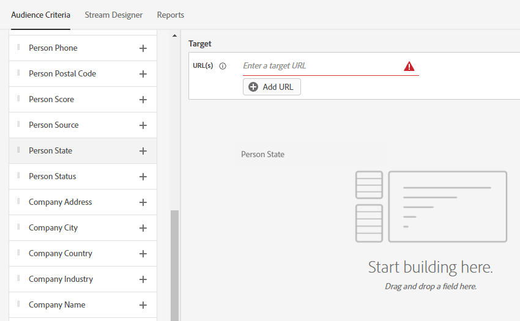

# 对话框概述 {#dialogue-overview}

对话是单独的聊天对话。 在每个对话框中，您可以决定特定聊天对话的显示位置、向谁显示对话以及对话的内容。 每个对话框还有其自己的报告页面，您可以在该页面中监控有效性。

## 受众标准 {#audience-criteria}

的 [受众标准](/help/marketo/product-docs/demand-generation/dynamic-chat/dialogues/audience-criteria.md){target=&quot;_blank&quot;}部分的内容是您定义将显示聊天对话的位置和对象的位置

## 流设计器 {#stream-designer}

的 [流设计器](/help/marketo/product-docs/demand-generation/dynamic-chat/dialogues/stream-designer.md)在对话框的{target=&quot;_blank&quot;}部分，您将设计要与网站访客进行的对话。

## 报表 {#reports}

的 [报表](/help/marketo/product-docs/demand-generation/dynamic-chat/dialogues/reports.md)在对话框的{target=&quot;_blank&quot;}部分中，您将能够查看有关对话框性能的量度。
