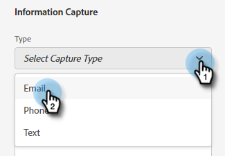

# 流设计器 {#stream-designer}

有 _许多_ 流组合。 本文包含一个示例，营销人员在该示例中询问网站访客是否有任何产品问题。 如果是，则访客可以计划约会。 如果否，则访客可以选择加入邮件列表以备将来通信。 酒店还提供免费PDF。 最终目标是安排约会或收集访客的电子邮件。

>[!PREREQUISITES]
>
>在使用文档卡之前，您必须先 [设置](/help/marketo/product-docs/demand-generation/dynamic-chat/dialogues/using-the-document-card.md){target=&quot;_blank&quot;}的Adobe帐户。

## 流设计器卡片 {#stream-designer-cards}

流设计器包含多张可添加以塑造聊天对话的卡片。

<table>
 <tr>
  <td><strong>消息</strong></td>
  <td>当您想要做出无需响应的语句时使用(例如：“嗨！ 所有项目现在都优惠25%，代码为SAVE25”)。
</td>
 </tr>
 <tr>
  <td><strong>问题</strong></td>
  <td>当您想要提出多选问题时，可使用该问题提供可用的响应(例如：你对哪种车感兴趣？ 响应= SUV、紧凑型、卡车等)。</td>
 </tr>
 <tr>
  <td><strong>文档</strong></td>
  <td>允许您在对话框中嵌入PDF文档，并跟踪访客的文档参与活动（查看了多少页面、已下载了文档，和/或使用了任何搜索词）。</td>
 </tr>
 <tr>
  <td><strong>信息捕获</strong></td>
  <td>在要收集信息时使用。 要选择的三个字段是“电子邮件地址”、“电话号码”和“文本”（允许访客自行编写消息）。</td>
 </tr>
 <tr>
  <td><strong>预约调度程序</strong></td>
  <td>为访客提供可用日期的日历以安排后续活动。 日历可用性反映 <a href="/help/marketo/product-docs/demand-generation/dynamic-chat/dynamic-chat-overview.md#routing">下一位代理排队</a>.</td>
 </tr>
 <tr>
  <td><strong>目标</strong></td>
  <td>这是访客看不到的唯一一张卡。 您可以确定在特定聊天中的哪个时间点实现目标(例如：如果您的目标是收集访客的电子邮件，请将目标卡片放在流中信息捕获之后立即放置。)</td>
 </tr>
</table>

## 创建流 {#create-a-stream}

1. 在 [已创建对话框](/help/marketo/product-docs/demand-generation/dynamic-chat/dialogues/create-a-dialogue.md){target=&quot;_blank&quot;}，单击 **流设计器** 选项卡。

   

1. 拖放问题卡。

   

1. 在“查特机器人响应”下，回答您的问题。

   

   >[!NOTE]
   >
   >Poke默认设置为on ，该设置在聊天图标旁边显示开题问题，访客无需单击该图标即可看到该问题。 Poke仅在对话中的第一张卡上可用。

1. 输入用户响应并单击 **保存**.

   

   >[!NOTE]
   >
   >**编辑存储的值** 对于那些希望在数据库中存储与在聊天机器人中为问题卡中映射的属性向访客显示的内容不同的值的用户而言，这是一个可选步骤(例如：访客会看到“搜索引擎优化”，您将该值存储为“SEO”。)

1. 对于“是”，我们要计划日程安排，因此该选项下方会拖动到日程安排计划程序卡上。

   

1. 在右侧的列中，单击 **保存**.

   

1. 由于这是一个目标，请将目标卡拖动到日程安排计划程序下方。

   

1. 命名您的目标（或选择现有目标）并单击 **保存**.

   

1. 对于“否”，我们希望了解他们是否将加入邮件列表，因此，在下面，该选项会拖动到另一张问题卡上。

   

1. 输入您的响应，并为访客添加响应选项。 单击 **保存** 完成时。

   

   >[!NOTE]
   >
   >您可以通过单击 **添加响应**.

1. 在“是”响应下方，将鼠标拖动到“信息捕获”卡上，以便收集访客的电子邮件。

   

1. 单击 **类型** 下拉框并选择 **电子邮件**.

   

1. 输入聊天机器人消息和占位符。 确保将属性映射到Marketo中的相应字段，然后单击 **保存**.

   

   <table>
    <tr>
     <td><strong>类型</strong></td>
     <td>要捕获的信息类型：电话，短信，电子邮件。</td>
    </tr>
    <tr>
     <td><strong>聊天机器人消息</strong></td>
     <td>访客看到的消息提示他们提供信息。</td>
    </tr>
    <tr>
     <td><strong>占位符</strong></td>
     <td>帮助访客查看要输入内容的示例文本。</td>
    </tr>
    <tr>
     <td><strong>将响应映射到属性</strong></td>
     <td>用于将访客的响应同步到其在Marketo订阅中的人员记录中的相应字段。</td>
    </tr>
   </table>

1. 由于收集其电子邮件是一个目标，因此请将目标卡片拖动到“信息捕获”下方。

   

1. 命名您的目标（或选择现有目标）并单击 **保存**.

   

1. 请记住，如果用户说“否”，请添加响应。 一个选项是将信息卡拖到下面，说“谢谢”。 但在本例中，我们将为他们提供免费的PDF文档。

   

1. 在本例中，我们将创建一个新文档。 为其命名，输入您已托管的PDF的URL，然后单击 **保存**.

   

1. 选择 **预览** 切换以预览对话框。

   

1. 准备好激活对话框后，单击 **发布**.

   

>[!NOTE]
>
>在单击发布之前，请记得确保 [输入了目标URL](/help/marketo/product-docs/demand-generation/dynamic-chat/dialogues/audience-criteria.md#target){target=&quot;_blank&quot;}。

>[!MORELIKETHIS]
>
>* [创建对话框](/help/marketo/product-docs/demand-generation/dynamic-chat/dialogues/create-a-dialogue.md){target=&quot;_blank&quot;}
>* [受众标准](/help/marketo/product-docs/demand-generation/dynamic-chat/dialogues/audience-criteria.md){target=&quot;_blank&quot;}
>* [报表](/help/marketo/product-docs/demand-generation/dynamic-chat/dialogues/reports.md){target=&quot;_blank&quot;}
>* [使用文档卡](/help/marketo/product-docs/demand-generation/dynamic-chat/dialogues/using-the-document-card.md){target=&quot;_blank&quot;}

