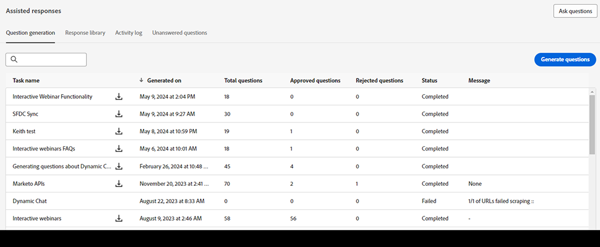

# 创作AI概述 {#generative-ai-overview}

利用Adobe Dynamic Chat中由创新型人工智能支持的功能，可优化销售代理的工作效率、深入了解网站访客意图并以安全的方式回应访客问题。

## 权限 {#permissions}

若要使用创作AI，请确保向所需用户授予适当的[权限](/help/marketo/product-docs/demand-generation/dynamic-chat/setup-and-configuration/permissions.md)。

## 生成响应卡 {#generation-response-card}

为访客在对话中到达某个时间点时创建消息。 设置他们一次可以提出的一系列问题，以获得您所需的关键绩效指标。 最多添加5个跟进问题，如果没有对访客问题的响应，则包括一个回退消息。

## 对话摘要 {#conversation-summary}

通常，要获取访客对话的完整上下文，您必须滚动浏览整个聊天记录。 对话摘要会实时为您生成摘要，甚至包括访客表示感兴趣的主题。 这对于需要在与多个访客的聊天之间切换时快速了解对话上下文的聊天代理特别有用。 除了在“代理收件箱”聊天屏幕中显示外，还可以在访客的Marketo Engage数据库中个人记录的活动日志中找到已完成的对话摘要。

>[!NOTE]
>
>将为实时和自动聊天生成对话摘要。

## 问题生成 {#question-generation}

使用经过销售、营销和产品知识培训的界面，通过人工智能辅助对话提升访客的入站体验](/help/marketo/product-docs/demand-generation/dynamic-chat/generative-ai/question-generation.md)。[

## 回复库 {#response-library}

[生成自定义的问题和答案集合](/help/marketo/product-docs/demand-generation/dynamic-chat/generative-ai/response-library.md)，全部由您预先批准，用于创作AI聊天营销活动中。

## 活动日志 {#activity-log}

[查看所有任务的列表](/help/marketo/product-docs/demand-generation/dynamic-chat/generative-ai/activity-log.md)及其随附的详细信息，包括名称、所有者、类型以及编辑这些任务的人和时间。

## 未解答的问题 {#unanswered-questions}

[使用基于先前对话未回答问题库的人工智能，为您的响应库创建其他预批准的响应](/help/marketo/product-docs/demand-generation/dynamic-chat/generative-ai/unanswered-questions.md)。

## 讨论的主题 {#discussed-topics}

讨论的主题将作为约束显示在智能列表触发器和过滤器中，允许您进一步深入到Dynamic Chat分析中。

>[!IMPORTANT]
>
>使用创作AI时，您必须遵守[Adobe Experience Cloud创作AI用户准则](https://www.adobe.com/legal/licenses-terms/adobe-dx-gen-ai-user-guidelines.html)，以便我们能够确保以安全负责的方式使用包含创作AI的Adobe Experience Cloud功能。

## 常见问题 {#faq}

**创作AI是否适用于所有Dynamic Chat用户？**

生成人工智能仅适用于Dynamic ChatPrime订阅者。 有关详细信息，请联系Adobe客户团队（您的客户经理）。

**我可以生成的问题和答案的数量是否存在限制？**

是的。 此时的生命周期限制为1000。

**生成AI中有哪些语言？**

目前，创成式人工智能仅支持英语。
