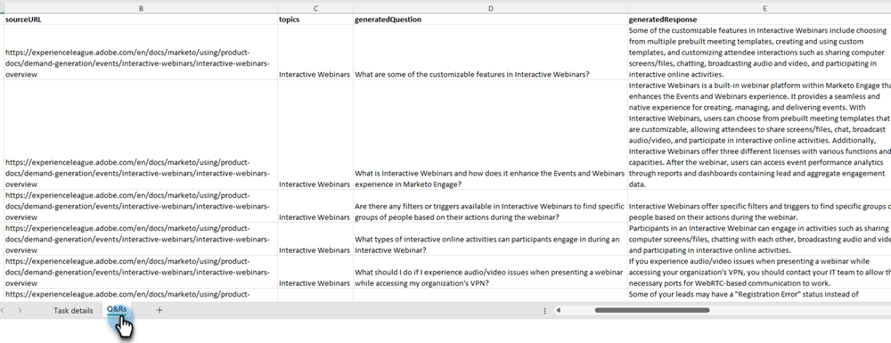

# 问题生成 {#question-generation}

查看您的所有任务及其相关详细信息，例如何时生成任务、问题总数、审批状态等。

## 生成问题 {#generate-questions}

1. 在“生成AI”下，单击 **辅助响应**.

   

1. 单击 **生成问题**.

   

1. 为您的任务提供一个名称并输入源URL（最多50个），将从其中提取所有内容。 输入所需的主题/关键字，然后在键盘上按Enter键。 完成后，单击 **生成**.

   

   >[!IMPORTANT]
   >
   >要确保Marketo Engage列入允许列表能够从提供的URL中擦除内容，您必须先多个IP地址。 [有关详细信息，请参阅下文](#ip-addresses-to-allowlist).

1. 根据您的内容，生成问题和响应最多可能需要30分钟。 单击 **确定**.

   

   >[!TIP]
   >
   >页面上的状态不会实时更新。 点击刷新以查看从“正在处理”到“完成”的时间。

   

## 下载问题和回答 {#download-questions-and-responses}

>[!NOTE]
>
>生成的问题和响应也可在 [响应库](/help/marketo/product-docs/demand-generation/dynamic-chat/generative-ai/response-library.md).

1. 找到所需的任务，然后单击其名称旁边的下载图标。

   

1. 在浏览器中找到downloads文件夹，然后选择该文件。 根据您使用的浏览器，这可能看起来有所不同。

   

1. 在Excel文件中， **任务详细信息** 显示了有关任务的各种详细信息，包括有关如何添加/编辑问题和/或响应的说明。

   

   >[!NOTE]
   >
   >如果您确实决定批量编辑问题和/或响应， [在此处了解如何重新上传它们](/help/marketo/product-docs/demand-generation/dynamic-chat/generative-ai/response-library.md).

1. 此 **Q&amp;R** 选项卡提供了其他详细信息，包括生成的问题和响应。

   

## 要允许列表的IP地址 {#ip-addresses-to-allowlist}

为了能够在生成问题和响应期间从Web URL提取内容，请确保以下所有IP地址都已被您的Web团队列入允许列表。

<table width="150">
  <tr>
    <td>20.167.0.149</td>
  </tr>
  <tr>
    <td>20.248.129.111</td>
  </tr>
  <tr>
    <td>20.167.0.146</td>
  </tr>
  <tr>
    <td>20.167.0.205</td>
  </tr>
  <tr>
    <td>20.248.135.80</td>
  </tr>
  <tr>
    <td>20.92.173.115</td>
  </tr>
  <tr>
    <td>20.167.0.195</td>
  </tr>
  <tr>
    <td>20.248.128.31</td>
  </tr>
  <tr>
    <td>20.167.1.48</td>
  </tr>
  <tr>
    <td>20.167.1.63</td>
  </tr>
  <tr>
    <td>20.167.1.92</td>
  </tr>
  <tr>
    <td>20.167.1.155</td>
  </tr>
  <tr>
    <td>20.248.135.132</td>
  </tr>
  <tr>
    <td>20.248.135.108</td>
  </tr>
  <tr>
    <td>20.248.134.140</td>
  </tr>
  <tr>
    <td>20.167.1.242</td>
  </tr>
  <tr>
    <td>20.167.0.198</td>
  </tr>
  <tr>
    <td>20.248.133.185</td>
  </tr>
  <tr>
    <td>20.248.134.190</td>
  </tr>
  <tr>
    <td>20.167.1.254</td>
  </tr>
  <tr>
    <td>20.248.128.118</td>
  </tr>
  <tr>
    <td>20.248.131.252</td>
  </tr>
  <tr>
    <td>20.167.0.188</td>
  </tr>
  <tr>
    <td>20.167.0.201</td>
  </tr>
  <tr>
    <td>20.211.64.11</td>
  </tr>
  <tr>
    <td>20.76.243.87</td>
  </tr>
  <tr>
    <td>20.76.244.212</td>
  </tr>
  <tr>
    <td>20.76.245.48</td>
  </tr>
  <tr>
    <td>20.76.245.76</td>
  </tr>
  <tr>
    <td>20.76.246.63</td>
  </tr>
  <tr>
    <td>20.76.246.146</td>
  </tr>
  <tr>
    <td>20.76.246.248</td>
  </tr>
  <tr>
    <td>20.76.247.92</td>
  </tr>
  <tr>
    <td>20.76.247.134</td>
  </tr>
  <tr>
    <td>20.76.247.244</td>
  </tr>
  <tr>
    <td>20.93.168.10</td>
  </tr>
  <tr>
    <td>20.93.168.44</td>
  </tr>
  <tr>
    <td>20.93.168.137</td>
  </tr>
  <tr>
    <td>20.93.169.20</td>
  </tr>
  <tr>
    <td>20.93.169.115</td>
  </tr>
  <tr>
    <td>20.93.169.214</td>
  </tr>
  <tr>
    <td>20.93.170.130</td>
  </tr>
  <tr>
    <td>20.93.170.138</td>
  </tr>
  <tr>
    <td>20.93.170.149</td>
  </tr>
  <tr>
    <td>20.93.172.63</td>
  </tr>
  <tr>
    <td>20.93.173.217</td>
  </tr>
  <tr>
    <td>20.93.173.243</td>
  </tr>
  <tr>
    <td>20.93.174.120</td>
  </tr>
  <tr>
    <td>20.93.174.159</td>
  </tr>
  <tr>
    <td>20.105.224.16</td>
  </tr>
  <tr>
    <td>20.10.235.102</td>
  </tr>
  <tr>
    <td>20.10.235.103</td>
  </tr>
  <tr>
    <td>20.10.235.143</td>
  </tr>
  <tr>
    <td>20.10.235.146</td>
  </tr>
  <tr>
    <td>20.10.235.147</td>
  </tr>
  <tr>
    <td>20.10.235.148</td>
  </tr>
  <tr>
    <td>20.10.235.188</td>
  </tr>
  <tr>
    <td>20.10.235.189</td>
  </tr>
  <tr>
    <td>20.10.235.246</td>
  </tr>
  <tr>
    <td>20.10.235.248</td>
  </tr>
  <tr>
    <td>20.10.235.255</td>
  </tr>
  <tr>
    <td>20.10.236.96</td>
  </tr>
  <tr>
    <td>20.10.236.97</td>
  </tr>
  <tr>
    <td>20.10.236.110</td>
  </tr>
  <tr>
    <td>20.10.236.111</td>
  </tr>
  <tr>
    <td>20.10.235.254</td>
  </tr>
  <tr>
    <td>20.10.236.138</td>
  </tr>
  <tr>
    <td>20.10.236.139</td>
  </tr>
  <tr>
    <td>20.10.236.140</td>
  </tr>
  <tr>
    <td>20.10.236.141</td>
  </tr>
  <tr>
    <td>20.10.236.84</td>
  </tr>
  <tr>
    <td>20.10.236.85</td>
  </tr>
  <tr>
    <td>20.10.236.86</td>
  </tr>
  <tr>
    <td>20.10.236.87</td>
  </tr>
  <tr>
    <td>20.119.144.14</td>
  </tr>
  <tr>
    <td>20.75.41.107</td>
  </tr>
  <tr>
    <td>20.75.43.104</td>
  </tr>
  <tr>
    <td>20.75.43.107</td>
  </tr>
  <tr>
    <td>20.75.43.113</td>
  </tr>
  <tr>
    <td>20.75.43.124</td>
  </tr>
  <tr>
    <td>20.75.43.204</td>
  </tr>
  <tr>
    <td>20.75.43.207</td>
  </tr>
  <tr>
    <td>20.75.43.214</td>
  </tr>
  <tr>
    <td>20.75.43.220</td>
  </tr>
  <tr>
    <td>20.75.44.0</td>
  </tr>
  <tr>
    <td>20.75.44.9</td>
  </tr>
  <tr>
    <td>20.75.44.52</td>
  </tr>
  <tr>
    <td>20.75.44.66</td>
  </tr>
  <tr>
    <td>20.75.44.82</td>
  </tr>
  <tr>
    <td>20.75.44.105</td>
  </tr>
  <tr>
    <td>20.75.44.108</td>
  </tr>
  <tr>
    <td>20.75.44.133</td>
  </tr>
  <tr>
    <td>20.75.44.135</td>
  </tr>
  <tr>
    <td>20.75.44.137</td>
  </tr>
  <tr>
    <td>20.75.44.147</td>
  </tr>
  <tr>
    <td>20.75.44.154</td>
  </tr>
  <tr>
    <td>20.75.44.195</td>
  </tr>
  <tr>
    <td>20.75.44.198</td>
  </tr>
  <tr>
    <td>20.75.45.32</td>
  </tr>
  <tr>
    <td>20.119.136.14</td>
  </tr>
  <tr>
    <td>172.177.93.157</td>
  </tr>
  <tr>
    <td>52.252.22.155</td>
  </tr>
  <tr>
    <td>20.62.18.64</td>
  </tr>
  <tr>
    <td>52.179.234.0</td>
  </tr>
  <tr>
    <td>52.179.234.1</td>
  </tr>
  <tr>
    <td>52.179.237.99</td>
  </tr>
  <tr>
    <td>52.179.237.148</td>
  </tr>
  <tr>
    <td>52.252.23.246</td>
  </tr>
  <tr>
    <td>52.253.64.47</td>
  </tr>
  <tr>
    <td>52.253.64.124</td>
  </tr>
  <tr>
    <td>52.253.64.125</td>
  </tr>
  <tr>
    <td>52.253.65.84</td>
  </tr>
  <tr>
    <td>52.253.65.85</td>
  </tr>
  <tr>
    <td>52.254.103.240</td>
  </tr>
  <tr>
    <td>52.253.65.92</td>
  </tr>
  <tr>
    <td>52.253.65.93</td>
  </tr>
  <tr>
    <td>52.177.89.135</td>
  </tr>
  <tr>
    <td>52.253.69.207</td>
  </tr>
  <tr>
    <td>52.253.69.240</td>
  </tr>
  <tr>
    <td>52.167.19.211</td>
  </tr>
  <tr>
    <td>52.177.147.229</td>
  </tr>
  <tr>
    <td>40.65.238.53</td>
  </tr>
  <tr>
    <td>52.177.147.249</td>
  </tr>
  <tr>
    <td>20.44.83.102</td>
  </tr>
  <tr>
    <td>52.177.148.19</td>
  </tr>
  <tr>
    <td>20.49.97.17</td>
  </tr>
  <tr>
    <td>20.14.171.7</td>
  </tr>
  <tr>
    <td>172.177.93.157</td>
  </tr>
  <tr>
    <td>20.213.91.77</td>
  </tr>
  <tr>
    <td>20.105.150.224</td>
  </tr>
  <tr>
    <td>13.68.17.252</td>
  </tr>
</table>