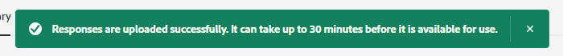

# 响应库 {#response-library}

在一个位置查看所有问题、它们的批准状态以及分配给它们的任务名称/主题。

## 手动添加问题 {#manually-add-a-question}

1. 在“生成AI”下，单击&#x200B;**[!UICONTROL Assisted responses]**。

   

1. 单击&#x200B;**[!UICONTROL Response library]**&#x200B;选项卡。

   

1. 单击 **[!UICONTROL Add question]**。

   

1. 输入您的问题和回答。 分配主题并添加用户可与访客共享的可选URL。 完成后单击&#x200B;**[!UICONTROL Save]**。

   

1. 单击刷新，您的新问题将以“[!UICONTROL Processing]”状态显示在顶部。

   

1. 几分钟后，再次刷新，状态将更改为“已批准”。

   

## 编辑单个问题/响应 {#generate-a-new-question}

>[!NOTE]
>
>默认情况下，所有生成的问题和响应都分配有&quot;[!UICONTROL need review]&quot;状态。 仅向聊天访客提供&quot;[!UICONTROL approved]&quot;问题和响应。

1. 在&#x200B;**[!UICONTROL Response library]**&#x200B;中，单击所需的问题。

   

1. 进行编辑并单击&#x200B;**[!UICONTROL Save]**。

   

## 批量编辑和上传问题/响应 {#bulk-edit-and-upload-questions-responses}

以下说明如何在[下载的Excel文件](/help/marketo/product-docs/demand-generation/dynamic-chat/generative-ai/question-generation.md#download-questions-and-responses){target="_blank"}中进行批量编辑。 它们还可以在文件的Task details选项卡中查看。

<table>
<thead>
  <tr>
    <th>操作</th>
    <th>说明</th>
  </tr>
</thead>
<tbody>
  <tr>
    <td>编辑问题</td>
    <td>在“editedQuestion”列（H列）中输入新问题</td>
  </tr>
  <tr>
    <td>编辑响应</td>
    <td>在“editedResponse”列中输入新响应（列I）</td>
  </tr>
  <tr>
    <td>添加新问题</td>
    <td>在“editedQuestion”列（列H）中输入新问题，并将questionResponse留空。 您还必须在列“主题”（列C）中输入相应的主题，并在列“sourceUr！”中输入源URL</td>
  </tr>
  <tr>
    <td>添加问题和答案</td>
    <td>在“editedQuestion”列（列H）中输入新问题，在“editedResponse”列（列I）中输入新响应，并将questionResponse留空。 您还必须在列“主题”（列C）中输入适当的主题</td>
  </tr>
</tbody>
</table>

1. 在文件中完成编辑后，返回到&#x200B;**[!UICONTROL Response library]**&#x200B;选项卡并单击&#x200B;**[!UICONTROL Upload responses]**。

   

1. 输入适用的任务名称。 拖放文件，或浏览到设备上并选择该文件。 完成后单击&#x200B;**[!UICONTROL Save]**。

   

1. 确认即会出现，您已准备就绪。

   

## 过滤您的问题 {#filter-your-questions}

默认情况下，问题按创建时间/日期顺序列出，最新的问题显示在最前。 如果您正在查找特定问题，请应用过滤器以缩小搜索范围。 按主题、任务名称和/或审批状态过滤。

