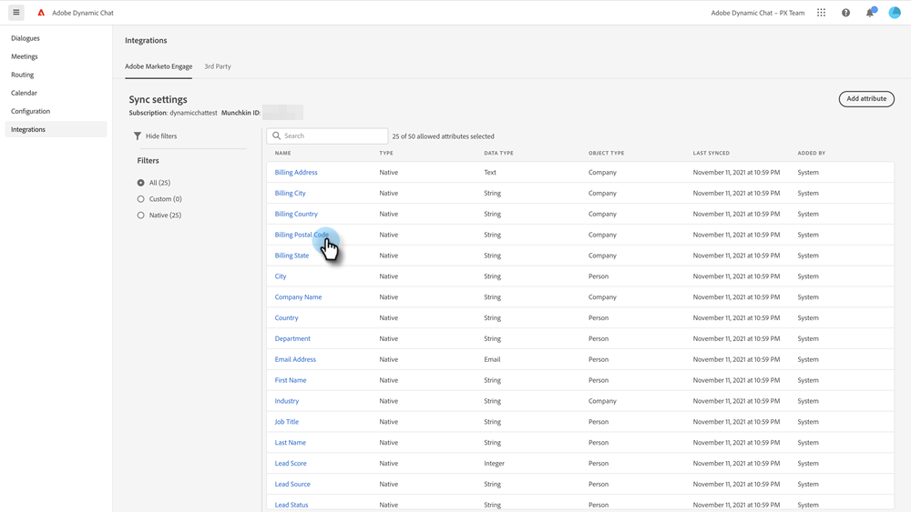

# Adobe Marketo Engage {#adobe-marketo-engage}

## 正在连接Dynamic Chat {#connecting-dynamic-chat}

完成[初始设置](/help/marketo/product-docs/demand-generation/dynamic-chat/setup-and-configuration/initial-setup.md){target="_blank"}后，就可以执行一次性同步连接Dynamic Chat以连接到Adobe Marketo Engage订阅了。

>[!NOTE]
>
>Dynamic Chat支持同步[Marketo native](https://experienceleague.adobe.com/zh-hans/docs/marketo-developer/marketo/rest/lead-database/field-types){target="_blank"}以及自定义人员字段和公司字段。

1. 在“我的Marketo”中，单击&#x200B;**[!UICONTROL Dynamic Chat]**&#x200B;磁贴。

   

   >[!NOTE]
   >
   >如果您看不到图块，请联系您的Marketo管理员。

1. 如果您之前曾使用Adobe ID访问过应用程序，则将会直接Dynamic Chat。 如果没有，[请设置您的Adobe ID](https://helpx.adobe.com/cn/manage-account/using/create-update-adobe-id.html){target="_blank"}。

1. 要连接您的Marketo实例，请选择&#x200B;**[!UICONTROL 集成]**。

   

1. 在Marketo信息卡上，单击&#x200B;**[!UICONTROL 启动同步]**。

   

1. 从您的Marketo实例中选择最多50个属性（标准或自定义字段）以同步到Dynamic Chat，以用于受众定位、数据映射和个性化。 完成后单击&#x200B;**[!UICONTROL 下一步]**。

   

1. 查看您的选择。 单击&#x200B;**[!UICONTROL 确认]**&#x200B;以启动同步。

   

>[!NOTE]
>
>同步可能需要2到24小时才能完成，具体取决于数据库的大小。

## 添加属性 {#add-an-attribute}

在初始同步之后，以下说明如何添加其他属性。

1. 在&#x200B;**[!UICONTROL 集成]**&#x200B;中，确保选中&#x200B;**[!UICONTROL Adobe Marketo Engage]**&#x200B;选项卡，然后单击&#x200B;**[!UICONTROL 添加属性]**。

   

1. 选择要添加的属性，然后单击&#x200B;**[!UICONTROL 下一步]**。

   

1. 查看您的选择，然后单击&#x200B;**[!UICONTROL 确认]**。

   

## 删除属性 {#remove-an-attribute}

在初始同步之后，以下说明如何删除属性。

>[!NOTE]
>
>只有属性当前未被任何对话框使用时，您才会看到用于移除该属性的选项。

1. 在&#x200B;**[!UICONTROL 集成]**&#x200B;中，确保选中&#x200B;**[!UICONTROL Adobe Marketo Engage]**&#x200B;选项卡，然后单击要删除的属性。

   

1. 单击&#x200B;**[!UICONTROL 删除属性]**。

   

>[!MORELIKETHIS]
>
>[初始设置](/help/marketo/product-docs/demand-generation/dynamic-chat/setup-and-configuration/initial-setup.md){target="_blank"}
